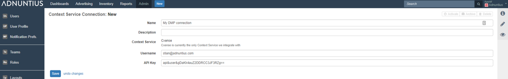
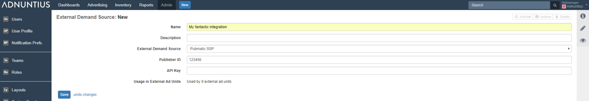
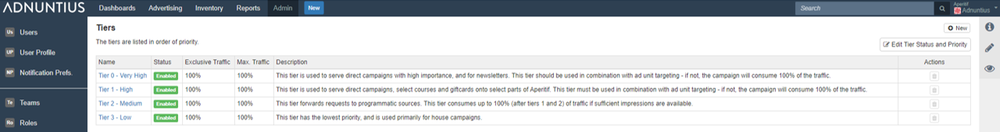

# Admin

The Admin section is where you manage users, roles, teams, notification preferences, custom events, layouts, tiers, integrations and more. You can get an introduction to Admin in this [Youtube](https://youtu.be/6NEH2pegA1g) video.

## Users and User Profile

The list of users are all users who have rights to perform certain actions \(as defined by [Roles](admin.md#roles)\) to certain parts of content \(as defined by [Teams](admin.md#teams)\). Here is how to create a new user.

**Email address, Name, Display name and Password**: Apply the user's email address, name and password. Display name is the name that will be displayed in the upper right corner of the user interface.


Please note that Adnuntius does not automatically send an email inviting the user to the network. So make sure that you inform the user about his/her new user and password.


**External reference \(optional\)**: Add an external reference \(optional\) if you want to match the user with the same person in another system.

**Roles**: A user needs to be assigned with at least two types of roles; a network role and one team role per team. You will find more information on [teams](admin.md#teams) and [roles ](admin.md#roles)later, but in short:

* A network role \(the top role in the user interface, in light gray\) determines the actions the user will be able to perform to advertisers, earnings accounts, layouts, report templates, users, tiers, custom events, roles and teams \(these are all functions that apply across your entire Adnuntius account\). 
* A team role determines the actions that a user will be able to perform to orders, line items, creatives, sites, ad units, report schedules and reports \(these are all functions that apply to a specific team, i.e. a set of sites\).


If you want to create a user that has no network permissions, you can create a network role where all permissions are unchecked \(and call it for instance "no permissions"\). This way, when you add a user with this network role, they cannot do anything to the network.



In [Admin &gt; Network](admin.md#network) you will be able to determine show or hide sections of the user interface that users do not have permissions to edit.


## Notification Preferences

Notification preferences allow you to subscribe to various changes, meaning that you can choose to receive emails when something happens to line items and reports. You can choose to subscribe to a broad set of line item or report preferences \(top\), or to specific notifications. Here is an explanation to some of the terms.

**Severity level** allows you to choose the types of notifications Adnuntius should send you. For instance, if you choose _Information_ you will receive notifications about line items ready to deliver or starting to run. If you choose _Warning_ you will receive notifications about for instance line items that are not starting to deliver even though it is past the start date. _Error_ will give you notifications about for instance reports that fail to execute for any reason.

**Notification method** lets you determine if Adnuntius should notify you per email or user interface. If you choose UI then you will find notifications in the right-most column of the user interface, when clicking the "i" icon.

## API Keys

API Keys are used to provide specific and limited access by external software to various parts of the application.

**Scope** allows the access level of the API Key to be set. The values currently supported are:

* Stats Querying \(to allow read-only access to stats data via the Adnuntius API or via the Tableau data connection\)
* User Segment Uploads \(to allow uploading of User Segment information for targeting into the Adnuntius platform\)

**Description** is a user-friendly description of the API Key, for keeping track of which keys are used for which purpose.

**Expiry** determines when the API Key will cease to allow access, to support restrictions on access should that be required.

## Teams

Teams let you connect users to a set of sites. This feature allows you to design your organization and account for, for example, multiple sales and ad operations teams that should have access to different sets of inventory. While [Roles ](admin.md#roles)lets you decide the actions that users can take to the inventory they have access to, Teams determines what inventory they can perform those actions on.


You can design multiple teams with the same sites under them. In other words, Adnuntius supports a many-to-many relationship between teams, where a site can belong to several teams.


**Name, description and external reference**: Give the team a name and description of your choice. You can also add an external reference \(optional\) if you want to match the team with the same entity in another system.

**Sites**: Add the set of sites you want to put into the team. Once you've chosen one or more sites, and user added to this team will have access to the sites. The actions they can perform to those sites however, will be determined by the role that you assign to the user for this team.

**Team members** shows you the users currently assigned to this team.

## Roles

While [Teams](admin.md#teams) determines the inventory a user will have access to, Roles determines what actions that user will be able to take to that inventory.

**Name and description**: Give the role a name and description \(optional\) of your choice.

**Role scope**: Choose whether this is a network role or a team role. A user must be allowed one network role, which determines the actions that user can take to network-wide functions such as admin functions and report templates. A user can have one team role per team, which determines the actions that user can take to team-specific functions such as publishing inventory and advertising. You can assign or reject the user these permissions:

* Network role permissions: 
  * Manage Business: Create, edit and delete advertisers and earnings accounts 
  * Manage Layouts: Create, edit and delete layouts 
  * Manage Report Templates: Create, edit and delete report templates 
  * Manage System: Edit the network and create, edit and delete users, tiers, custom events, roles and teams
* Team role permissions: 
  * Manage Advertising: Create, edit and delete orders, line items and creatives
  * Manage Publishing: Create, edit and delete sites and ad units 
  * Run Reports: Create, edit and delete report schedules and generate reports


If you want to create a user that has no network permissions, you can create a network role where all permissions are unchecked \(and call it for instance "no permissions"\). This way, when you add a user with this network role, they cannot do anything to the network.



In [Admin &gt; Network](admin.md#network) you will be able to determine show or hide sections of the user interface that users do not have permissions to edit.


## Layouts

Layouts allow you to create any look and feel to your creative, and to add any event tracking to an ad when it's displayed. When creating a creative, you will always choose a layout, and your layout will be come visible when you have saved your layout.

**Name, description, category and labels**: Give the layout a name and description \(optional\) of your choice. Categories allow you to group layouts with similar traits so that they are easier to find when later booking a line item and creating a creative.

**Default width and height \(optional\)**: When you add a creative you will always have to provide a width and height to that creative. Creatives using this layout will have these dimensions by default, so that if a creative is usually created with this size, then the process will go quicker. You can of course always change the width and height on a per-creative basis.

**Layout type** is where you determine whether your new layout will be a third party \(to render third-party creative content\), HTML \(to render HTML creatives that can be uploaded via a zip\), VAST 2.0 \(to render VAST 2 video creatives\), or regular \(to define your own components and render template for making a creative.

**Layout usage** gives you information about the creatives currently using this layout.

**Render template** is the code that you can insert to determine the look and feel, and any event, of your choice.

**Components in render template** are assets that you can add to the layout. You can add URLs \(for example click destinations\), text \(for example for native ads\), choices \(for instance choices on whether a video should autoplay or not\), or media \(being images in GIF, JPG or PNG\).

## Custom Events

Custom events let you define any event that you want to track for a creative, line item and order. Custom events can be inserted into layouts to start counting events on a per-creative basis. After creating a custom events you can add them to a line item by including a CPA bid and then choosing your conversion event.

**Name and description**: Give the event a name and description \(optional\) of your choice.

**Value type** determines what is counted, and you can choose between number \(for example the number of events or conversions\), time in milliseconds or seconds \(for example, the seconds a user holds the cursor over an ad\), or money \(for example the value of a purchase online\).

**ID and code example**: Once you've created your event, you can paste the code with the ID into a [Layout](admin.md#layouts) to start counting events.

## Reference Data

When you use [category or key value targeting](advertising.md#line-item) on line items or creatives, it can be hard to remember how a categories \(as defined by the URL structure\) are designed on your site, or which key values are being sent with the ad requests. Reference data lets you upload a text file that creates a library of categories and key values that you can choose from, rather than remember them all.

**Category uploader**: Just create a .txt file where each line specifies a new category that you want to add.

**Key value uploader**: Just create a .txt file where each line specifies a new key-value entry and commas separate the data like so: mykey, myfirstvalue, mysecondvalue

## Context Service Connections

Context service connections allow you to connect to your DMP so that you can target ads to segments, keywords and more. Adnuntius is currently connected to Cxense DMP.

**Name and description**: Give the connection a name and description \(optional\) of your choice.

**Username and API key**: Provide the username \(email address\) that you use when logging into your Cxense account. Then add the API key for your user. You will find this in the upper right corner after logging into Cxense, when clicking on your email address.


Adnuntius synchs with Cxense every 5 minutes. So it may take a few minutes before you can see your segments.


## External Demand Sources

External demand sources enables you to connect to a Supply-Side Platform \(SSP\) in order to fetch programmatic ads server-side. If you are a publisher with programmatic revenue, this may be a feature that enables you to increase revenue by auctioning your direct inventory against programmatic inventory, and earn the highest revenue cross-channel for every ad impression.


This is the first step to set up programmatic ads. After you have completed these first steps, move to [External ad units](inventory/#external-ad-unit) to set up connections between each Adnuntius ad unit and your SSP ad units.


**Name and description**: Give the connection a name and description \(optional\) of your choice.

**External demand source**: Choose your demand source. Please note that if you choose prebid, then this is all you have to do - you do not have to complete the step below.

**Publisher ID**: Type in the publisher ID that you receive from your SSP account. Once this is done, Adnuntius connects to your SSP server-side.


Don't have an SSP account, but want one? Connect with us at support@adnuntius.com, and we can help you out.


## Extension Connections

Extension connections is where you connect to our Demand Side Platform \(DSP\) to transform Adnuntius from "just an adserver" to a marketer platform where you can market your ads directly AND programmatically. After you've completed the steps below you will be able to select parts of your budget to be spent through the DSP as opposed to directly. This is something you will of course be able to control.

**Name and description**: Give the connection a name and description \(optional\) of your choice.

**Username and password**: Apply your username and password with Platform 161 \(our DSP partner\).


Want an account? Contact us at support@adnuntius.com and we will help you out.


## Tiers

Tiers enable you to prioritize delivery of some line items above others. If you are familiar with other adservers that work with predefined tiers, you may recognize terms like "roadblock" or sponsorship". Adnuntius works slightly different, as we want to enable you to build exactly the tier structure that is right for you.

Every line item in Adnuntius is placed inside a tier \(you can choose a default tier in [Admin &gt; Network](admin.md#network)\). Once a line item is created, it will share the traffic to that tier with other line items placed inside the same tier.

**Name and description**: Give the tier a name and description \(optional\) of your choice.

**Exclusive traffic** sets the share of your traffic that will be exclusively offered to the line items placed inside the tier. If I have a tier that has first priority and I set its exclusivity to 25% it means that, as long as there are line items to serve inside this tier, they will consume 25% of traffic before line items in lower tiers will be able to see any traffic.

**Maximum traffic** sets the max traffic for line items in a tier. If I would set the exclusive traffic to 25% and the maximum to 35%, it means that the line items in the tier may get additional 10% of traffic \(but no more\), provided that they win the auction compared to line items in lower tiers. Here are some examples of what different configurations of exclusive/maximum would mean:

* 100/100: as long as there are line items in this tier that can serve impressions \(i.e. they have no restrictions such as impression objectives or smoothing\), they will consume 100% of traffic regardless of their bids. 
* 50/100: as long as there are line items in this tier that can serve impressions \(i.e. they have no restrictions such as impression objectives or smoothing\), they will consume 50% of traffic regardless of their bids. They can also get up 100% as long as they bid higher on eCPM compared to line items in lower tiers. 

**Edit tier status and priority**: on the page with overview of tiers you will find a button named "Edit tier Status and Priority". When you click on this you will be able to enable and disable tiers, and to change their priority against each other.

## Network

The network page lets you make certain changes to the network as a whole.

**Name and Network ID**: You can change the name of the network if your company changes name. However, you can not change the ID.

**Currencies**: The default currency is a currency that is chosen when your account is set up, and cannot be changed. The default currency is used when generating reports. You can add multiple currencies, and choose your preferred currency when creating line items. However, the reporting will always be done in your default currency.

**Timezone** is also set up when your account is created, and cannot be changed.

**Consent to use personal data**: Adnuntius enables you to comply with privacy legislation such as the GDPR, and as part of this you can choose whether Adnuntius is allowed to assume consent \(and thus use personal data by default\), or if approval needs to be provided by the user before that user's data can be used in targeting.

**DMP connection and site ID**: If you have a connected DMP account, this will show the existing account set up.

**Viewability calculation method** allows you to determine how viewability is calculated by Adnuntius. You can choose to divide viewable impressions by all impressions, or by rendered impressions only. As a point of comparison, Google Ad Manager defines viewability as impressions over rendered impressions, and it may make sense to choose this method if you are relying on lots of third party players delivering your ads \(as viewability cannot be easily calculated once served inside another system\).

**Web notification URL** lets you define a URL that [system notifications](admin.md#notification-preferences) will be sent to whenever they arise. If you want another system to pick up these notifications, then you can apply a URL to that system here.

**App section viewability** lets you show or hide sections of the app that users do not have permissions to edit. _Show all_ means that Adnuntius will show all sections of the app at all times \(however, teams still dictate visibility of individual objects\), even though users will not be allowed to edit or add anything. _Hide ineditable sections_ means that Adnuntius will hide sections of the app that users do not have permissions to edit.

**User interface and report logos** lets you specify a logo that will be applied to the top left corner of admin.adnuntius.com \(user interface\), and to any report generated by Adnuntius \(report\). This way you can put your own touch on for instance reports that are shared with your customers.

**Network-wide defaults** lets you define defaults that will help you use Adnuntius more efficiently. You can apply defaults for:

* Tiers: The default tier that will be applied to line items when they are created. 
* Line item state: Set line items to approved, paused or stopped. 
* Line item date range: Adnuntius uses today's date as a default start date - this range sets the default end date. If you for example add the number 7, line items will be created with default start date today and end date one week from now. 
* Creative delivery: Set line items to open \(new line items default to same creative delivered multiple times per ad server response\), unique \(new line items default to no same creative from a line item delivering per ad server response\) or one per line item \(new line items default to max. of one creative from a line item per ad server response\).
* Creative name: Set the default name on new creatives.
* Geospatial targeting center point: Set the longitude/latitude for the default geospatial area center.
* Geospatial targeting zoom: Set the longitude/latitude for the default geospatial area.

