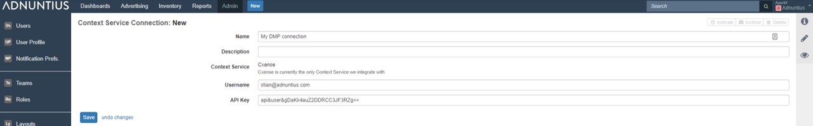
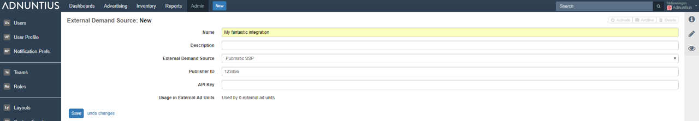
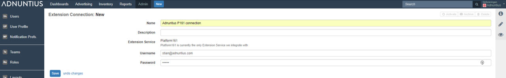

# Connections

## DMP Connections

Context service connections allow you to connect to your DMP so that you can target ads to segments, keywords and more. Adnuntius is currently connected to Cxense DMP.

**Name and description**: Give the connection a name and description \(optional\) of your choice.

**Username and API key**: Provide the username \(email address\) that you use when logging into your Cxense account. Then add the API key for your user. You will find this in the upper right corner after logging into Cxense, when clicking on your email address.


Adnuntius synchs with Cxense every 5 minutes. So it may take a few minutes before you can see your segments.



Do you need a data platform to start collecting user information? Talk to us about Adnuntius Data by contacting us at [support@adnuntius.com](mailto:support@adnuntius.com). 


## SSP Connections

External demand sources enables you to connect to a Supply-Side Platform \(SSP\) in order to fetch programmatic ads client-side or server-side. If you are a publisher with programmatic revenue, this may be a feature that enables you to increase revenue by auctioning your direct inventory against programmatic inventory, and earn the highest revenue cross-channel for every ad impression.


This is the first step to set up programmatic ads. After you have completed these first steps, move to [External ad units](../inventory/external-adunits.md) to set up connections between each Adnuntius ad unit and your SSP ad units.


**Name and description**: Give the connection a name and description \(optional\) of your choice.

**External demand source**: Choose your demand source. Please note that if you choose prebid, then this is all you have to do - you do not have to complete the step below.

**Publisher ID**: Type in the publisher ID that you receive from your SSP account. Once this is done, Adnuntius connects to your SSP server-side.


Do you need access to SSPs? [We can help you](https://adnuntius.com/programmatic-just-got-full-service/)! 


## DSP Connections \(Not Yet Ready\)

This feature is currently work in progress, and is not yet ready for usage.

Extension connections is where you connect to our Demand Side Platform \(DSP\) to transform Adnuntius from "just an adserver" to a marketer platform where you can market your ads directly AND programmatically. After you've completed the steps below you will be able to select parts of your budget to be spent through the DSP as opposed to directly. This is something you will of course be able to control.

**Name and description**: Give the connection a name and description \(optional\) of your choice.

**Username and password**: Apply your username and password with Platform 161 \(our DSP partner\).

