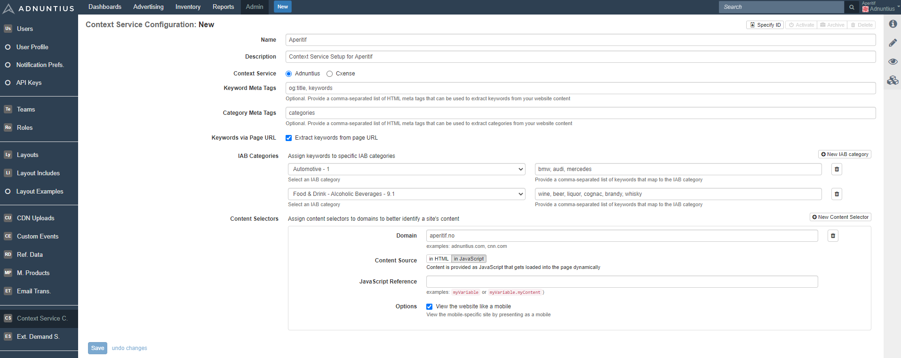

# Context Services \(Work in Progress\)

**Please note that we are currently finishing development, and that this will not work currently \(but it will very soon\). In the meantime, this information may not be accurate.** 

The Adnuntius Context Service makes it easy to import information from your pages, so that you or your buyers can target line items and/or creatives to pages describing certain topics. For example, if you have pages explaining how to make home-made pizza and you want to enable the advertiser “Tony’s Pizza Sauce” to show ads on those pages, then this is the service for you. 

In order for the context service to work Adnuntius needs to know the URL of the page so that its crawler can pick its content. If you are showing ads on your pages using Adnuntius [javascript ad tags](../../requesting-ads/intro/) then this will happen automatically as the javascript will send the URL. You can also send the URL with [prebid](https://docs.prebid.org/dev-docs/bidders.html#adnuntius) requests. 

To set up context services, go to [https://admin.adnuntius.com/admin/context-service-configurations](https://admin.adnuntius.com/admin/context-service-configurations) and then click “new” in the upper right corner. You can set up multiple connections, so if you for instance operate multiple sites you can create one connection per domain. 

First, give your new context service and **name and optional description** - for instance “Adnuntius Context Service”, or the name of the domain that the connection is intended for. Nobody expect you and your colleagues with access to the admin user interface will be able to read this.



Under Context Service, choose Adnuntius. You will notice that Cxense is an alternative, and this is because you can also use Cxense to send contextual information if you are currently a customer of Cxense \(now called Piano\). 

**Keyword and Category Meta Tags** allow you to send in any meta data you have on your pages, and enable them for keyword targeting and category targeting respectively. For you non-developers, let’s say you go to one of your pages, right-click on the page and click to view the page source. Among the meta data you find these lines: 

```text
<meta property="og:title" content="Rich's Rich Ravioli: How to Make the Perfect Ravioli">
<meta name="keywords" content="recipes, italian, ravioli, rich">
<meta name="categories" content="recipes, italian">
```

As you will see in the image above we have added "og:title" and "keywords" to the keyword meta tags field. When we do this, the following will happen once you save this connection. 

* Essential keywords that are part of the title of every page will be sent to Adnuntius. Examples of keywords that may be sent to Adnuntius include "rich", "ravioli" and "perfect". 
* The words "recipes", "italian", "ravioli" and "rich" will be sent to Adnuntius. 
* All these keywords will be made available to line item and creative targeting under [keyword targeting](../advertising/targeting.md#keyword-targeting). 

Similarly if you add "categories" to the category meta tags field, you will send "recipes" and "italian". However, since you are using the category meta tags field rather than the keywords meta tags field, these keywords will be made available as part of [category targeting](../advertising/targeting.md#category-targeting) instead. 

The tick box **Keywords via Page URL** lets you automatically send any keywords that we can pick up from your URLs. For example, let's say that you have a page with the URL below. In this example, Adnuntius will pick up and send the keywords "recipes", "italian" and "ravioli", and you will be able to target towards these pages using [category targeting](../advertising/targeting.md#category-targeting). 

```text
https://www.aperitif.no/recipies/italian/ravioli/best-ravioli-ever/12345
```

**IAB Categories** lets you assign keywords to specific IAB categories. Any information you collect will be made available as [category targeting](../advertising/targeting.md#category-targeting). Here you can write any keyword you would like to assign to a category, and when a keyword is entered then Adnuntius will listen for that keyword in article texts. In the example image above, "beer" is entered as a keyword and tied to the IAB category "Food & Drink - Alcoholic Beverages - 9.1". When "beer" is added then Adnuntius will scan each page and look for that keyword. When found, that page is added as a target whenever someone books a campaign targeting the category "Food & Drink - Alcoholic Beverages - 9.1".

**Content Selectors** allow you to assign content selectors to domains to better identify a site's content. The first value to add is the domain, for example adnuntius.com or aperitif.no. The following information to be entered depends on the content source; HTML or JavaScript. 

| Source | Field | Explanation and examples |
| :--- | :--- | :--- |
| HTML | CSS Selector |  Examples: `p.article` or `div.main div.content` or `p.article, div.content` |
| HTML | Exclude CSS Selector | This CSS selector excludes all matching elements from the main selector. |
| HTML | View the website like a mobile | View the mobile-specific site by presenting as a mobile. |
| JavaScript | JavaScript Reference | Examples: `myVariable` or `myVariable.myContent`\)  |
| JavaScript | View the website like a mobile | View the mobile-specific site by presenting as a mobile. |

