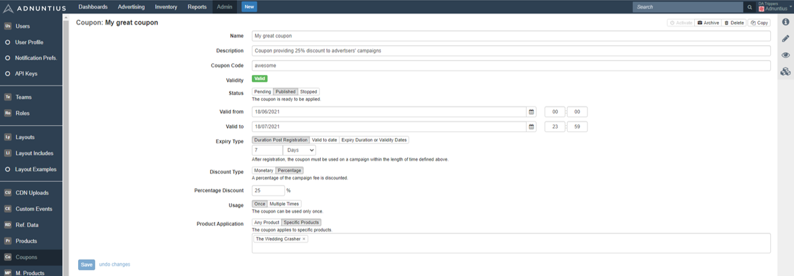
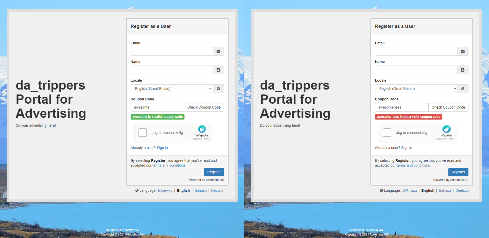

# Coupons \(Work in Progress\)

## How to Create Coupons

Here is how you create a coupon. First, give your coupon a **name** and **description** \(optional\). These will not be visible to anyone but you, and they are just meant to help you organize your coupons. 

The **coupon code** is the code that self-service advertisers will need to enter in order to unlock the discount. You can create codes based on numbers, letters, words - anything you want. 

Validity.

Status

Valid from

Valid to.

Expiry type. 

The **discount type** lets you choose if the discount should be monetary or a percentage. If you for example choose monetary and add the number 100, then you will give the advertiser a discount of 100 in your chosen currency. 

**Usage** lets you choose if the coupon should be possible to use once or multiple times. If you for example choose "Once" then the advertiser will not be able to use the coupon for more than one campaign. _Please note that if you choose "Once" then that code cannot be applied by different advertisers since it can only be used once. So only use this option is you are creating a code for one advertiser alone._ 

**Product application** lets you choose if the discount should be available for any of the [products](products.md) you offer, or just for specific products. 

## How Advertisers can Use Coupons

Once you have created a coupon, you can distribute the code to advertisers in email, SMS or banner campaigns. Once the advertiser has received a code, they will be able to enter that code when registering with your self-service portal. 

When they have entered a code they will be able to check and verify that the coupon code is valid. In the example below "awesome" is a code you have created and is therefore valid, while "awesomeness" is not valid. 

