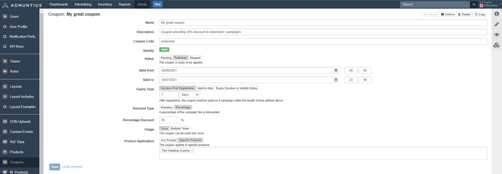
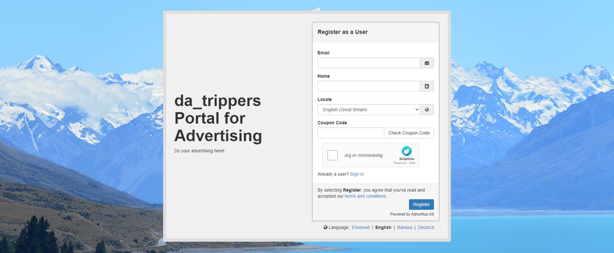
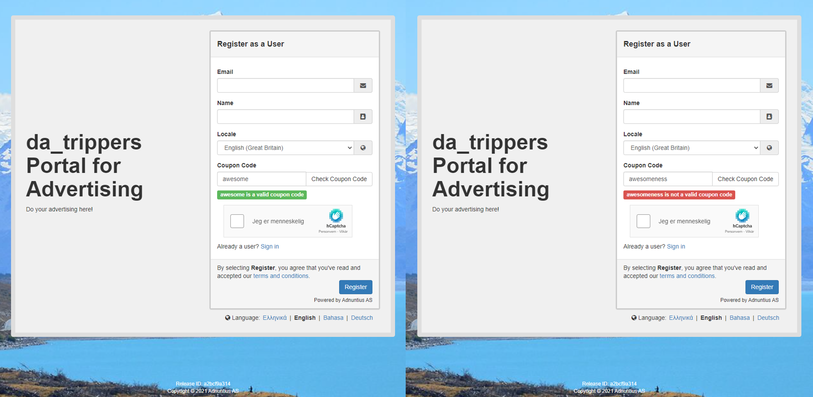

# Coupons

## How to Create Coupons

Here is how you create a coupon. First, give your coupon a **name** and **description** (optional). These will not be visible to anyone but you, and they are just meant to help you organize your coupons. 

The **coupon code** is the code that self-service advertisers will need to enter when registering with you portal in order to unlock the discount. You can create codes based on numbers, letters, words - anything you want. 

The **status** can be set to Pending, Published or Stopped. Pending means that you're working on the coupon and it is not ready to be applied, and it will not work if anyone tries to use it. Published means that your coupon is ready, and its code can be applied by advertisers who have received it. Stopped means that you have stopped the coupon, and it can no longer be applied by anyone. 

**Valid from** lets you set the date and time from which the coupon should be valid. Valid to lets you set a stop date and time. After the stop date the coupon code will not work, regardless of the expiry types explained below. 


If you want a coupon code that lasts indefinitely, just set a stop date far into the future, like December 31, 2050.


**Expiry type** lets you set rules for how long the coupon should stay active after an advertiser has applied it.

* Duration post registration means that, after registration, the coupon must be used on a campaign within the length of time defined. For example, if you set length of time to 7 days, then this means that the advertiser must create campaign(s) within 7 days after registration in order to get the discount. 
* Valid to date means that, after registration, the coupon must be used before the valid to date is passed. For example, if the valid to date is set to December 31st 2021, then this means that the advertiser must create campaign(s) before that date in order to get the discount.
* Expiry duration or validity dates means that, after registration, the coupon can be used according to the duration above or valid to date, whichever is longer.

The **discount type **lets you choose if the discount should be monetary or a percentage. If you for example choose monetary and add the number 100, then you will give the advertiser a discount of 100 in your chosen currency. 

**Usage** lets you choose if the coupon should be possible to use once or multiple times. If you for example choose "Once" then the advertiser will not be able to use the coupon for more than one campaign. 


Note that if you choose "Once" then each advertiser can still use a coupon once. The coupon code is tied to an email account, so each email account with access to the coupon will be able to apply it once. 


**Product application** lets you choose if the discount should be available for any of the [products](products.md) you offer, or just for specific products. 


See how you can [create coupons using the API](../../admin-api/endpoints/coupons.md). 


## How Advertisers can Use Coupons

Once you have created a coupon, you can distribute the code to advertisers in email, SMS or banner campaigns. Once the advertiser has received a code, they will be able to enter that code when registering with your self-service portal. 

When they have entered a code they will be able to check and verify that the coupon code is valid. In the example below "awesome" is a code you have created and is therefore valid, while "awesomeness" is not valid. 

