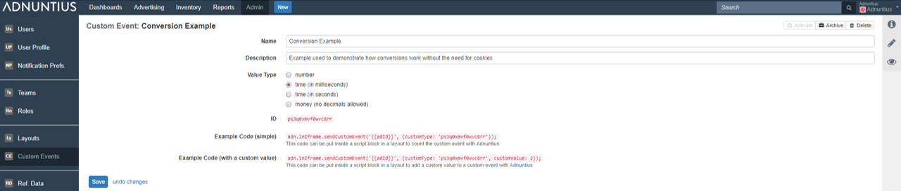

# Custom Events



**Name and description**: Give the event a name and description \(optional\) of your choice.

**Value type** determines what is counted, and you can choose between number \(for example the number of events or conversions\), time in milliseconds or seconds \(for example, the seconds a user holds the cursor over an ad\), or money \(for example the value of a purchase online\).

**ID and code example**: Once you've created your event, you can paste the code with the ID into a [Layout](./#layouts) to start counting events.

