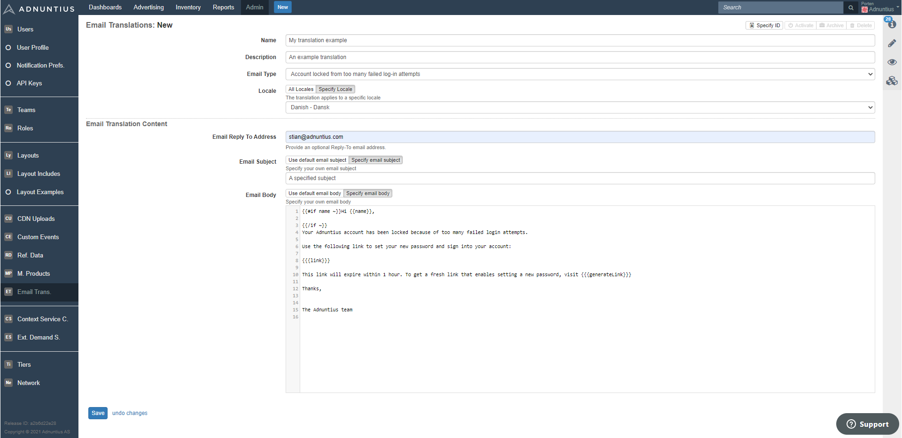

# Email Translations

To create an email translation, go to [https://admin.adnuntius.com/admin/email-translations](https://admin.adnuntius.com/admin/email-translations), then click "new" in the upper right corner. Give the new email translation a **name and description** \(optional\) of your choice. 

Choose **email type**, which is the email that is to be sent to the receiver. For example: "Forgot password" will be the email that users receive when they click that they have forgotten their password. Other examples include "Account locked from too many failed log-in attempts" and "A line item has started delivering".



**Locale** lets you specify the area of the world where this translation should be used. For example, if you want to create a Polish translation to be used in Poland, then simply choose Polish from the dropdown list, and we make sure that the translation will be sent to users located in Poland. 

**Email Subject** lets you specify an email subject. You can choose to use the default subject \(click "Specify email subject" to see what the default message is\), or to provide your own. 

**Email body** lets you lets you write the body text of the email. Please note that if you modify the text, make sure that you don't remove the "link" part shown below, as this is what generates a link to let the user register or set a new password.

```text
{{{link}}}
```

