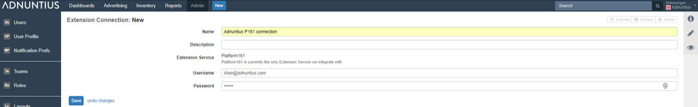

# Extension Connections

Extension connections is where you connect to our Demand Side Platform \(DSP\) to transform Adnuntius from "just an adserver" to a marketer platform where you can market your ads directly AND programmatically. After you've completed the steps below you will be able to select parts of your budget to be spent through the DSP as opposed to directly. This is something you will of course be able to control.

**Name and description**: Give the connection a name and description \(optional\) of your choice.

**Username and password**: Apply your username and password with Platform 161 \(our DSP partner\).

