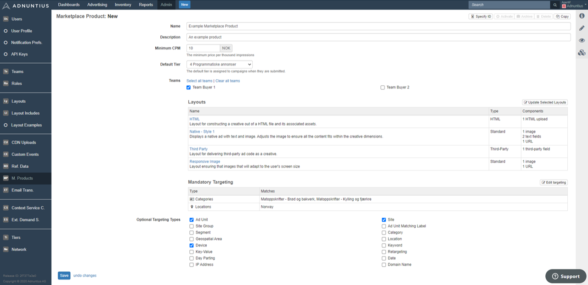
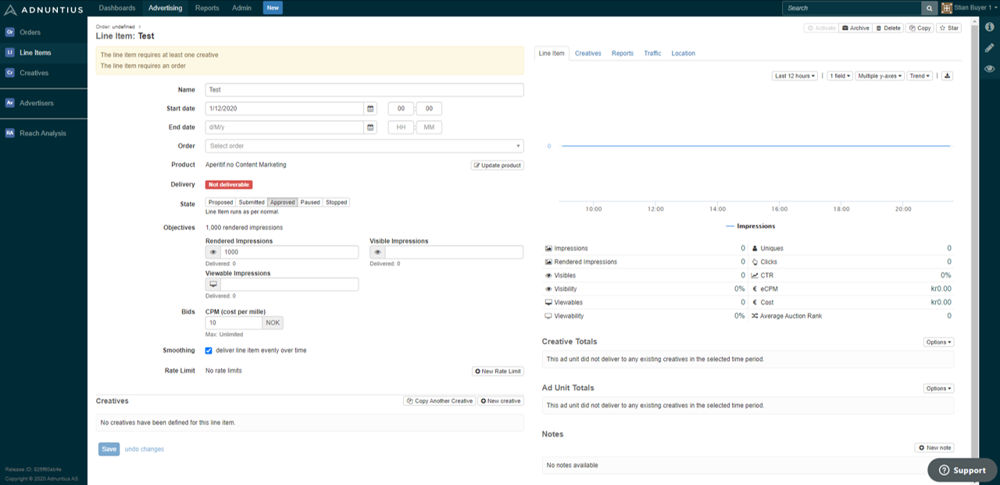

# Marketplace Products

A marketplace product can be created in order to design a specific buying option to one or more defined marketplace advertisers buying your traffic. A marketplace product is comparable to a programmatic deal ID that can be shared with a buyer, but markeplace products adds more features and provides a higher level of automation. 

Whenever a marketplace product is created and assigned to one or more buyers, then buyers will be able to create [line items](../advertising/line-items.md) with the opportunities and constraints that you set in the product. 

**Where to find marketplace products.** [Click here](https://admin.adnuntius.com/admin/marketplace-products) to go to the marketplace product section in admin.adnuntius.com. To create a new product, click New in the upper right corner of the screen. You can create any number of products. 


Please note that one product always needs to be set as a "default". This means that whenever a marketplace advertiser clicks to create a line item, this is the product that will be selected by default. From that screen they can choose other products that you have given access to.

This means that all marketplace advertisers always purchase advertising using a product.


Give the product a **name and description** of your choice. The name and description will be available to the buyers that you allow access to use this product.

**Minimum CPM** specifies the minimum CPM bid that the marketplace advertiser has to pay when buying advertising through this product. 

**Default tier** specifies in which tier the marketplace advertiser's line items will be placed when they use this product. You can therefore decide which priority that the line items should have relative to other line items. 

**Teams** is where you can choose which teams \(marketplace advertisers\) should have access to this product. Please note that your default product needs to have all teams enabled for that product. 

**Layouts** lets you make different [layouts ](layouts.md)available to buyers. For example, if you want a specified set of marketplace advertisers to have access to buy the layout parallax \([see example here](https://admin.adnuntius.com/admin/layout-examples/layout-example/parallax-layout-example)\), then you can add this layout to the product. When added, advertisers will be able to choose between only the layouts that you enable here. 

**Mandatory targeting** lets you pre-choose the targeting criteria that will be available when creating line items using this product. For example, if this product should offer location targeting only within Australia, then you can set that location targeting here. This means that all line items created with this product will always be targeted to Australia only. 

**Optional targeting** lets you choose the options that advertisers can choose between when targeting their campaigns. If you for example allow for location targeting and site targeting, then marketplace advertisers will be able to choose between whatever locations and sites they want to.


If you do not send contextual information such as categories or key values to Adnuntius, then you should disable these targeting criteria so that they are not available to marketplace advertisers. You can easily exclude targeting options with optional targeting.


When a product is created and assigned to a buyer, then that buyer can choose that product when creating a line item. The screenshot below shows an example where a buyer has been assigned to one product only. 


Please note that marketplace advertisers will be able to add targeting to their creatives, but not to line items. They will find the allowed targeting criteria when they click to create creatives. 


