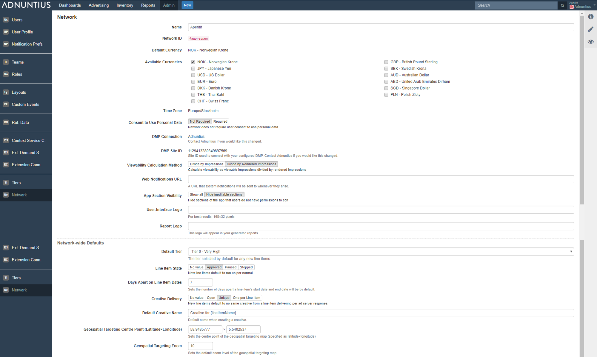

# Network

**Name and Network ID**: You can change the name of the network if your company changes name. However, you can not change the ID.

**Currencies**: The default currency is a currency that is chosen when your account is set up, and cannot be changed. The default currency is used when generating reports. You can add multiple currencies, and choose your preferred currency when creating line items. However, the reporting will always be done in your default currency.

**Timezone** is also set up when your account is created, and cannot be changed.

**Consent to use personal data**: Adnuntius enables you to comply with privacy legislation such as the GDPR, and as part of this you can choose whether Adnuntius is allowed to assume consent \(and thus use personal data by default\), or if approval needs to be provided by the user before that user's data can be used in targeting.

**DMP connection and site ID**: If you have a connected DMP account, this will show the existing account set up.

**Viewability calculation method** allows you to determine how viewability is calculated by Adnuntius. You can choose to divide viewable impressions by all impressions, or by rendered impressions only. As a point of comparison, Google Ad Manager defines viewability as impressions over rendered impressions, and it may make sense to choose this method if you are relying on lots of third party players delivering your ads \(as viewability cannot be easily calculated once served inside another system\).

**Web notification URL** lets you define a URL that system notifications will be sent to whenever they arise. If you want another system to pick up these notifications, then you can apply a URL to that system here.

**App section viewability** lets you show or hide sections of the app that users do not have permissions to edit. _Show all_ means that Adnuntius will show all sections of the app at all times \(however, teams still dictate visibility of individual objects\), even though users will not be allowed to edit or add anything. _Hide ineditable sections_ means that Adnuntius will hide sections of the app that users do not have permissions to edit.

**User interface and report logos** lets you specify a logo that will be applied to the top left corner of admin.adnuntius.com \(user interface\), and to any report generated by Adnuntius \(report\). This way you can put your own touch on for instance reports that are shared with your customers.

**Network-wide defaults** lets you define defaults that will help you use Adnuntius more efficiently. You can apply defaults for:

* Tiers: The default tier that will be applied to line items when they are created. 
* Line item state: Set line items to approved, paused or stopped. 
* Line item date range: Adnuntius uses today's date as a default start date - this range sets the default end date. If you for example add the number 7, line items will be created with default start date today and end date one week from now. 
* Creative delivery: Set line items to open \(new line items default to same creative delivered multiple times per ad server response\), unique \(new line items default to no same creative from a line item delivering per ad server response\) or one per line item \(new line items default to max. of one creative from a line item per ad server response\).
* Creative name: Set the default name on new creatives.
* Geospatial targeting center point: Set the longitude/latitude for the default geospatial area center.
* Geospatial targeting zoom: Set the longitude/latitude for the default geospatial area.

