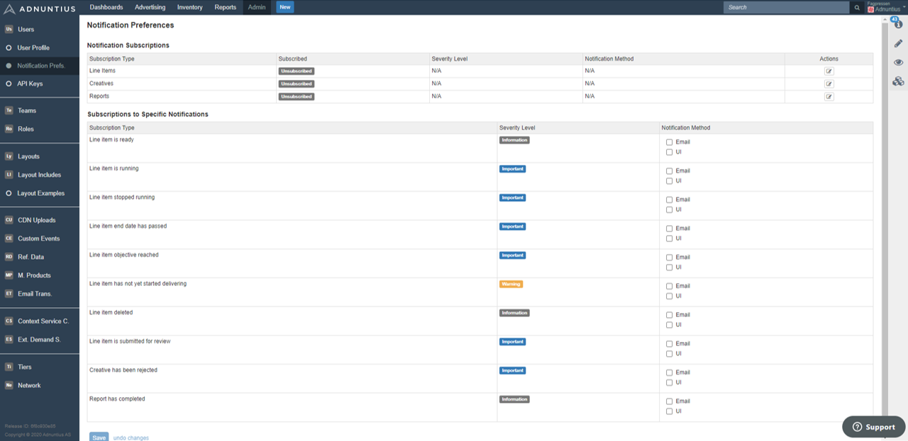

# Notification Preferences

You can choose to subscribe to a broad set of line item or report preferences \(top\), or to specific notifications.

**Severity level** allows you to choose the types of notifications Adnuntius should send you. For instance, if you choose _Information_ you will receive notifications about line items ready to deliver or starting to run. If you choose _Warning_ you will receive notifications about for instance line items that are not starting to deliver even though it is past the start date. _Error_ will give you notifications about for instance reports that fail to execute.

**Notification method** lets you determine if Adnuntius should notify you per email or user interface. If you choose UI then you will find notifications in the right-most column of the user interface, when clicking the "i" icon.

