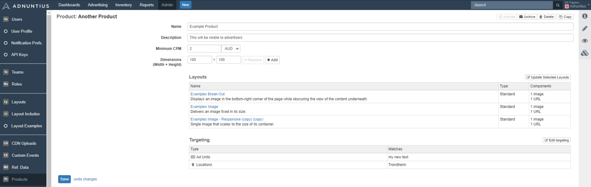

# Products



Please note that this section is only visible if you are a customer of Adnuntius Self-Service. If you want access to this, please contact us at [support@adnuntius.com](mailto:support@adnuntius.com). Also, see [here ](../../../onboarding-guides/adnuntius-self-service/)if you want to learn how to set up Adnuntius Self-Service. Here is how you create a product. First, go to [https://admin.adnuntius.com/admin/products](https://admin.adnuntius.com/admin/products) and click "new" in the upper right corner. 

**Name and description.** Give your product a name and description. Note that these will be visible to advertisers, so make sure that you provide a good name and description. 

**Minimum CPM** lets you set a floor price so that you know what you will make in revenue from self-service advertisers. Once you have set a minimum price, campaigns created will have this as a CPM bid. 


Advertisers will add a total budget to their campaigns to make things easy. If you set a CPM price of 5 USD and an advertiser buys for 500 USD, then they are effectively buying 100,000 impressions \(since impressions = budget x 1000 / CPM\).


**Dimensions** allow you to determine the sizes that advertisers should be able to choose between. If you later choose to add ad unit targeting to this product, ensure that the chosen ad units support the dimensions you specify. 

**Choose one or more layouts** to determine which layouts you want to enable advertisers to buy. [Read more about layouts](layouts.md). 

**Add targeting** if you want to restrict this product to be served in certain ad units, geographical areas, devices, segments and more. [Read more about targeting criteria](../advertising/targeting.md). 

Once you have created a product it will be available for self-service advertisers to buy in your booking channel. 

