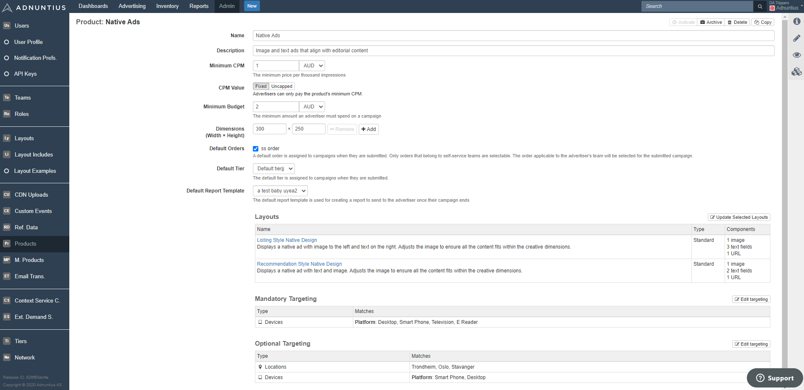

# Products


How to create products for self-service advertising.


Please note that this section is only visible if you are a customer of Adnuntius Self-Service. If you are not but want to learn more, please contact us at [support@adnuntius.com](mailto:support@adnuntius.com) or see an [online demo video here](https://adnuntius.com/products/adnuntius-self-service/). Also, see [here ](../../../onboarding-guides/adnuntius-self-service/)if you want to learn how to set up Adnuntius Self-Service. Here is how you create a product. First, go to [https://admin.adnuntius.com/admin/products](https://admin.adnuntius.com/admin/products) and click "new" in the upper right corner.

**Name and description.** Give your product a name and description. Note that these will be visible to advertisers, so make sure that you provide a good name and description.

**Minimum CPM** lets you set a floor price so that you know what you will make in revenue from self-service advertisers. Once you have set a minimum price, campaigns created will have this as a CPM bid.


Advertisers will add a total budget to their campaigns to make things easy. If you set a CPM price of 5 USD and an advertiser buys for 500 USD, then they are effectively buying 100,000 impressions (since impressions = budget x 1000 / CPM).


**CPM value** lets you determine if advertisers buying this product shall only pay the product's minimum CPM (fixed price), or if advertisers can choose to pay the product's minimum CPM or higher (auction). If you choose Uncapped then the higher paying advertisers will get more attention.

**Minimum budget** lets you set a minimum budget to a campaign. This means that if an advertiser tries to set a campaign budget lower than this limit, they will receive an error message and be asked to raise their budget so that it is at least this minimum.

**Dimensions** allow you to determine the sizes that advertisers should be able to choose between. If you later choose to add ad unit targeting to this product, ensure that the chosen ad units support the dimensions you specify.

**Default order** lets you choose under which order you want to place all self-service campaigns with this product. When an advertiser subsequently chooses this product, the resulting campaign can be found under this order. A default order is assigned to campaigns when they are submitted. Only orders that belong to self-service teams are selectable. The order applicable to the advertiser's team will be selected for the submitted campaign.


The default order must be part of a self-service team. [Click here to learn more about teams](../users/users-teams-and-roles.md).


**Default tier** lets you choose under which [tier](tiers.md) a campaign using this product will be placed. In short, a tier is a priority level that lets you determine which sets of campaigns should have priority over others. For instance, if you have direct sales operations selling "VIP campaigns" that should get priority over self-service campaigns, then you can choose to set your product to a lower tier to ensure that they will not interfere with those VIP campaigns.

The **default report template** is used for creating a report, based on your chosen [template](../reports/reports-templates-and-schedules.md), to send to the advertiser once their campaign ends. This means that the advertiser will receive an email with a link leading to a page containing the numbers that you choose to show based on that template.

**Choose one or more layouts** to determine which layouts you want to enable advertisers to buy. [Read more about layouts](../design/layouts.md).

Add **mandatory targeting** if you want to restrict this product to be served in certain ad units, geographical areas, devices, segments and more. [Read more about targeting criteria](../advertising/targeting.md).

Add **optional targeting** if you want advertisers to determine themselves how to target their campaigns to certain contexts or audiences.

Once you have created a product it will be available for self-service advertisers to buy in your booking channel.
