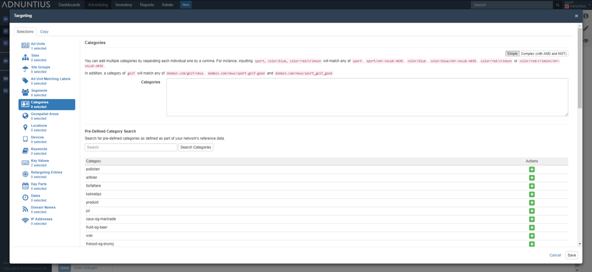

# Reference Data

When you use [category](../advertising/targeting.md#category-targeting) or [key value](../advertising/targeting.md#key-value-targeting) targeting on line items or creatives, it can be hard to remember how a categories \(as defined by the URL structure\) are designed on your site, or which key values are being sent with the ad requests. Reference data lets you upload a text file that creates a library of categories and key values that you can choose from, rather than remember them all.

**Category uploader**: Just create a .txt file where each line specifies a new category that you want to add. Below is a template that you can download and use if you are in doubt.



**Key value uploader**: Just create a .txt file where each line specifies a new key-value entry and commas separate the data like so: mykey, myfirstvalue, mysecondvalue. Below is a template that you can download and use if you are in doubt.



