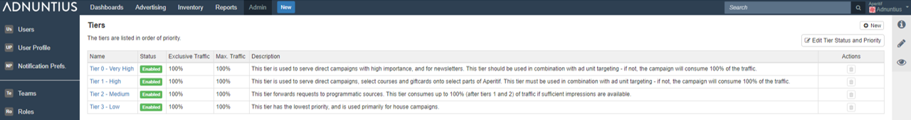

# Tiers

If you are familiar with other adservers that work with predefined tiers, you may recognize terms like "roadblock" or sponsorship". Adnuntius works slightly different, as we want to enable you to build exactly the tier structure that is right for you.

Every line item in Adnuntius is placed inside a tier \(you can choose a default tier in [Admin &gt; Network](network.md)\). Once a line item is created, it will share the traffic to that tier with other line items placed inside the same tier.

**Name and description**: Give the tier a name and description \(optional\) of your choice.

**Exclusive traffic** sets the share of your traffic that will be exclusively offered to the line items placed inside the tier. If I have a tier that has first priority and I set its exclusivity to 25% it means that, as long as there are line items to serve inside this tier, they will consume 25% of traffic before line items in lower tiers will be able to see any traffic.

**Maximum traffic** sets the max traffic for line items in a tier. If I would set the exclusive traffic to 25% and the maximum to 35%, it means that the line items in the tier may get additional 10% of traffic \(but no more\), provided that they win the auction compared to line items in lower tiers. Here are some examples of what different configurations of exclusive/maximum would mean:

* 100/100: as long as there are line items in this tier that can serve impressions \(i.e. they have no restrictions such as impression objectives or smoothing\), they will consume 100% of traffic regardless of their bids. 
* 50/100: as long as there are line items in this tier that can serve impressions \(i.e. they have no restrictions such as impression objectives or smoothing\), they will consume 50% of traffic regardless of their bids. They can also get up 100% as long as they bid higher on eCPM compared to line items in lower tiers. 

**Edit tier status and priority**: on the page with overview of tiers you will find a button named "Edit tier Status and Priority". When you click on this you will be able to enable and disable tiers, and to change their priority against each other.

