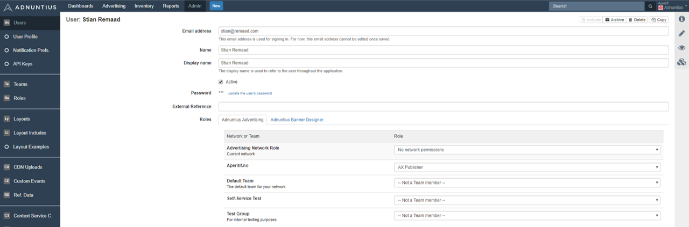

# Users, Teams and Roles

## Creating Users

**Email address, Name and Display name**: Apply the user's email address and name. Display name is the name that will be displayed in the upper right corner of the user interface.


Adnuntius automatically sends an email inviting the user to the network, and passwords are created automatically. However, administrators can change users' password later if needed. 


Add an **external reference \(optional\)** if you want to match the user with the same user in another system. For instance, if John Doe is registered in another system with user ID 123456, then you can add 123456 as an external reference in Adnuntius. This way you can easily recognize two different entries as the same user across two different systems.

**Roles**: A user needs to be assigned with at least two types of roles; a network role and one team role per team. You will find more information on [teams](./#teams) and [roles ](./#roles)later, but in short:

* A network role \(the top role in the user interface, in light gray\) determines the actions the user will be able to perform across your entire Adnuntius account. this includes advertisers, earnings accounts, layouts, report templates, users, tiers, custom events, roles and teams. 
* A team role determines the actions that a user will be able to perform to content that is team-specific, which includes orders, line items, creatives, sites, ad units, report schedules and reports.

You can also switch between Adnuntius Advertising and Adnuntius Designer. If you click Adnuntius Designer you can assign a role to the user for the Adnuntius Designer application \(please note that you may have to create a [role](./#roles) first\). 


If you want to create a user that has no network permissions, you can create a network role where all permissions are unchecked \(and call it for instance "no permissions"\). This way, when you add a user with this network role, they cannot do anything to the network, only to the team\(s\) they're invited to.



In [Admin &gt; Network](./#network) you can choose to show or hide sections of the user interface that users do not have permissions to edit.


## Teams

Teams let you connect users to a set of sites. This feature allows you to design your organization and account for, for example, multiple sales and ad operations teams that should have access to different sets of inventory. While [Roles ](./#roles)lets you decide the actions that users can take to that inventory, Teams determines what inventory they can perform those actions on.


You can design multiple teams with the same sites under them. In other words, Adnuntius supports a many-to-many relationship between teams, where a site can belong to several teams.


**Name, description \(optional\) and external reference \(optional\)**: Give the team a name and description of your choice. You can also add an external reference if you want to match the team with the same entity in another system.

**Sites**: Add the set of sites you want to put into the team. Once you've chosen one or more sites, and user added to this team will have access to the sites. The actions they can perform to those sites however, will be determined by the [role](./#roles) that you assign to the user for this team.

**Team members** shows you which users are currently assigned to this team, and what team role they have.

## Roles

While [Teams](./#teams) determines the inventory a user will have access to, Roles determines what actions that user will be able to take to that inventory.

To create a role, go to Admin &gt; Roles and in the upper right corner click "New". Start by giving your role a **Name and description \(optional\)**.

**Application** lets you choose between Advertising \(Adnuntius Advertising\) and Banner \(Adnuntius Designer\). If you choose Banner you will see that there are no more choices, as Adnuntius Designer has one role only. The choices below are for Adnuntius Advertising. 

**Role type, scope and permissions** determine the actions that users will be able to take. The table below explains each option and combination. 

| Role Type | Role Scope | Permissions | Explanation |
| :--- | :--- | :--- | :--- |
| Internal | Network | Manage business | Create, edit and delete advertisers and earnings accounts |
|  |  | Manage layouts | Create, edit and delete layouts |
|  |  | Manage Report Templates | Create, edit and delete report templates |
|  |  | Manage System | Edit the network and create, edit and delete users, tiers, custom events, roles and teams |
|  |  | Download Logs | Permission to download our raw ad server logs from our SFTP server \(contact [support@adnuntius.com](mailto:support@adnuntius.com) if this is interesting to you\) |
|  |  | View All Objects | Can view all objects within the system, including those without a team or found within teams the user does not belong to |
|  | Team | Manage Advertising | Create, edit and delete orders, line items and creatives |
|  |  | Manage Publishing | Create, edit and delete sites and ad units |
|  |  | Run Reports | Create, edit and delete report schedules and generate reports |
| External | Network | Manage business |  |
|  |  | Manage layouts |  |
|  |  | Manage report templates |  |
|  |  | Self-service user admin |  |
|  | Team | Run reports |  |
|  |  | Self-service team advertising |  |
|  |  | Self-service own advertising |  |

**Role scope**: Choose whether this is a network role or a team role. A user must be allowed one network role, which determines the actions that user can take to network-wide functions such as admin functions and report templates. A user can have one team role per team, which determines the actions that user can take to team-specific functions such as publishing inventory and advertising. You can assign or reject the user these permissions:

* Network role permissions: 
  * Manage Business: Create, edit and delete advertisers and earnings accounts 
  * Manage Layouts: Create, edit and delete layouts 
  * Manage Report Templates: Create, edit and delete report templates 
  * Manage System: Edit the network and create, edit and delete users, tiers, custom events, roles and teams
* Team role permissions: 
  * Manage Advertising: Create, edit and delete orders, line items and creatives
  * Manage Publishing: Create, edit and delete sites and ad units 
  * Run Reports: Create, edit and delete report schedules and generate reports


If you want to create a user that has no network permissions, you can create a network role where all permissions are unchecked \(and call it for instance "no permissions"\). This way, when you add a user with this network role, they cannot do anything to the network.



In [Admin &gt; Network](./#network) you will be able to determine show or hide sections of the user interface that users do not have permissions to edit.


