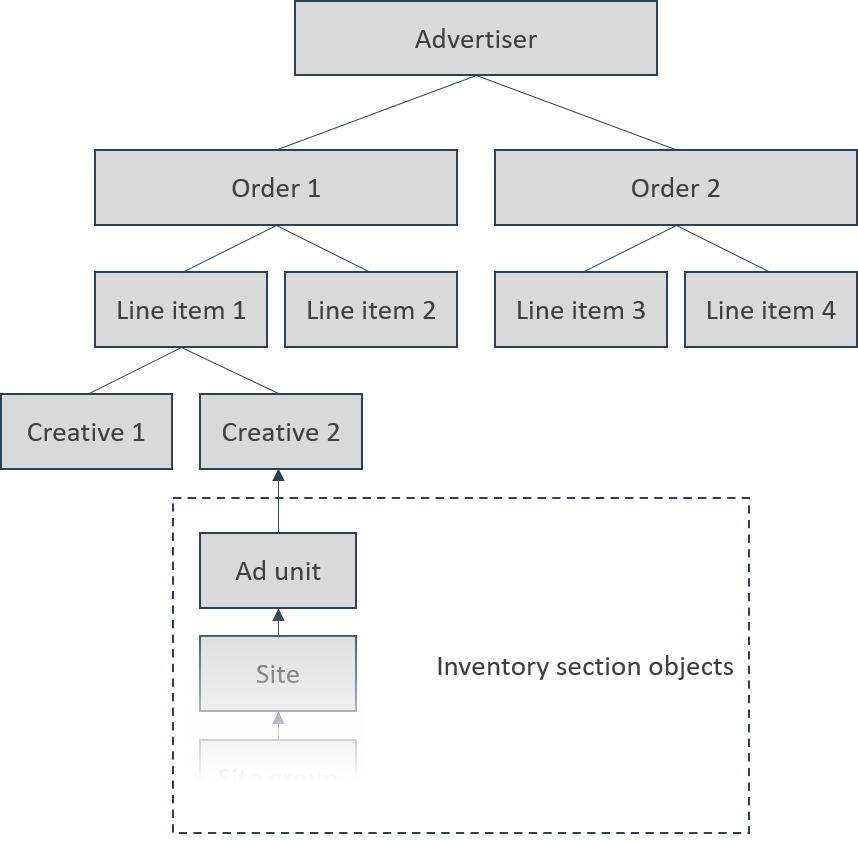

# Advertising

Here is how the various objects hang together: an advertiser is the top level object, and contain multiple orders, which in turn can contain multiple line items, which in turn can contain multiple creatives. Creatives will then be served inside ad units, which are set up under the inventory section.

## Concept Summary

| Concept                                      | Description                                                                                                                                                                                                             |
| -------------------------------------------- | ----------------------------------------------------------------------------------------------------------------------------------------------------------------------------------------------------------------------- |
| [Advertiser](advertisers.md)                 | Adding an Advertiser (for instance; CocaCola) is a natural first step when a salesperson has closed a sale with a new buyer. An advertiser can contain multiple orders.                                                 |
| [Order](orders.md)                           | Determines who has access to the campaign, what set of sites that impressions can be delivered to (see [Teams ](../admin/#teams)for more information), and business rules across the line items belonging to the order. |
| [Line item](line-items.md)                   | Determines start and end dates, delivery objectives (impressions, clicks or conversions), pricing, targeting, creative delivery and prioritization. One line item can contain multiple creatives.                       |
| [Line Item Template](line-item-templates.md) | Line item templates lets you add targeting, pricing, frequency capping and much more to a template, that can be re-used whenever you create a campaign that should inherit those settings from your template.           |
| [Creative](creatives.md)                     | The design of the ad that is shown to the end user. Can consist of various assets such as images, text and videos.                                                                                                      |
| [Library Creative](library-creative.md)      | Library creatives enable you to edit creatives across multiple line items from a single central location.                                                                                                               |
| [Reach analysis](reach-analysis.md)          | An analysis you can run to forecast the volume of matching traffic for a line item.                                                                                                                                     |

***
