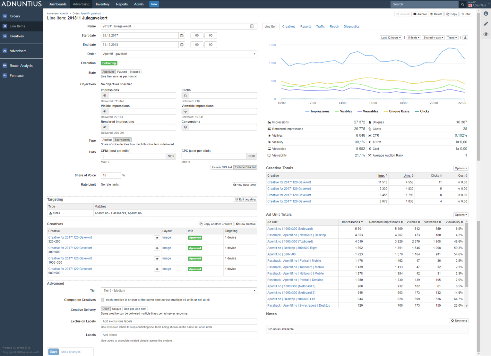
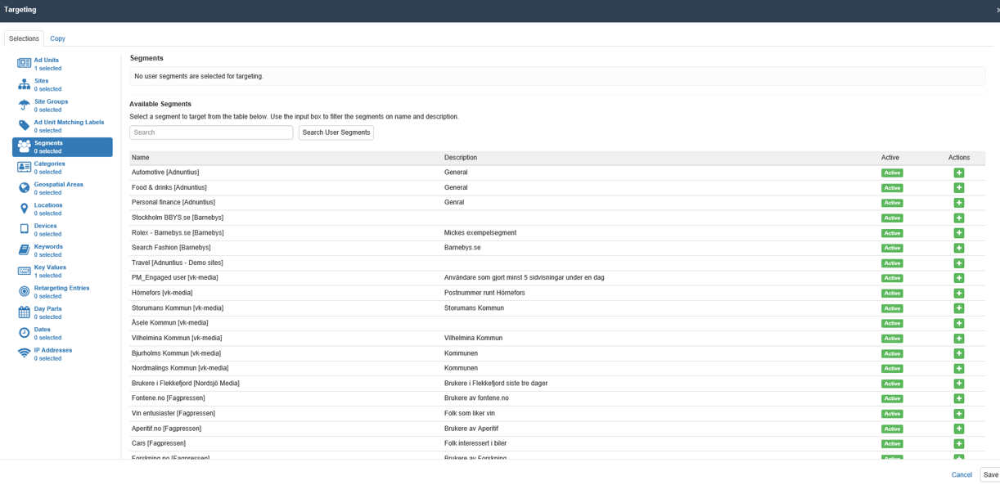
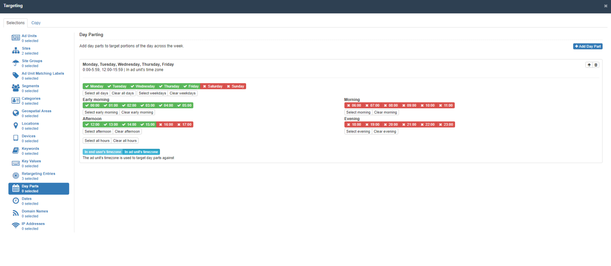
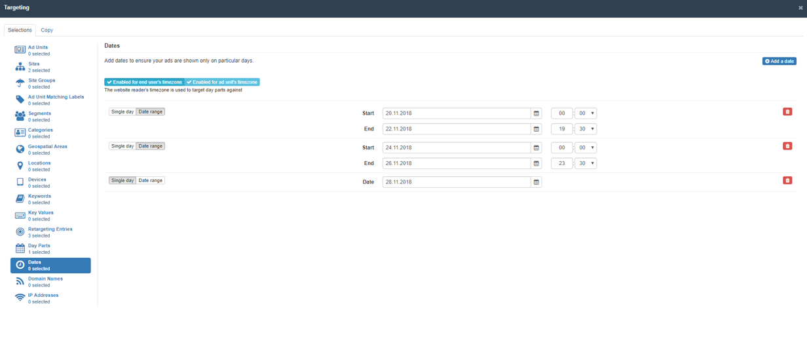
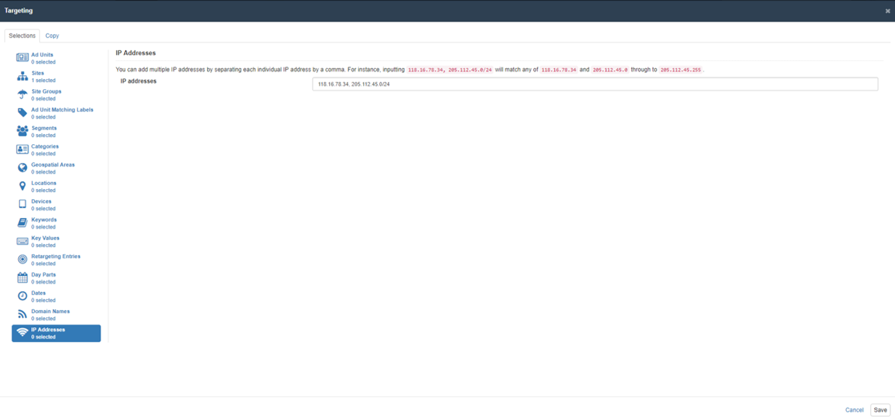

# Advertising

The Advertising section is where you manage advertisers, orders, line items, creatives and explore available inventory. You can get an introduction to advertising in this [Youtube](https://www.youtube.com/watch?v=2Wk2INyWRa4) video.

## Concept Summary

| Concept | Description |
| :--- | :--- |
| [Advertiser](advertisers.md) | Adding an Advertiser \(for instance; CocaCola\) is a natural first step when a salesperson has closed a sale with a new buyer. An advertiser can contain multiple orders. |
| [Order](orders.md) | Determines who has access to the campaign, and what set of sites that impressions can be delivered to \(see [Teams ](../admin.md#teams)for more information\). One order can contain multiple line items. |
| [Line item](line-items.md) | Determines start and end dates, delivery objectives \(impressions, clicks or conversions\), pricing, targeting, creative delivery and prioritization. One line item can contain multiple creatives. |
| Creative | The material shown to the end user. Can consist of various assets such as images, text and videos. |
| Reach analysis | An analysis you can run to quickly estimate the volume of matching traffic for a line item.  Does not consider tiers or bids, nor competing line items. |

## Line Item

A line item determines start and end dates, delivery objectives \(impressions, clicks or conversions\), pricing, targeting, creative delivery and prioritization. Here is how you create one.



**Name:** Add a name of your choice. Please note that it is always better to use spacing between words rather than underscores, as searching for items later makes the items easier to find.

**Start and end dates:** When creating a line item you can specify when you want your campaign to go live. You can also specify an end date, or you can leave this field blank \(in which case the campaign will run until you choose to stop it\). Please note that if you leave the end date open, smoothing will not work.

**Execution:** Shows the status of the campaign. "_Delivering_" means that the line item is currently delivering impressions. "_Ready to deliver_" means that no additional information is needed for the line item to deliver, but it has not yet started delivering \(for instance because the start date is in the future\). "_Not deliverabl\_e" means that no impressions are being delivered; this may be because the line item is paused, or because information like creatives or a bid is missing from the campaign. "\_Ended_" means that the line item has passed its end date, or that the objectives have been met, causing the line item to stop delivering.


If your line item has the execution state of "Not deliverable" then first check for a yellow warning box on the top of the line item page. This should give you information about what is missing. You can also try running a diagnostics check, please see further down for more information.


**State** allows you to pause or stop a campaign. "_Approved_" means that the line item will run as soon as the start date is met, all material is added, and everything is ready. "_Paused_" means that the line item won't deliver impressions, but the booked impressions are still taken into consideration when running [reach analyses](./#reach-analysis) or [forecasts](./#forecasts). "_Stopped_" means that the line item won't deliver impressions, and the booked impressions are cancelled \(so the line item will not count into any reach analyses or forecasts\).

**Objectives** allow you to specify the goal of the campaign. You canchoose one or multiple objectives. If you choose multiple objectives, then the line item will stop delivering impressions as soon as it reaches _one of its objectives_. Here are the objectives you can choose between:

* Impressions: Counted whenever an ad from the line item has been delivered by our adserver.
* Clicks: Counted whenever a user clicks on an ad. 
* Visible impressions: Counted whenever an ad has one or more pixels shown in the user's viewport.
* Viewable impressions: Counted whenever an ad has 50% or more pixels shown in the user's viewport for 1 second or longer. 
* Rendered impressions: Counted whenever an ad has been rendered onto the page. 
* Conversions: Counted whenever a conversion has happened according to how you want to define a conversion \(read more below\). 

**Type** lets you choose between "_Auction_" and "_Sponsorship_". "_Auction_" means that you will be able to set a CPM price \(cost per thousand ad impressions\), CPC price \(cost per click\) or CPA \(cost per action/conversion\), and then choose whether or not to **smooth** delivery. Enabling smoothing means that the line item will deliver impressions evenly throughout the line item's period \(does not work when the end date is left blank\). "Sponsorship" also allows you to set CPM, CPC and/or CPA prices, but instead of smoothing, you will add a Share of voice. **Share of voice** is the percentage of traffic from whatever targeted inventory that you will allow this line item to receive.


When specifying a share of voice, take into consideration the [tier ](../admin.md#tiers)into which your line item is booked. If a tier is allowed to consume 50% of traffic and is the second highest prioritized tier, then consider that a line item with share of voice 25% then these rules will apply: \(1\) your line item will only get as much traffic as is passed on from the highest tier; and \(2\) your line item will receive 25% of the 50% of traffic that your tier has been assigned with. So your line item will get 25% x 50%x \(100% - what is consumed by higher prioritized tiers\).


**Rate limits** lets you limit the delivery of a line item. if you choose to add more than one rate limit, then both limits will be added to the line item, essentially adding two restrictions on top of each other.

* _Type \(line item-wide or per user\)_: Per user means that you will limit the number of impressions or clicks per user for whatever period you set. Line item-wide means that you will limit the delivery of the whole line item.
* _Count_ lets you set the number of impressions or clicks
* _Type_ lets you choose if that number should be impressions, visible impressions, viewable impressions, rendered impressions, or clicks. 
* _Period_ lets you choose whether the X number of impressions or clicks should be per hour, day, week, month or for the line item's lifetime. 

**Targeting** lets you target the line item's impressions to specific users or content. There are many targeting criteria you can choose between, but we have tried to gather them for you here.


Any of the targeting criteria below can be added to both line items and [creatives](./#creatives). Just make sure that when you use targeting on both these levels, that they are not mutually exclusive. For instance, if I target a line item to people sitting in New York, and one of its creatives to people sitting in Miami, then I reach no people with that creative \(because no one can be in two places at the same time\).




Target select ad units, or exclude select ad units. When you target one ad unit, you make sure that your line item is shown only in this ad unit. [Learn more about ad units](../inventory/#ad-units).





Target select sites. When choosing one site, you make sure that your line item is shown only in ad units belonging to this site. [Learn more about sites](../inventory/#site).





If you have many sites, and want to save time when booking your campaigns, you can gather sites into site groups. Once you have done this you can easily target your groups of sites. [Learn more about site groups](../inventory/#site-group).





Matching labels are labels added to ad units that you can later use for targeting groups of ad units. Let's say that you add the label "sports" to three different ad units, and then target a line item to the matching label "sports". You will then target your ads to be shown in these three ad units.





Segments are groups of users that match whatever criteria you would like to set for that audience. Adnuntius has a server-side "out-of-the-box" integration to data management platform \(DMP\) partner Cxense, which means that you can easily [connect to Cxense ](../admin.md#context-service-connections)to get your segments into Adnuntius for targeting.




Would you like to consider Cxense as your DMP? Contact us at support@adnuntius.com, and we will introduce you to the DMP and get you started.



Would you like your DMP to get integrated with Adnuntius? Contact us at support@adnuntius.com, and we can discuss!




Adnuntius can read the URLs from whatever pages that ad units are deployed to. [Read more about how derive categories for category targeting from page URLs](../inventory/#ad-units). Once you've set up your ad units, you can add multiple categories by separating each individual one by a comma. For instance, inputting sport, color/blue, color/red/crimson will match any of sport, sport/ANY-VALUE-HERE, color/blue, color/blue/ANY-VALUE-HERE, color/red/crimson or color/red/crimson/ANY-VALUE-HERE. In addition, a category of golf will match any of domain.com/golf/news, domain.com/news/sport-golf-good and domain.com/news/sport\_golf\_good.



You can create a library of pre-defined categories to simplify targeting \(this way you don't have to remember or look up your site's category structure every time you want to use category targeting. [Read more about how to create a library](../admin.md#reference-data).




Geospatial targeting can be used when you want to closely manage which geographical locations are to be targeted. Simply click the polygon or rectangle icon on the right hand side of the map and start drawing.



If you want to define a default position from which you can start drawing \(for instance the area that you use the most\), you can define this in the [Admin &gt; Network section](../admin.md#network).



If you ask your users or customers for permission to track their locations, you can send this to Adnuntius for improved targeting. Out of the box, Adnuntius uses [Netacuity Pulse](https://www.digitalelement.com/solutions/netacuity-pulse/) to provide you with excellent location targeting.




Named locations lets you search for specific locations and to add them to a list locations that you want to target with your ad.



Adnuntius uses [Netacuity Pulse](https://www.digitalelement.com/solutions/netacuity-pulse/) to provide you with excellent location targeting.




Device targeting lets you target ads to specific devices. Simply choose the device types, operating systems or brands, hit "save" and your ad is targeted.

Adnuntius has access to a range of browser, hardware and platform information. If there is any data you would like us to add to the device targeting list, then feel free to send us a request on support@adnuntius.com. You can also use key value targeting \(see next tab\) to target specific devices using any of these keys:

* browserName 
* browserVendor 
* browserVersion 
* hardwareFamily 
* hardwareModel 
* hardwareName 
* hardwareVendor 
* platformName 
* platformVendor 
* platformVersion



Adnuntius uses [51Degrees Device Detection](https://51degrees.com/device-detection) to provide you with excellent device targeting.




Key values is your regular swiss army knife of targeting, as you can send any key and value to Adnuntius with any ad request. You can add multiple values for every key by separating individual values by a comma. For instance, inputting red, blue, green as values means that the key will match any of red, blue or green. [Read more about adn.js and key value targeting](http://admin.adnuntius.com/adn).

You can add key values with the boolean operators AND, OR and NOT.





Keywords are words in written text on any page where the ad is shown. Targeting a keyword therefore means that you will target an ad to any page where the keyword is part of the text. Please note that Adnuntius uses data management platform partner Cxense to power this feature, and keyword targeting will not work without a Cxense account.

You can add key values with the boolean operators AND, OR and NOT.



Are you interested in testing Cxense as a data management platform? Contact us at support@adnuntius.com and we will help you out.




Retargeting can be used to target an ad to users who have performed specific actions. For instance, you can retarget a user that have put a product in your shopping cart, but didn't actually purchase it. Or you can retarget a user who has read about sports the last 30 days.

You can add multiple values for every retargeting key by separating individual values by a comma. For instance, inputting red, blue, green as values means that the retargeting key will match any of red, blue or green.

To register targets, include the image tags in the example onto your web page. The example below registers the following three targets:

* shop with value petshop.com.au will last as a target for 2 592 000 seconds \(30 days\) 
* age with value 39 will last as a target for 5 184 000 seconds \(60 days\) 
* sport with value handball will last as a target for the default length of time \(usually 30 days\)

```text


```





Day Parting lets you choose the days and times of day that your ad should be shown. You can add multiple day parts.





You can add specific dates or ranges of dates to make sure that your line item delivers on the date that it should.





Targeting specific IP addresses can be useful, for instance when testing in a limited environment that ads look good before they are released to the whole world. You can add multiple IP addresses by separating each individual IP address by a comma. For instance, inputting 118.16.78.34, 205.112.45.0/24 will match any of 118.16.78.34 and 205.112.45.0 through to 205.112.45.255.






When you target multiple items in the same group \(for instance, multiple ad units\) your ads will be eligible to be shown in item 1, item 2, OR item N. When you target multiple groups \(for instance, one ad unit and one segment\) then your ads will only be shown when group 1 AND group 2 matches.


**Overview, charts and reports**: On the right side of an order page you will find multiple tabs that each has its function.



Provides you with insights into the line item's delivery. You can specify the period you want to look at, the metrics important to you, and how you want the data visualized. Once you have the data interesting to you, you can also download it as an Excel file. In the user interface you can also see a breakdown of each creative, and each ad unit added to the line item.





Provides you with insights into the delivery of the line item's creatives. You can specify the period you want to look at, the metrics important to you, and how you want the data visualized. Once you have the data interesting to you, you can also download it as an Excel file. You can also do the same to each creative part of the line item.





Allows you to create a report based on a [report template](../reports.md#reports-report-templates-and-report-schedules), that can be shared with others as a link. You can also schedule reports to be created regularly, and whoever should receive the reports. Once you have created a scheduled report and added a recipient, Adnuntius will automatically send reports to recipients, containing the data you have decided on using in the report template. Here you can [see a demo of how to set up automated reporting](https://www.youtube.com/watch?v=_-OEgPFBq0A&feature=youtu.be).

The report tab also gives you the audit history of the line item. This means that you can see the changes made to the line item, when they were made, and who made them.





Reach is an analysis you can run to quickly estimate the volume of matching traffic for the line item. A normal reach analysis estimates the total number of available impressions matching your targeting criteria, while an experimental analysis attempts to account for competing line items in its reach estimation. The reported numbers are a best guess only and can be incorrect for a number of subtle reasons. We recommend that you use the normal version if you only need a simple reach estimate.

A more comprehensive explanation of reach analyses and interpretation of results can be found [further down on this page](./#reach-analysis).



If you experience something wrong with the line item \(for instance, it doesn't start delivering as expected\), diagnostics is a great way to give you more insight into what might be going on. Before we explain the results you get from clicking "Run diagnostics test", let's explain what "Burn rates" tells you.

A burn rate below 100% means that Adnuntius is slowing down your line item's delivery to avoid delivering its objectives well before its end date. If you have smoothing enabled for your line item, and the line item is slightly overdelivering, then the system may slow down the burn rate to get the delivery back on track.

If you click "Run Diagnostics Test", you may get a result that looks something like this:

> * Line Item dates indicate it should be currently running.
> * Line Item has no validation warnings.
> * Located all assets for the Line Item on the CDN.
> * Team contains Ad Units with suitable dimensions
> * Line Item loses auctions for the team's site's AdUnits that it fits: check CPM and de-duplication.
> * Line Item has no limit on delivery rate.

This response can be interpreted as follows:

* If the line item's start date had been in the future or the end date had been in the past, this could have been the reason why the line item didn't deliver any impressions. However, this check tells you that the dates are not the problem.
* When there is some information missing on a line item \(for instance, if there is no creative to serve, or that the line item is paused\), then there would be a warning in a yellow box on top of the line item page. This check looks for such a warning, but in this case there is no warning, and there is no information missing from the line item. 
* The asset test checks if Adnuntius has successfully been able to find the line item's creative material on our CDN. If you ever see a warning here, try to re-create your creatives, and if that does not work, contact us at support@adnuntius.com.
* The ad unit test checks if \(1\) there are ad units with the appropriate width and height that can serve one of the creatives, and \(2\) that those ad units' parent sites belong to a team that matches the order \(remember - an order is always placed on a team which in turn accesses a set of sites; so if the line item targets a totally different set of sites \(and therefore ad units\), the line item will serve no impressions. 
* The auction test checks if the line item has a chance of winning impressions, considering the competition from other line items. When all things else are equal, it is the eCPM bid of the line items that determines which one will get the impression. If a warning like the above appears, try to either \(1\) increase the bid of the line item, or \(2\) decrease the bid of or pause the competing line items.
* The last test checks if the line item is held back due to smoothing. If this warning kicks in then try to turn off smoothing to check if this starts the delivery.


You can also [run diagnostics for ad units](../inventory/#ad-units) if you wonder what ad would win an auction for a given ad unit.



You can also add ?adndebug123 at the end of any URL \(example: [www.aperitif.no?adndebug123](https://www.aperitif.no/?adndebug123)\) to show you all ad units, line items, creatives, targeting and more information in the context of a webpage.




## Creatives

Creatives is the material shown to the end user, and can consist of various assets such as images, text and videos. Here is how to work with creatives.


**Name and state**: Give the creative a name of your choice \(It is always better to use spacing between words rather than underscores, as searching for items later makes the items easier to find\). Adnuntius will always generate a default name, but you can [change how this default naming is set in the Admin &gt; Network section](../admin.md#network). State can be set to _Approved_ \(meaning that the creative is ready to run\) or _Incomplete_ \(meaning that something needs to be changed or added before the creative can run\).

**Creative type** can be set to _Internal_ or _External._ Internal is what is mostly used, and means any creative you are designing or uploading yourselv. External creatives are relevant to publishers who want programmatic ads on their sites, and means creatives that are fetched from SSPs that Adnuntius is integrated to, such as Pubmatic. The tabs below shows how to set up an external creative, while the rest of this section is about creating internal creatives.



After choosing Creative type "External", the first step is to select your external demand source. Please note that if you haven't set this up yet, you will need to do so by first [adding an external demand source](../admin.md#external-demand-sources), and then [creating external ad units](../inventory/#external-ad-unit).





If you want to target your programmatic creative to specific ad units, you can use external ad unit targeting. Please note that if you haven't created external ad units yet, [you can learn how to do so here](../inventory/#external-ad-unit).





**Layout** is where you add the look, feel and behavior of your creative. Adnuntius comes with an out-of-the-box library of layouts like responsive images, interstitials, Flash, HTML and more, but you can create any layout to create the perfect match with your website, using elements like media files, text and click URLs. [Learn how to manage layouts](../admin.md#layouts).


When you choose a layout you will see that the "Layout's components" box changes. This is because different layouts may need different information \(multiple images, text input, or anything else your heart desires\). The system will ask you what it needs to assemble the creative.


**Uploaded assets** is where you upload the files needed to assemble the creative. You can click to upload, or drag and drop. You can also drag and drop multiple files into the file drop field, and get all files into the creative with one move.

**Share of voice:** if you have more than one creative on your line item, you can control delivery of this creative compared to others in the line item by giving it a percentage. If you give two creatives 50% each, then the line item will ensure that each creative delivers the same number of impressions. If you give three creatives 50% each, then each creative will get 33% of the impressions.

**Targeting:** You can add targeting to both the line item and your creative. As the targeting criteria are identical for both, please have a look at the [line item documentation](./#line-item) to see how you can target creatives.

**Width x Height** means the dimensions of your creative. These dimensions are only used to find out which ad units are eligible to show this creative. An ad unit will always be set up with minimum and maximum width and height, and if an ad unit can only show 980x300 pixels, then a creative with added dimensions 980x150 will not show in this ad unit.

**Creative preview** gives you a preview of the creative. Please note that not all layouts will give you a preview \(in which case the system will tell you\). But if Adnuntius cannot give you a preview, you can click to "preview on a black page" and the creative will render as it will be shown on a page.


You can also generate previews from the line item page by clicking the small eye next to the creative name. From there you can choose to preview the creative on a blank page, or if you want to generate a URL. When you generate a URL, Adnuntius will attempt to serve the creative into all eligible ad units on whatever URL you added.


**Creative tag**: As a marketer, or a publisher that for any reason wants to market an Adnuntius creative through a third party adserver, this is the place to generate a code that can be sent off to the publisher that owns that adserver.

## Reach analysis

Reach is an analysis you can run to quickly estimate the volume of matching traffic for a line item. Here is how to manage reach analyses.


**Line item** allows you to choose a line item from which you want to copy the details \(targeting criteria and creative sizes\). This means that you can quickly fill in the details of the reach analysis by choosing a representative line item first.


If you have packages you often sell \(for instance ad products consisting of set sizes or targeting criteria, then you should consider creating a template line item for each of these packages. Once you have done that, then simply copy the details from the template line item into the form each time you want to quickly run an analysis.


**Details to fill in:** If you choose not to use another line item as a template, then you can fill in the intended start date, end date, team, creative sizes and targeting criteria.

**Interpreting the results:** Let's say that you run a reach analysis, and then get a response like this:

> Audience estimated to match **88.46%** of all traffic across your network. A line item could deliver between:
>
> * **17 342 539** and **17 564 062** impressions
> * **16 047 479** and **16 260 853** rendered impressions
>
> Of those impressions above, between **443 047** and **517 135** impressions would face no competition from other line items.

88.46% means that, with the ad units and targeting you provided, you will reach 88.46% of all the ad impressions you can serve with Adnuntius. Furthermore, you will see the range of impressions and rendered impressions you will be able to serve. Lastly, you will see that with only 443 047 to 517 135 impression being without competition from other line items, there are certainly competitors for the impressions you are trying to book for the line item. These competitors are listed in the reach analysis result too. In the list you will find the overlap, so that you can see which campaigns you can make changes to in order to free up more space.

