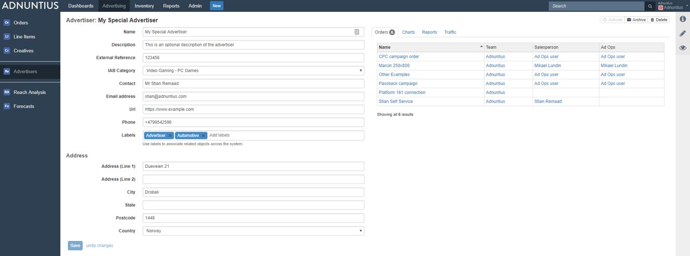
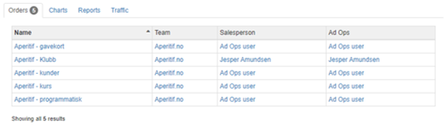
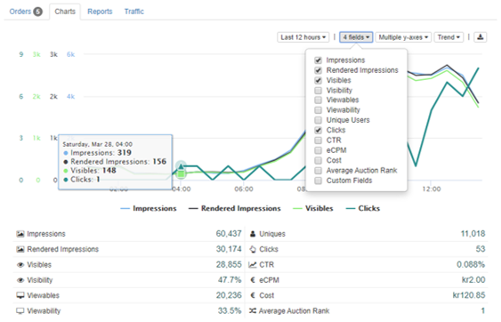
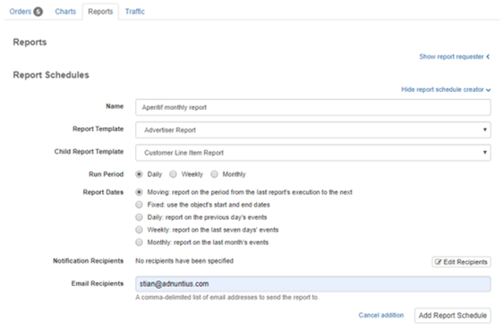
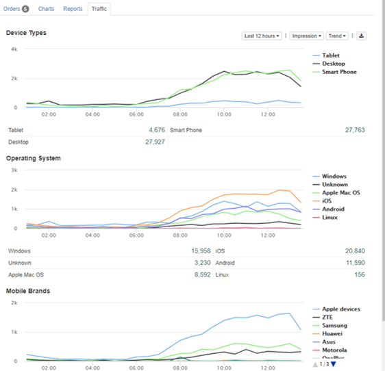

# Advertisers



**Name, description and contact information:** Add a name, an optional description of your choice and the contact information to the advertiser \(optional\). It is always better to use spacing between words rather than underscores, as searching for items later makes the items easier to find.


Adnuntius Advertising can be used by direct advertisers also. If you are the only advertiser using the account, then you can just add yourself as an advertiser, and think of this section no more.


**External reference:** Add an external reference \(optional\) if you want to match the advertiser with the same client in another system. For instance, if Coca Cola is registered in your invoicing system with customer ID 123456, then you may want to add 123456 as an external reference in Adnuntius. This way you can easily recognize two different entries as the same advertiser across two different systems, which may in turn speed up processes like invoicing.

**IAB category:** Adding an IAB category to the client allows you to group advertisers together. Once you've added a category you can send impressions, clicks and conversions to for instance your DMP, and then create segments based on users who responded to your campaigns and their categories.

**Labels** can be added to make reporting work for you. Let's say you add the label "agency" to a set of advertisers, and then want to run a report only for this group of advertisers. You can then run a report which filters on these advertisers specifically. [Read more about reports. ](../reports/advertising-queries.md)

Once an advertiser is created you will see the following in the right side tabs. 



The order tab gives you an overview of the orders belonging to this advertiser. 




Charts lets you see the performance of all campaigns belonging to this advertiser.




Once an advertiser is created, you can also generate reports, and scheduled reports, based on any of your report templates. To create a scheduled report, just add a name, the report template, the run period and dates, and the receivers. 




Under the traffic tab you can find reports splitting the traffic for this advertiser by device types, operating systems and mobile brands.




