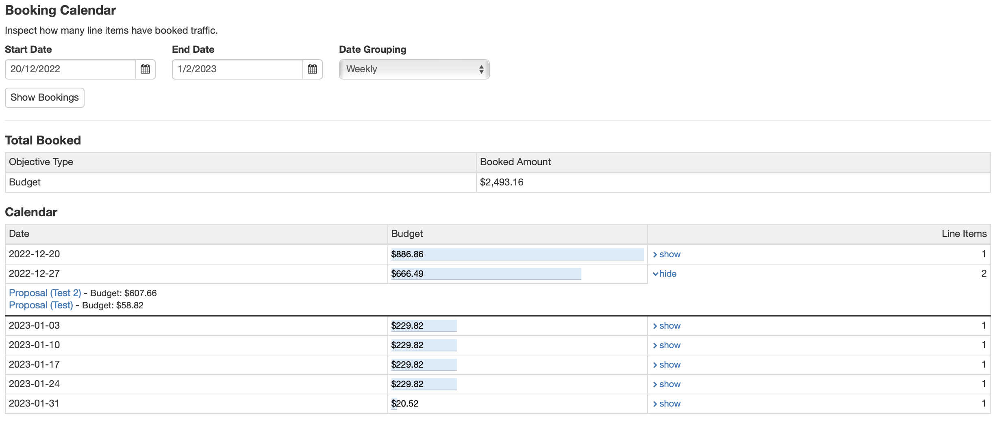

# Booking Calendar

To use the [**Booking Calendar**](https://admin.adnuntius.com/booking-calendar), chose a start and end date for the period you would like to see how many line items have booked traffic and select if you want to group your results by day, week or month.

<figure><figcaption></figcaption></figure>
