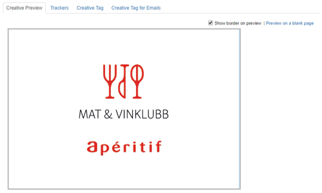
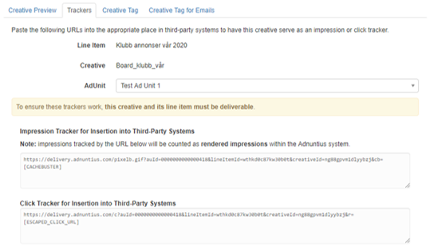
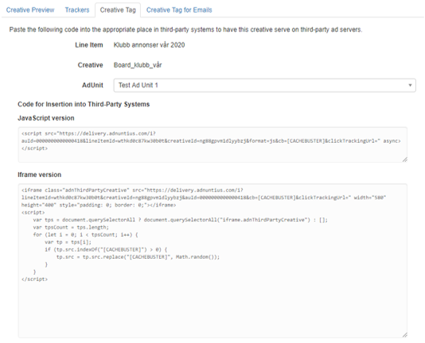
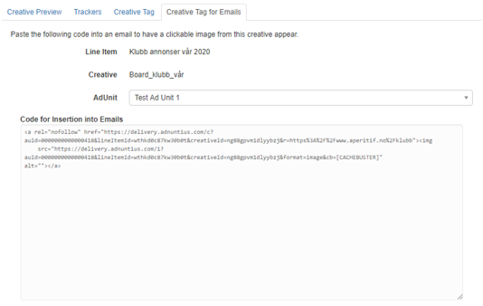

# Creatives

**Name and state**: Give the creative a name of your choice. You can also set up rules for how names should be generated automatically under [Network](../admin/#network). State can be set to _Approved_ \(meaning that the creative is ready to run\) or _Incomplete_ \(meaning that something needs to be changed or added before the creative can run\).

**Creative type** can be set to _Internal_ or _External._ Internal is what is mostly used, and means any creative you are designing or uploading yourself. External creatives are relevant to publishers who want programmatic ads on their sites, and means creatives that are fetched from SSPs via prebid or one of our server-side integrations. The tabs below shows how to set up an external creative, while the rest of this section is about creating internal creatives.



After choosing Creative type "External", the first step is to select your external demand source. Please note that if you haven't set this up yet, you will need to do so by first [adding an external demand source](../admin/#external-demand-sources), and then [creating external ad units](../inventory/#external-ad-unit).




If you want to target your programmatic creative to specific ad units, you can use external ad unit targeting. Please note that if you haven't created external ad units yet, [you can learn how to do so here](../inventory/#external-ad-unit).




**Layout** is where you add the look, feel and behavior of your creative. Adnuntius comes with an out-of-the-box library of layouts like responsive images, interstitials, HTML and more, but you can create any layout to create the perfect match with your website, using elements like media files, text, choices and click URLs. [Learn how to manage layouts](../admin/#layouts).


When you choose a layout you will see that the "Layout's components" box changes. This is because different layouts may need different information \(multiple images, text input, or anything else your heart desires\). The system will ask you what it needs to assemble the creative.


**Uploaded assets** is where you upload the files needed to assemble the creative. You can click to upload, or drag and drop. You can also drag and drop multiple files into the file drop field, and get all files into the creative with one move.

**Share of voice \(optional\):** if you have more than one creative on your line item, you can control delivery of this creative compared to others in the line item by giving it a percentage. If you give two creatives 50% each, then the line item will ensure that each creative delivers the same number of impressions. If you give three creatives 50% each, then each creative will get 33% of the impressions.

**Targeting:** You can add targeting to both line items creatives. [Read all about targeting here](targeting.md). 

**Width x Height** means the dimensions of your creative. These dimensions are only used to find out which ad units are eligible to show this creative. An ad unit will always be set up with minimum and maximum width and height, and if an ad unit can only show 980x300 pixels, then a creative with added dimensions 980x150 will not show in this ad unit.

Under width and height you have multiple choices; here are explanations of each. 



**Creative preview** gives you a preview of the creative. Please note that not all layouts will give you a preview \(in which case the system will tell you\). But if the user interface cannot give you a preview, you can click "preview on a black page" and the creative will render as it will be shown on a page.


You can also generate previews from the line item page by clicking the small eye next to the creative name. From there you can choose to preview the creative on a blank page, or if you want to generate a URL. When you generate a URL, Adnuntius will attempt to serve the creative into all eligible ad units on whatever URL you added.




You can easily generate impression trackers and click trackers, so that you can paste the resulting URLs into the appropriate place in third-party systems to have this creative serve as an impression or click tracker. Just choose the ad unit you want to use, and the trackers are automatically created.




If your creative is going to be served by a third party system, then you can generate a creative tag that can be pasted into the appropriate place in third-party systems to have this creative serve on third-party ad servers. Just choose the ad unit you want to use, and the tag is automatically created.




You can also create tags for emails if this creative is going to be served inside emails. Just choose the ad unit you want to use, and the tag is automatically created.

Please note that if you want an email tag that can serve ANY creative \(not just this specific creative\), you can do so under [Ad units](../inventory/adunits-1.md). 




