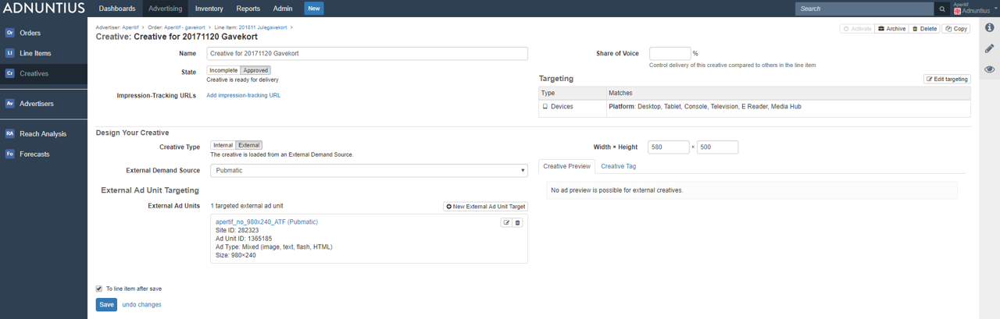

# Creatives


How to create a creative.


There are different places in Adnuntius from where to create a creative, depending on your needs and preferences. Here are the differences.

| From where?              | A line item                                                                                                                 | Creatives overview                                                                                                                    | Library creatives                                                                                                                                                     |
| ------------------------ | --------------------------------------------------------------------------------------------------------------------------- | ------------------------------------------------------------------------------------------------------------------------------------- | --------------------------------------------------------------------------------------------------------------------------------------------------------------------- |
| Where to find it?        | On each line item, click “new creative” or “copy another creative” to create a new creative from another existing creative. | On the creatives overview page: [https://admin.adnuntius.com/creatives](https://admin.adnuntius.com/creatives).                       | On the library creatives overview page: [https://admin.adnuntius.com/library-creatives](https://admin.adnuntius.com/library-creatives).                               |
| Bulk upload available?   | No.                                                                                                                         | Yes.                                                                                                                                  | Yes.                                                                                                                                                                  |
| Assigned to a line item? | Automatically assigned to the line item from which you clicked to create.                                                   | Optional; can be assigned to a line item when creating, or left without a line item.                                                  | Library creatives are not assigned to line items, only to Teams.                                                                                                      |
| Who has access?          | Anyone with access to the team that the line item’s order belongs to.                                                       | If assigned to a line item; anyone with access to the team that the line item’s order belongs to. If unassigned; only you personally. | If assigned to a team; anyone with access to that team. If unassigned; only you personally.                                                                           |
| How are stats recorded?  | Uniquely; if a creative is copied then those two will exist individually and record stats separately.                       | Uniquely; if a creative is copied then those two will exist individually and record stats separately.                                 | No stats are collected to library creatives; but if you copy a library creative to a creative assigned to a line item, then that creative will record stats as usual. |


Read more about library creatives [here](library-creative.md).


## Creating a Single Creative

After you have clicked to create a new creative (from the line item, or by clicking "new" in the upper right corner from the creative overview page or library creative overview page), give your creative a **name** of your choice.&#x20;

You can set the **state** of a creative to approved, incomplete or paused.&#x20;

* Approved means that it will start delivering as soon as the necessary assets as described below are added to the creative and the line item is set to deliver.
* You can set the creative to Incomplete to prevent it from delivering, and to signal to yourself and colleagues that more information or material needs to be added before the creative is approved.
* You can set the creative to Incomplete to prevent it from delivering, even though all necessary assets and information is added to the creative.&#x20;


**Impression tracking URLs** can be added to ensure that third party systems can track the impressions in the same way as Adnuntius can. Impression tracking URLs are provided by the advertiser or whoever controls the access to that third party system. Please note that some third party systems will deliver an impression tracker as an image tag, such as the one below.

```markup

```

If this is the case, you can paste in the URL within this pixel; for example:

```http
http://track.adform.net/adfserve/?bn=12345678;1x1inv=1;srctype=3;ord=[timestamp]
```

**Creative type** can be set to _Internal_ or _External._ External creatives are relevant only to publishers who want programmatic ads on their sites, and means creatives that are fetched from SSPs via prebid or one of our server-side integrations. The tabs below shows how to set up an external creative, while the rest of this section is about creating internal creatives.



After choosing Creative type "External", the first step is to select your external demand source. Please note that if you haven't set this up yet, you will need to do so by first [adding an external demand source](../admin/context-services.md), and then [creating external ad units](../inventory/external-adunits.md).





If you want to target your programmatic creative to specific ad units, you can use external ad unit targeting. Please note that if you haven't created external ad units yet, [you can learn how to do so here](../inventory/#external-ad-unit).





**Layout** specifies the file types and properties, and the types of formats ("look and feel") that you can serve with your campaign. When you select a layout, Adnuntius will tell you what information is needed for the creative. For example, if you choose a layout called "Image" then Adnuntius may ask you for an image file with a max size restriction, and a click URL.&#x20;


If your user has access to create layouts, [here is how you do it](../design/layouts.md).


**Uploaded assets** is where you upload the files needed to assemble the creative. You can click to upload, or drag and drop. You can also drag and drop multiple files into the file drop field, and get all files into the creative with one move.

If you have more than one creative on your line item, you can put a **share of voice** on the creatives to control delivery of this creative compared to others in the line item. If you give one creative 33% and the other 66% then one creative will have double the weight (attention) compared to the other. If you leave the field blank, then no creative will be prioritized more than the other.&#x20;

You can add **targeting** to both line items **** and creatives. To learn about targeting, please [see the targeting documentation](targeting.md).

**Width and Height** means the dimensions of your creative. These dimensions are only used to find out which ad units are eligible to show this creative. An ad unit will always be set up with minimum and maximum width and height, and if an ad unit can only show 980x300 pixels, then a creative with added dimensions 980x150 will not show in this ad unit.

## Creative Bulk Uploads

We want to make it easy and fast for our customers to create campaigns. One of the tasks we know can be time consuming is uploading and preparing creative material, which is why we created bulk upload for creatives. Bulk upload makes it easy to drag and drop images, html files and files containing third party tags, to create multiple creatives at the same time.

To upload creatives in bulk go to the creatives page, or the library creatives page, both under the Advertising section in Adnuntius. In the upper right corner, click "bulk upload".

Choose the type of creatives that you want to upload. You can choose between images, third party, and html. Then, click to upload your creatives or drag and drop your creative files in one move into the upload window. Please note that if you have an excel or CSV file with multiple third party creatives, you can drag and drop that file.


You should now arrive at a new page where you can make changes to the creatives as needed.

* Apply a line item if you already have a line item that these creatives should be assigned to. Click "copy to others" if all creatives you are currently managing should be assigned to the same line item. If you do not assign a line item then the creatives will be retrievable from the creative or library creative overview page.
* You can make any changes to the names of the creatives as you wish.
* You can change the layout of the creatives, and click "copy to others" to make that change apply to all creatives you are uploading.
* Assign or check the width and hight of the creative.
* The remaining fields depend on the layout, and will change depending on the creative you want to create.

When you have clicked to save a creative you can make changes to each creative according to the documentation above.&#x20;


## When a Creative is Created

When a creative is created you will have access to the following resources.

### Statistics

Creative charts provide you with insights into the creative's delivery. You can specify the period you want to look at, the metrics important to you, and how you want the data visualized. Once you have the data interesting to you, you can also download it as an Excel file.


### Creative Preview

Creative preview gives you a preview of the creative. Please note that not all layouts will give you a preview (in which case the system will tell you). But if the user interface cannot give you a preview, you can click "preview on a black page" and the creative will render on a blank page, as it will be on a live page.


### Trackers

You can easily generate impression trackers and click trackers so that you can ask third party, so that you can paste the resulting URLs into the appropriate place in third-party systems to have this creative serve as an impression or click tracker. Just choose the ad unit you want to use, and the trackers are automatically created.


### Creative Tag

If your creative is going to be served by a third party system, then you can generate a creative tag that can be pasted into the appropriate place in third-party systems to have this creative serve on third-party ad servers. Just choose the ad unit you want to use, and the tag is automatically created.


### Creative Tag for Emails

You can also create tags for emails if this creative is going to be served inside emails. Just choose the ad unit you want to use, and the tag is automatically created.

Please note that if you want an email tag that can serve ANY creative (not just this specific creative), you can do so under [Ad units](../inventory/adunits-1.md).


