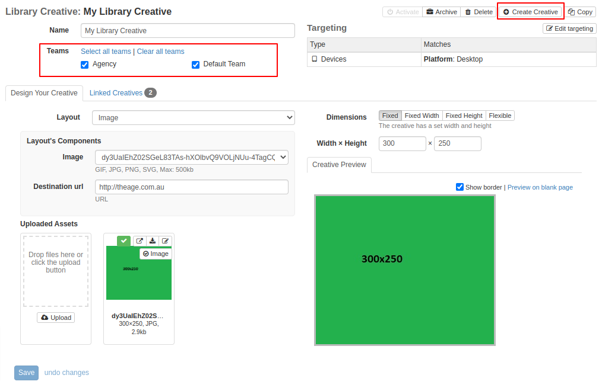

# Library Creatives

Library Creatives enable the same creative design to be used across multiple line items, all of which are editable via the Library Creative.

An extra bonus is that an individual Creative that is linked to a Library Creative can override specific elements from the Library Creative's design yet still be tied to it. 

## How to Work With Library Creatives

Library Creatives are created in much the same way as a [Creative](creatives.md).

Two differences are setting up what Teams have access to a Library Creative and the ability to create Creatives based off the Library Creative.

