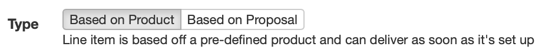
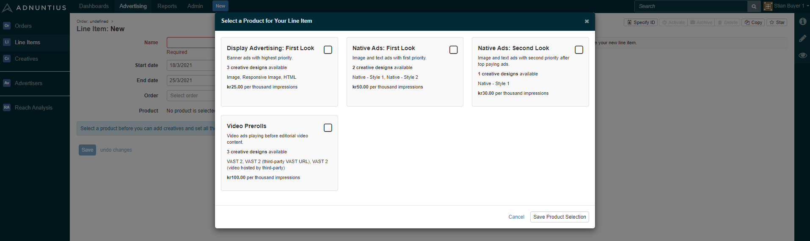

# Line Items

A Line Item belongs to an Order, and can contain multiple Creatives as its children. To understand the organization of advertising objects, [see here](./).

## Creating a Line Item

To create a line item go to [https://admin.adnuntius.com/line-items](https://admin.adnuntius.com/line-items) and click "new" in the upper right corner. First, give your line item a **name** of your choice.


Please note that, depending on your privileges, some of the elements explained on this page may not be visible to you. For any questions, contact us at support@adnuntius.com.


Give the line item a **start and end date and time**. If you choose not to provide an end date the line item will continue delivering until you pause or stop it. Please note that [smoothing ](smoothing.md)will not work if no end date is set.&#x20;

In order for a line item to run, it needs to be assigned to an **Order**.&#x20;

If your user is the role of a Marketplace Advertiser, then you will see the object "**Type**" and you may be asked to choose between "**Based on Product** (Line item is based off a pre-defined product and can deliver as soon as it's set up)" or "**Based on Proposal** (Line item is based off your own proposal and will require publishers approval to deliver)".&#x20;

<figure><figcaption></figcaption></figure>

_- Please note that this step does not apply to administrators or other user roles. -_

If you select the line item to be based on a "**Product**" you may be asked to choose one or have the option to update and change the pre-selected product. A [Marketplace Product](../design/marketplace-products.md) allows certain users to package layouts, price conditions and targeting criteria into a product, and make it available to one or more Marketplace Advertisers.

If you select the line item to be based on a "**Proposal**" you need to select one ore more sites that belong to the same publisher. A Line Item Proposal allows a marketplace advertiser to build their own proposal with start and end dates, delivery objectives (impressions, clicks or conversions), pricing and targeting. The line item will be submitted to the publisher for approval before it can deliver.

<figure><figcaption>
If you're a Marketplace Advertiser you will be asked to select one ore more sites.
</figcaption></figure>

The line item's **delivery** shows you certain information about the line item's status.&#x20;

* "_Delivering_" means that the line item is live and currently delivering impressions.
* "_Ready to deliver_" means that no additional information is needed for the line item to deliver, but it has not yet started delivering any impressions (for instance because the start date is in the future). If your line item remains in this state when it should have started delivering, have a look at these [common reasons](../../../other-useful-information/faq.md#my-line-item-state-is-ready-to-deliver-but-it-wont-start-why). You can also run a diagnostics test by clicking the "diagnostics" tab on the line item.&#x20;
* "_Not deliverable"_ means that no impressions can be delivered, either because something is missing (such as a bid or a valid creative) or because the line item is paused or stopped. To see what is missing, look for a yellow warning at the top of the line item page. You can also run a diagnostics test by clicking the "diagnostics" tab on the line item.&#x20;
* _"Ended"_ means that the line item has passed its end date, or that the objectives have been met, causing the line item to stop delivering.

The system will also provide the following information:&#x20;

* _"Healthy"_ means that, with the current delivery velocity, the line item will deliver the set objectives by the end date.&#x20;
* _"Over-delivering: 30%"_ means that, with its current velocity, the line item will overdeliver (in this example by 30%) or stop before its end date. You can change this by setting smoothing to "even" or "frontloaded" to make Adnuntius pace the delivery of impressions. You may also see the message _"heavy smoothing applied"_, which means that Adnuntius has discovered the over-delivery and has taken steps to slow down and pace the delivery.
* _"Under-delivering: 30%"_ means that, with its current velocity, the line item will underdeliver (in this example by 30%) by the end date. This most commonly occurs when there is insufficient traffic under the current targeting on the line item, and/or when there are many line items competing for the same attention.&#x20;

You can change the campaign's **state**.&#x20;

* _"Reserved"_ means that the line item will not deliver any impressions, but its booked traffic will be considered when running [reach analyses](reach-analysis.md).
* "_Approved_" means that the line item will start delivering impressions as soon as the line item is _ready to deliver_.
* "_Paused_" means that the line item won't deliver impressions, but the booked impressions are still taken into consideration when running reach analyses.&#x20;
* "_Stopped_" means that the line item won't deliver impressions, and the booked impressions are cancelled (so the line item will not count into any reach analyses).

The two states "Proposed" and "Submitted" are used in self-service advertising where you want to quality approve campaigns before they go live (for instance, to check that they do not contain illegal or offensive content).


If you are interested in self-service advertising, reach out to us anytime at [support@adnuntius.com](mailto:support@adnuntius.com) and we will help you out.


**Objectives** allow you to specify the goal of the campaign. You can choose one or multiple objectives. If you choose multiple objectives, then the line item will stop delivering impressions as soon as it reaches _one of its objectives_. Here are the objectives you may choose between:

* Budget: Stops the line item when the budget has been reached.&#x20;
* Impressions: Counted whenever an ad from the line item has been delivered by our adserver.
* Clicks: Counted whenever a user clicks on an ad.
* Visible impressions: Counted whenever an ad has one or more pixels shown in the user's viewport.
* Viewable impressions: Counted whenever an ad has 50% or more pixels shown in the user's viewport for 1 second or longer.
* Rendered impressions: Counted whenever an ad has been rendered onto the page (rendering can be controlled with lazy requesting or lazy loading).
* Conversions: Counted whenever a conversion has happened according to how you want to define a conversion (read more below).

**Bids** and **bid strategy** lets you choose how much and how to bid.&#x20;

* _Standard_ means that the line item will bid whatever CPM bid you set on the campaign. If you set 5 EUR as a bid, the line item will bid just that.&#x20;
* _vCPM_ means that the bid will be adjusted to the historical viewability of the request. If you bid 5 EUR but the likely viewability is 80%, then the bid will be adjusted in this one example to 5 x 80% = 4 EUR.&#x20;
* _Dynamic bidding_ dynamically adjusts impression bids up to the provided maximum CPM, to optimise the budget spend. If you bid 5 EUR this means that the system will never bid more than 5 EUR, but will potentially bid lower as long as it doesn't affect the line item's objectives.

**Type** lets you choose between Auction and Sponsorship. "_Auction_" means that the line item will compete with other line items based on your line item's bid (CPM, CPC or CPA). All bids will be converted to eCPM before the auction takes place. With the Auction model you can enable or disable [smoothing](smoothing.md), which means that (when enabled) the line item's impressions will be delivered evenly throughout the campaign period.

_"Sponsorshop"_ means that, rather than running an auction, you can give the line item a share of voice as a percentage. For example, if you give your line item 25% share of voice, this line item will get 25% of the traffic that is targeted to the line item (if you for instance choose an ad unit as targeting, the line item will get 25% of this ad unit's available traffic). Please note that when you choose Sponsorship, the CPM pricing will be disregarded when the system chooses an ad.


When specifying a share of voice, take into consideration the [tier](../admin/tiers.md) into which your line item is booked. If a tier is allowed to consume 50% of traffic and is the second highest prioritized tier, then consider that a line item with share of voice 25% then these rules will apply: (1) your line item will only get as much traffic as is passed on from the highest tier; and (2) your line item will receive 25% of the 50% of traffic that your tier has been assigned with. So your line item will get 25% x 50%x (100% - what is consumed by higher prioritized tiers).


**Smoothing** lets you control the pacing of ad delivery. You can choose between "ASAP", "Even" and "Frontloaded". See the [smoothing](smoothing.md) page for more detail.

**Capping** lets you limit the delivery of a line item. if you choose to add more than one rate limit, then both limits will be added to the line item, essentially adding two restrictions on top of each other.

* _Type (line item-wide or per user)_: Per user means that you will limit the number of impressions or clicks per user for whatever period you set. Line item-wide means that you will limit the delivery of the whole line item.
* _Count_ lets you set the number of impressions or clicks
* _Type_ lets you choose if that number should be impressions, visible impressions, viewable impressions, rendered impressions, or clicks.
* _Period_ lets you choose whether the X number of impressions or clicks should be per hour, day, week, month or for the line item's lifetime.

**Targeting** lets you direct the line item's impressions to specific users or content. There are many targeting criteria you can choose between, so [we have set aside a different page for this](targeting.md). You can apply this targeting to both line items and creatives. Just make sure that when you use targeting on both these levels, that they are not mutually exclusive. For instance, if you target a line item to people sitting in New York, and one of its creatives to people sitting in Miami, then you reach no people with that creative (because no one can be in two places at the same time).


Please note that you do not have to add targeting to both line items and creatives, unless you need to further narrow the reach of a creative from the targeting applied to the parent line item.


When you target multiple items in the same group (for instance, multiple ad units) your ads will be eligible to be shown in item 1, item 2, OR item N. When you target multiple groups (for instance, one ad unit and one segment) then your ads will only be shown when group 1 AND group 2 matches.

You can upload **creatives** to the line item, or copy creatives from other line items. To learn more about creatives, [see the creatives documentation page](creatives.md).&#x20;

**Tiers** let you prioritize this line item above or below other line items. If more than one line item exists within one tier, then those line items will compete for attention according to the _Type_ set above. If you have set the type to "auction" then the line items will compete on eCPM pricing, while if you set the type to "sponsorship" then the share of voice is set by the percentage. To create and re-arrange tiers, please see [tiers](../admin/tiers.md).

**Companion creatives** let you determine if each creative should be delivered individually, or if they should be served at the same time. This enables you to create for instance so-called "horse shoe ads", where two skyscrapers and a top banner are always shown at the same time, or not at all. You can choose between the following settings:&#x20;

* Off: Each creative will be delivered individually.
* Any: At least one creative, possibly more or all, will be shown at the same time across multiple ad units that match this line item.
* Multiple: At least two creatives, possibly more or all, will be shown at the same time across multiple ad units that match this line item.
* All: Each creative is shown at the same time across multiple ad units or not at all.

**Creative delivery** allows you to determine whether creatives can be served multiple times on the same page, or if restrictions should apply. "Open" means that the same creative can be delivered multiple times one the same page. "Unique" means that no same creative from this line item can be delivered one the same page. And "one per line item" means that maximum one creative from this line item can be delivered one the same page.

**Creative weighting** lets you control whether the creatives uploaded to your line item should be shown with equal frequency ("Equal"), or if the creatives that receive more clicks should be shown more frequently. Adnuntius measures the clickrate of each creative, and if one creative provides better clickrate then the system will show more of that creative and less of the others. This weighting will however not affect any objectives you set; if you for instance set a line item to deliver 1,000,000 impressions, this weighting does not put that objective into risk.

CPM cost calculation lets you determine if the line item should define CPM based on impressions or rendered impressions. The following choices are available:

* Use [the network's default method](../admin/network.md) of calculating CPM advertising costs.
* By impressions: Calculate advertising costs as CPM × impressions ÷ 1000.
* By rendered impressions: Calculate advertising costs as CPM × rendered impressions ÷ 1000.

**Exclusion labels** allow you to ensure that defined line items cannot be delivered on the same page. This can be useful if you for instance have two car dealers that do not want to be shown together. In this case you can add the label "car-dealer" to both line items, which means that these two line items will never be shown on the same page.


Please note that in order for companion creatives, creative delivery and exclusion labels to work, ad units must be deployed to the publisher's page according to the [Multi adn.request Calls](broken-reference/) guidelines.


**Labels** let you add labels to a line item to make it easier to search for, and to group line items together in reporting. To learn more about reports, please see the [reports section](../reports/).

## When a Line Item is Created

When a Line Item is created you will be able to see the following tabs.

### Line Item

The line item tab shows you how the line item is delivering. You can specify the period you want to look at, the metrics important to you, and how you want the data visualized. Once you have the data interesting to you, you can also download it as an Excel or CSV file. In the user interface you can also see a breakdown of each creative, and each ad unit added to the line item.

### Creatives

The creaties tab shows you how each of the line item's creatives delivers. You can specify the period you want to look at, the metrics important to you, and how you want the data visualized. Once you have the data interesting to you, you can also download it as an Excel file. You can also do the same to each creative that is part of the line item.

### Reports

The Reports tab lets you create a report based on a [report template](../reports/reports-templates-and-schedules.md), that can be shared with others as a link. You can also schedule reports to be created regularly, and whoever should receive the reports. Once you have created a scheduled report and added a recipient, Adnuntius will automatically send reports to email recipients, containing the data you have decided on using in the [report template](../reports/reports-templates-and-schedules.md).

The report tab also gives you the audit history of the line item. This means that you can see the changes made to the line item, when they were made, and who made them.

.png>)

### Articles

This tab gives you a breakdown of delivery per article. This can be particularly useful when using semantic and/or keyword targeting, to understand which articles display your ad more often. You can also click the cog wheel symbol to target or exclude an article.&#x20;

<figure><figcaption></figcaption></figure>

### Traffic

The traffic tab shows you the delivery of impressions, clicks, viewables and visible impressions across the line items belonging to this line item.

### Location

The location tab gives you the traffic to the line item broken down by country.

### Reach

Reach is an analysis you can run to forecast the volume of matching traffic for a line item. A reach analysis estimates the total number of available impressions, clicks, viewable impressions and more that match your targeting criteria. Please see [Reach Analysis](reach-analysis.md) for more information on how to read the results.

.png>)

### Diagnostics - Tests

If you experience something wrong with the line item (for instance, it doesn't start delivering as expected), diagnostics is a great way to give you more insight into what might be going on. Before we explain the results you get from clicking "Run diagnostics test", let's explain what "Burn rates" tells you.

A burn rate below 100% means that Adnuntius is slowing down your line item's delivery to avoid delivering its objectives well before its end date. If you have [smoothing](smoothing.md) enabled for your line item, and the line item is slightly overdelivering, then the system may slow down the burn rate to get the delivery back on track.

If you click "Run Diagnostics Test", you may get a result that looks something like this:

<table><thead><tr><th width="240.44738649828076">Diagnostics example</th><th width="443.5867132161395">Explanation</th></tr></thead><tbody><tr><td>Line Item dates indicate it should be currently running.</td><td>If the line item's start date had been in the future or the end date had been in the past, this could have been the reason why the line item didn't deliver any impressions. However, this check tells you that the dates are not the problem.</td></tr><tr><td>Line Item has no validation warnings.</td><td>When there is some information missing on a line item (for instance, if there is no creative to serve, or that the line item is paused), then there would be a warning in a yellow box on top of the line item page. This check looks for such a warning, but in this case there is no warning, and there is no information missing from the line item.</td></tr><tr><td>Located all assets for the Line Item on the CDN.</td><td>The asset test checks if Adnuntius has successfully been able to find the line item's creative material on our CDN. If you ever see a warning here, try to re-create your creatives, and if that does not work, contact us at support@adnuntius.com.</td></tr><tr><td>There are Ad Units with suitable dimensions.</td><td>The ad unit test checks if there are ad units with the appropriate width and height that can serve one of the creatives. </td></tr><tr><td>Line item delivery is NOT currently limited by smoothing.</td><td>Smoothing might limit the delivery of a line item if enabled, to ensure that the line item will not meet its objectives before the end date. If your line item is limited by smoothing and you want this to stop, try setting the line item's delivery to "unsmoothed". </td></tr><tr><td>There is no frequency capping.</td><td>Frequency capping might limit the delivery of a line item if enabled. If your line item is limited by frequency capping and you want this to stop, try removing the frequency cap from your line item.</td></tr><tr><td>The line item has lost about 25% of auctions in the last 24 hours.</td><td>If your line item loses auctions you may have to increase its bid price if you want it to win more often. Increasing the win rate may increase your velocity. </td></tr><tr><td>The line item did not deliver enough events in the past 24 hours. </td><td>This means that your line item didn't deliver enough impressions, clicks or whatever your objectives are, in order to deliver on all objectives before the end date of your line item. You can change this with one of the actions described above. </td></tr></tbody></table>

If your user has access to the Inventory part of Adnuntius you can also run [diagnostics for ad units](../inventory/adunits-1.md) if you wonder what ad would win an auction for a given ad unit.


You can also add ?adndebug123 at the end of any URL (example: [www.aperitif.no?adndebug123](https://www.aperitif.no/?adndebug123)) to show you all ad units, line items, creatives, targeting and more information in the context of a webpage.


### Diagnostics - Win Rate

Please see the "Auction Win Rate" in the example screen shot above for an example.&#x20;

Have you ever found your campaign to underdeliver according to your targets, without getting immediate help to understand what you can do to increase its velocity? Auction win rate helps you understand how your line item performs and what are the potential reasons that it doesn't deliver faster. Below is an explanation of each of the values you see in the auction win rate overview and what you can do about it.&#x20;


Please note that Adnuntius allows you to change the names of the values under the Network, so you may see different names for certain values.


* **Win rate (today) - for example 70%.** The percentage of auction bids that your line item won. Taking into account your line item's targeting, creative sizes, bid price, frequency capping and all other factors that limit your delivery, your line item ended up winning 70% of auction bids in this example.
* **Total matches - for example 10,000.** The number of ad requests that match your targeting and creative sizes. Total matches represents the total available impressions for your line item and is hence the maximum that could possibly be served, given your targeting and creative sizes. If you want this number to be larger you can try to add more creatives with different sizes, or you can remove some targeting.
* **Excluded by frequency capping - for example 3%.** The share of impressions you avoid because your line item has frequency capping enabled. You can turn off or increase the frequency cap to reduce the percentage. In this example, if you remove the frequency cap then your 10% win rate may grow to 13% because you remove a limiting factor.
* **Excluded by Rate Limiting - for example 5%.** Adnuntius adds a rate limit if you are meeting your objective(s) and your line item needs to slow down. For example, if you set your line item to deliver evenly throughout the campaign period and you are currently forecasted to overdeliver at the end of the period, then Adnuntius will slow down delivery. In this example your line item is avoids bidding on 5% of the matching requests. If you set the line item's delivery to "unsmoothed" and remove any line-item-wide rate limits then your10% win rate may grow to 15% because you remove limiting factors.
* **Auction bids - for example 9,200.** Total matches, minus the potential impressions removed by frequency capping and rate limiting. These are the impressions that you can actually win, given your currently configured capping and rate limiting.
* **Win rate - for example 70%.** The share of auction bids where you win the auction between all line items bidding in Adnuntius. If your win rate is less than 100% then the losses are due to either tiers (priority of the line item), sponsorship or auction price.
* **Impressions - for example 6,440.** This is the number of impressions you have won.
* **Rendered impressions - for example 1,932.** The impressions that are actually rendered onto a page. Differences between impressions and rendered impressions can occur for instance if the publisher uses header bidding to let multiple bidders compete for an impression. In this example the rendered impressions are 30% of the impressions, which means that out of the impressions you win in Adnuntius, you win the header bidding auction 30% of the time.
* **Win rate (yesterday) - for example 8%.** The same as "win rate: today" but for the day before. This number can be useful as a comparison if you are trying to increase your win rate.

### Diagnostics - Rate Limiting

Please see the "Rate Limiting" graph in the example screen shot above for an example. The rate limiting shows you the burn rate of your line item in the past. Adnuntius adds a rate limit if you are meeting your objective(s) and your line item needs to slow down. For example, if you set your line item to deliver evenly throughout the campaign period and you are currently forecasted to overdeliver at the end of the period, then Adnuntius will slow down delivery.

If you're burn rate is less than 100% and you want it to deliver faster, try setting the line item's delivery to "unsmoothed" and/or turn off any rate limits.&#x20;

### Floor Prices

Floor prices lets you see any floor prices applied to the publishers and sites that you target.&#x20;

### Bid Updates

If you have applied dynamic bidding to your line item, bid updates can be useful to understand the bidding history and trends of your line item. The bidding history is broken down per site, and shows the max and minimum CPM bid.&#x20;

