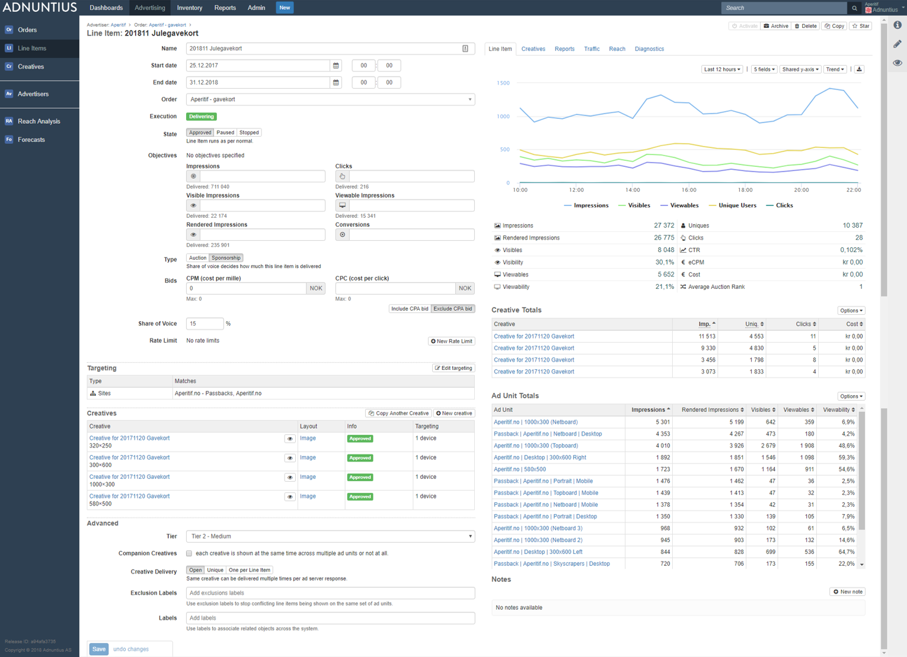
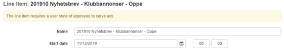
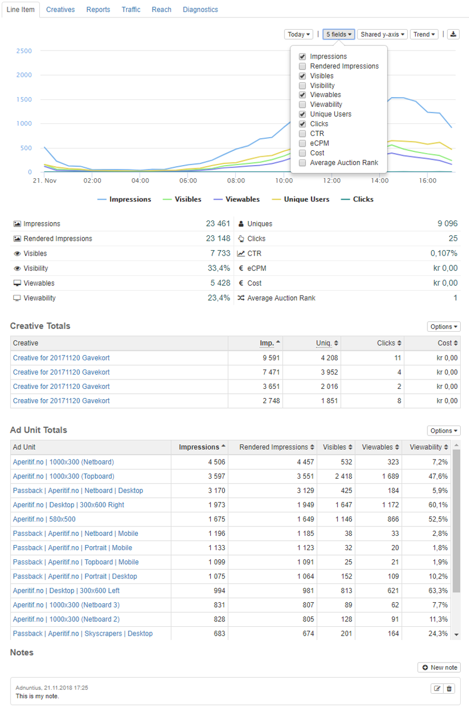
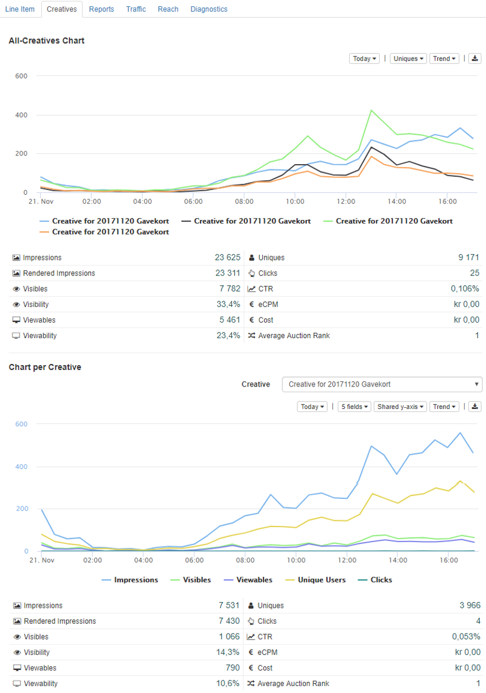
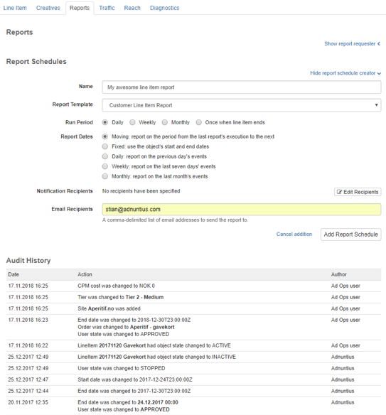
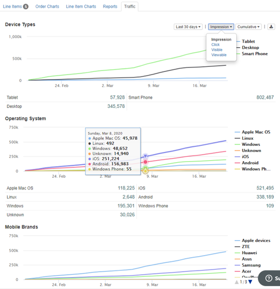
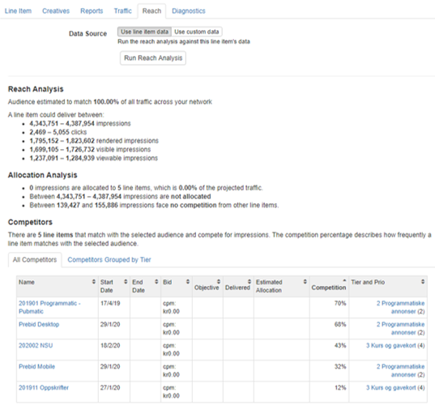

# Line Items



**Name:** Add a name of your choice. Please note that it is always better to use spacing between words rather than underscores, as searching for items later makes the items easier to find.

**Start and end dates:** When creating a line item you can specify when you want your campaign to go live. You can also specify an end date, or you can leave this field blank \(in which case the campaign will run until you choose to stop it\). Please note that if you leave the end date open, smoothing will not work.

**Execution:** Shows the status of the campaign. "_Delivering_" means that the line item is currently delivering impressions. "_Ready to deliver_" means that no additional information is needed for the line item to deliver, but it has not yet started delivering \(for instance because the start date is in the future\). "_Not deliverable"_ means that no impressions can be delivered, either because something is missing \(such as a bid or a valid creative\) or because the line item is paused or stopped. _"Ended"_ means that the line item has passed its end date, or that the objectives have been met, causing the line item to stop delivering.

If your line item has the execution state of "Not deliverable" then first check for a yellow warning box on the top of the line item page \(see example below\). This may give you information about what is missing. You can also try running a diagnostics check, please see further down on this page for more information.


Many customers are confused when they get the message "The line item requires a bid specification". This means that you have to enter a CPM bid to the line item. This bid can be 0, but something has to be added for the line item to deliver. 


**State** allows you to pause or stop a campaign. "_Approved_" means that the line item will run as soon as the start date is met, all material is added, and everything is ready. "_Paused_" means that the line item won't deliver impressions, but the booked impressions are still taken into consideration when running [reach analyses](reach-analysis.md). "_Stopped_" means that the line item won't deliver impressions, and the booked impressions are cancelled \(so the line item will not count into any reach analyses\).

The two states "Proposed" and "Submitted" are used in self-service advertising where you want to quality approve campaigns before they go live \(for instance, to check that they do not contain illegal or offensive content. 


If you are interested in self-service advertising, reach out to us anytime at [support@adnuntius.com](mailto:support@adnuntius.com) and we will help you out. 


**Objectives** allow you to specify the goal of the campaign. You can choose one or multiple objectives. If you choose multiple objectives, then the line item will stop delivering impressions as soon as it reaches _one of its objectives_. Here are the objectives you can choose between:

* Impressions: Counted whenever an ad from the line item has been delivered by our adserver.
* Clicks: Counted whenever a user clicks on an ad. 
* Visible impressions: Counted whenever an ad has one or more pixels shown in the user's viewport.
* Viewable impressions: Counted whenever an ad has 50% or more pixels shown in the user's viewport for 1 second or longer. 
* Rendered impressions: Counted whenever an ad has been rendered onto the page \(rendering can be controlled with lazy requesting or lazy loading\). 
* Conversions: Counted whenever a conversion has happened according to how you want to define a conversion \(read more below\). 

**Type** lets you choose between Auction and Sponsorship. "_Auction_" means that the line item will compete with other line items based on your line item's bid \(CPM, CPC or CPA\). All bids will be converted to eCPM before the auction takes place. With the Auction model you can enable or disable smoothing, which means that \(when enabled\) the line item's impressions will be delivered evenly throughout the campaign period. 

_"Sponsorshop"_ means that, rather than running an auction, you can give the line item a share of voice as a percentage. For example, if you give your line item 25% share of voice, this line item will get 25% of the traffic that is targeted to the line item \(so, if you for instance choose an ad unit as targeting, the line item will get 25% of this ad unit's available traffic\). Please note that when you choose Sponsorship, the CPM pricing will be disregarded when the system chooses an ad. 


When specifying a share of voice, take into consideration the [tier](../admin/tiers.md) into which your line item is booked. If a tier is allowed to consume 50% of traffic and is the second highest prioritized tier, then consider that a line item with share of voice 25% then these rules will apply: \(1\) your line item will only get as much traffic as is passed on from the highest tier; and \(2\) your line item will receive 25% of the 50% of traffic that your tier has been assigned with. So your line item will get 25% x 50%x \(100% - what is consumed by higher prioritized tiers\).


**Rate limits** lets you limit the delivery of a line item. if you choose to add more than one rate limit, then both limits will be added to the line item, essentially adding two restrictions on top of each other.

* _Type \(line item-wide or per user\)_: Per user means that you will limit the number of impressions or clicks per user for whatever period you set. Line item-wide means that you will limit the delivery of the whole line item.
* _Count_ lets you set the number of impressions or clicks
* _Type_ lets you choose if that number should be impressions, visible impressions, viewable impressions, rendered impressions, or clicks. 
* _Period_ lets you choose whether the X number of impressions or clicks should be per hour, day, week, month or for the line item's lifetime. 

**Targeting** lets you direct the line item's impressions to specific users or content. Any of the targeting criteria below can be added to both line items and creatives. Just make sure that when you use targeting on both these levels, that they are not mutually exclusive. For instance, if you target a line item to people sitting in New York, and one of its creatives to people sitting in Miami, then you reach no people with that creative \(because no one can be in two places at the same time\).


Please note that you do not have to add targeting to both line items and creatives, unless you need to.


When you target multiple items in the same group \(for instance, multiple ad units\) your ads will be eligible to be shown in item 1, item 2, OR item N. When you target multiple groups \(for instance, one ad unit and one segment\) then your ads will only be shown when group 1 AND group 2 matches.

There are many targeting criteria you can choose between, so [we have set aside a different page for this](targeting.md).

**Tiers** allow you to prioritize this line item above or below other line items. If more than one line item exists within one tier, then those line items will compete for attention according to the type set above. If you have set the type to "auction" then the line items will compete on eCPM pricing, while if you set the type to "sponsorship" then the share of voice is set by the percentage. To create and re-arrange tiers, please see [tiers](../admin/tiers.md).

**Companion creatives** let you determine if each creative should be delivered individually, or if they should be served at the same time. This enables you to create for instance so-called "horse shoe ads", where two skyscrapers and a top banner are always shown at the same time, or not at all. 

**Creative delivery** allows you to determine whether creatives can be served multiple times on the same page, or if restrictions should apply. "Open" means that the same creative can be delivered multiple times one the same page. "Unique" means that no same creative from this line item can be delivered one the same page. And "one per line item" means that maximum one creative from this line item can be delivered one the same page.

**Exclusion labels** allow you to ensure that defined line items cannot be delivered on the same page. This can be useful if you for instance have two car dealers that do not want to be shown together. In this case you can add the label "car-dealer" to both line items, which means that these two line items will never be shown on the same page. 


Please note that in order for companion creatives, creative delivery and exclusion labels to work, ad units must be deployed to the publisher's page according to the [Multi adn.request Calls](../../requesting-ads/intro/adn-request.md#multi-adn-request-calls) guidelines.


**Labels** let you add labels to a line item to make it easier to search for, and to group line items together in reporting. To learn more about reports, please see the [reports section](../reports/). 

**Overview, charts and reports**: On the right side of an order page you will find multiple tabs that each has its function.



Provides you with insights into the line item's delivery. You can specify the period you want to look at, the metrics important to you, and how you want the data visualized. Once you have the data interesting to you, you can also download it as an Excel file. In the user interface you can also see a breakdown of each creative, and each ad unit added to the line item.




Provides you with insights into the delivery of the line item's creatives. You can specify the period you want to look at, the metrics important to you, and how you want the data visualized. Once you have the data interesting to you, you can also download it as an Excel file. You can also do the same to each creative that is part of the line item.




Allows you to create a report based on a [report template](../reports/reports-templates-and-schedules.md), that can be shared with others as a link. You can also schedule reports to be created regularly, and whoever should receive the reports. Once you have created a scheduled report and added a recipient, Adnuntius will automatically send reports to recipients, containing the data you have decided on using in the [report template](../reports/reports-templates-and-schedules.md).

The report tab also gives you the audit history of the line item. This means that you can see the changes made to the line item, when they were made, and who made them.




The traffic tab shows you the delivery of impressions, clicks, viewables and visible impressions that this line item has delivered.




Reach is an analysis you can run to forecast the volume of matching traffic for a line item. A  reach analysis estimates the total number of available impressions, clicks, viewable impressions and more that match your targeting criteria. Please see [Reach Analysis](reach-analysis.md) for more information on how to read the results. 




If you experience something wrong with the line item \(for instance, it doesn't start delivering as expected\), diagnostics is a great way to give you more insight into what might be going on. Before we explain the results you get from clicking "Run diagnostics test", let's explain what "Burn rates" tells you.

A burn rate below 100% means that Adnuntius is slowing down your line item's delivery to avoid delivering its objectives well before its end date. If you have smoothing enabled for your line item, and the line item is slightly overdelivering, then the system may slow down the burn rate to get the delivery back on track.

If you click "Run Diagnostics Test", you may get a result that looks something like this:

> * Line Item dates indicate it should be currently running.
> * Line Item has no validation warnings.
> * Located all assets for the Line Item on the CDN.
> * Team contains Ad Units with suitable dimensions
> * Line Item loses auctions for the team's site's AdUnits that it fits: check CPM and de-duplication.
> * Line Item has no limit on delivery rate.

This response can be interpreted as follows:

* If the line item's start date had been in the future or the end date had been in the past, this could have been the reason why the line item didn't deliver any impressions. However, this check tells you that the dates are not the problem.
* When there is some information missing on a line item \(for instance, if there is no creative to serve, or that the line item is paused\), then there would be a warning in a yellow box on top of the line item page. This check looks for such a warning, but in this case there is no warning, and there is no information missing from the line item. 
* The asset test checks if Adnuntius has successfully been able to find the line item's creative material on our CDN. If you ever see a warning here, try to re-create your creatives, and if that does not work, contact us at support@adnuntius.com.
* The ad unit test checks if \(1\) there are ad units with the appropriate width and height that can serve one of the creatives, and \(2\) that those ad units' parent sites belong to a team that matches the order \(remember - an order is always placed on a team which in turn accesses a set of sites; so if the line item targets a totally different set of sites \(and therefore ad units\), the line item will serve no impressions. 
* The auction test checks if the line item has a chance of winning impressions, considering the competition from other line items. When all things else are equal, it is the eCPM bid of the line items that determines which one will get the impression. If a warning like the above appears, try to either \(1\) increase the bid of the line item, or \(2\) decrease the bid of or pause the competing line items.
* The last test checks if the line item is held back due to smoothing. If this warning kicks in then try to turn off smoothing to check if this starts the delivery.


You can also run [diagnostics for ad units](../inventory/adunits-1.md) if you wonder what ad would win an auction for a given ad unit.



You can also add ?adndebug123 at the end of any URL \(example: [www.aperitif.no?adndebug123](https://www.aperitif.no/?adndebug123)\) to show you all ad units, line items, creatives, targeting and more information in the context of a webpage.




