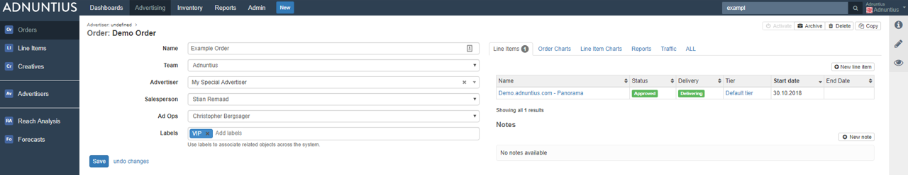
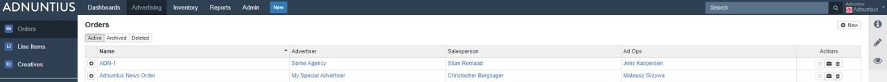
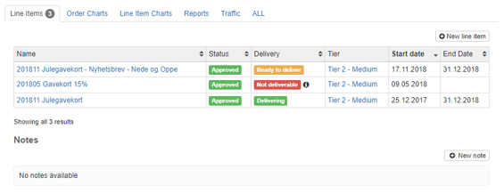
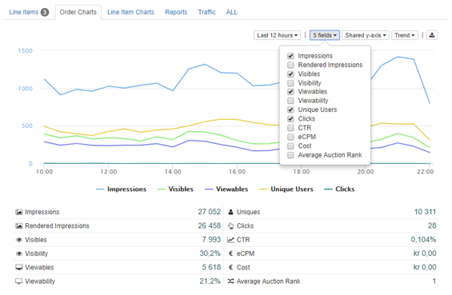
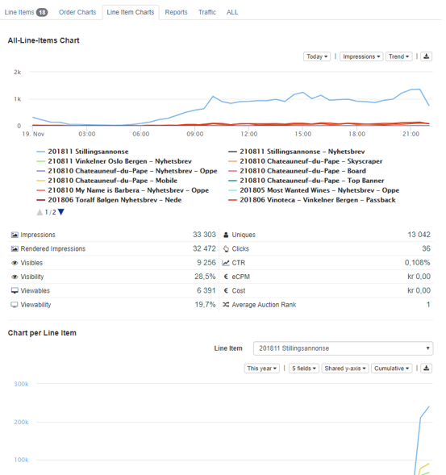
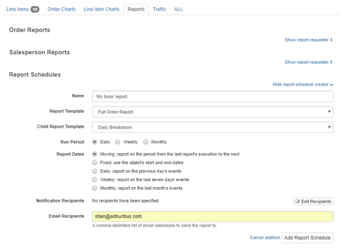

# Orders

An order can contain multiple line items. It also determines what team the campaign belongs to, and the set of sites that impressions can be delivered to \(see Admin &gt; [Teams](../../admin-api/endpoints/teams.md) for more information\).

**Name:** Add a name of your choice. Please note that it is always better to use spacing between words rather than underscores, as searching for items later makes the items easier to find.

**Team:** A team contains a set of sites, and one or more users that have access to perform actions to the order and underlying line items \(the actions they can perform depend on users' [roles](../../admin-api/endpoints/roles.md). If your user has access to multiple teams you will be able to choose from a dropdown menu, otherwise only the team available to you will appear. [Learn more about teams.](../admin.md#teams)

**Advertiser:** connects the order to a parent advertiser. Used to keep control of inventory. If you are an advertiser yourself, or don't need this hierarchy, we recommend that you just create one advertiser \(yourself\), and then connect any order to yourself as an advertiser.

**Salesperson \(optional\):** if a salesperson is responsible for the order, then you can assign the order to that user. Please note that you have to create a user for that person; [learn how to create a user](../admin.md#users-and-user-profile). After you've done that, you can create reports that can be automatically distributed, showing how much revenue they have earned, their development over time, and more. [Learn how to create salesperson reports](../reports.md#reports-report-templates-and-report-schedules).

**Ad ops \(optional\):** If you have an adops function in your company, then you can add that person to the order. When you have done this you can easily keep overview of who has the responsibility for which orders, as you can see in the image below.

**Labels** can be added to make reporting work for you. Let's say you add the label "autumn" to a set of orders, and then want to run a report only for this group of orders. You can then run a report which filters on these orders specifically. [Learn how to run reports like this](../reports.md#advertising-queries).

**Overview, charts and reports**: On the right side of an order page you will find multiple tabs that each has its function.



Provides you with an overview of line items created with this order as a parent. Here you can also quickly create a new line item to reserve inventory \(means that forecasting will take the line item into account when estimating future available space\), and create notes. Notes are text fields that will be viewable by any user that has access to the order.




Provides you with insights into the order's delivery. You can specify the period you want to look at, the metrics important to you, and how you want the data visualized. Once you have the data interesting to you, you can also download it as an Excel file.




Provides you with insights into the delivery of line items which are part of this order. You can specify the period you want to look at, the metrics important to you, and how you want the data visualized. Once you have the data interesting to you, you can also download it as an Excel file.




Allows you to create a report based on a [report template](../reports.md#reports-report-templates-and-report-schedules), that can be shared with others as a link. You can also schedule reports to be created regularly, and whoever should receive the reports. Once you have created a scheduled report and added a recipient, Adnuntius will automatically send reports to recipients, containing the data you have decided on using in the [report template](../reports.md#reports-report-templates-and-report-schedules).




The traffic tab shows you the delivery of impressions, clicks, viewables and visible impressions across the line items belonging to this order. 




