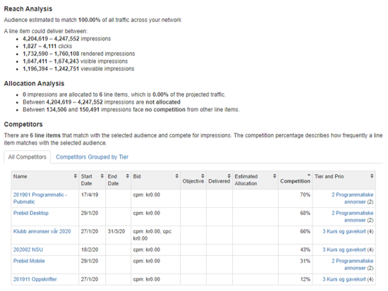
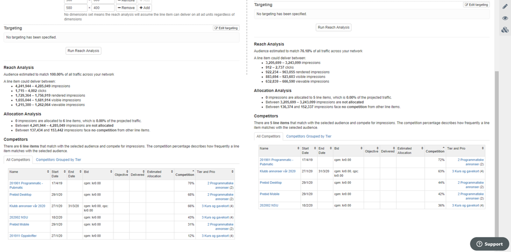

# Reach Analysis

## Creating a Reach Analysis

Reach analyses take historic traffic into account when forecasting what you can deliver in the future. The historic traffic takes targeting into account so that you can also apply targeting, creative sizes and more to get a more presise estimate.

**Line item** allows you to copy the properties (targeting, sizes and more) from an existing line item. You can alternatively choose to add all this information manually, so this is an optional feature. Once you've chosen a line item, click "Copy" to add the line item's properties. 

**Start and end dates** allows you to set the future period for your forcast. 

**Team** allows you to restrict your analysis to the set of sites that belongs to your chosen team. 

**Creative width and height** lets you specify one or more sizes that should be included. If you set no dimensions, this means that the reach analysis will assume the line item can deliver on all ad units regardless of dimensions.

**Targeting** lets you specify any of the available targeting criteria so that your reach analysis takes targeting into account. 

Lastly, click "Run reach analysis" to get your results.

## How to Interpret Results

Once you've hit "Run reach analysis" you will get an estimated future traffic for your chosen period, sizes and targeting criteria. Below is an example reach analysis that will be used as an example on how to understand the analysis.

The first sentence says "**Audience estimated to match 100.00% of all traffic across your network**". This means that your targeting criteria and sizes added to the analysis do not restrict the potential traffic in any way. If you had added more targeting and/or removed some of the creative sizes, you may for instance get the sentence "Audience estimated to match 75.90% of all traffic across your network". 

Next, you are told that "**A line item could deliver between**

* **4,204,619 – 4,247,552 impressions **
* **1,827 – 4,111 clicks **
* **1,732,590 – 1,760,108 rendered impressions **
* **1,647,411 – 1,674,243 visible impressions **
* **1,196,394 – 1,242,751 viewable impressions**"

Considering that you were first told that "Audience estimated to match 100.00% of all traffic across your network", this means that the numbers above represent all the traffic that you can potentially deliver. However, if you were told that you could match 75.90% then, for instance, the number of impressions could be 3,185,276 – 3,222,602.

The next sentence says "**0 impressions are allocated to 6 line items, which is 0.00% of the projected traffic**". This sounds strange, but in this example there are 6 line items that have no objectives (impressions, clicks etc.) whatsoever. If a line item has no objectives then its delivery is not included in the reach analysis. If one of these were changed to include an impression objective of 1,000,000 impressions for the forecast period, then the sentence could be something like "1,000,000 impressions are allocated to 6 line items, which is 23.81% of the projected traffic". 

Next you see that "**Between 4,203,899 – 4,246,668 impressions are not allocated**". This means that no traffic is allocated. In the example above where one line item would have 1,000,000 impressions booked, the message could be "Between 3,203,899 – 3,246,668 impressions are not allocated"

Next you see that "**Between 129,900 and 145,597 impressions face no competition from other line items**". While the 6 line items have no objectives, they still take up the inventory. So this message tells you that out of the total traffic, between 129,900 and 145,597 impressions have no ads to serve whatsoever. 

**Competitors** shows you the line items that are competing for the traffic you are trying to set aside (either as one list, or grouped by tier). This is useful because, if your reach analysis shows you that you do not have enough traffic available for an important upcoming campaign, then this list shows you which line items that you need to make changes to in case you have to make room for your important campaign. 

* Start dates and end dates show you when competing line items start and end. Perhaps you can move the start or end dates of less important line items? 
* Bid prices show you how much other ads are bidding for your inventory. If you need to move a line item, do you risk losing revenue from better paid line items? 
* Objectives and delivered shows you the booked traffic, and how much is delivered so far. 
* Estimated allocation shows you the traffic allocated to competing line items for the period you've chosen for the reach analysis. 
* Competition shows you how much competing line items are overlapping with your reach analysis. For example, 50% means that a competitor will compete for half of the traffic that you are trying to set aside for another line item. 
* Tier and prio shows you the tier of competing line items. If you need to set aside more traffic for an important line item, then you can place other line items in lower prioritized tiers. [Here you can also see how you create tiers and organize them.](../admin/tiers.md) 

## Creating New Line Items from Reach

If your reach analysis is showing you enough traffic, then you can easily create a new line item with the chosen criteria by clicking "Copy to new line item". 

## Copy to Compare Analysis

Copy to compare analysis lets you copy all criteria (dates, targeting, sizes etc) to a new reach analysis that can be compared side-by-side with your existing reach analysis. For example, if you want to see how the available traffic changes if you add or remove certain sizes or targeting criteria, the comparison will give you the available traffic for both your chosen criteria so that you can compare them side by side. The example below shows a comparison where two reach analyses are made, but where one analysis uses more sizes than the other one. 

