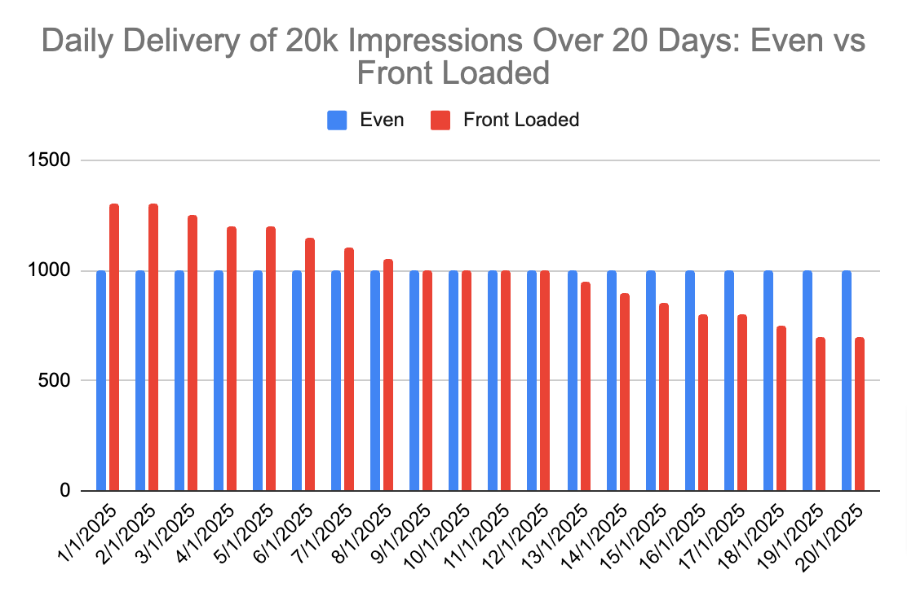

# Smoothing

Adnuntius provides six options for ad delivery:

1. _Unsmoothed:_ your line item is delivered as fast as possible and may finish well before its end date if it meets its objectives early
2. _Even_: line item delivery is smoothed out so that its objectives are met at an even rate from day to day until the line item's end date
3. _Front Loaded_: line item delivery is allowed to run somewhat faster than the even rate and slows down more considerably towards the line item's end date.
4. _Strict Cap:_ line item delivery is like even, but should the delivery run 5% faster than the even rate due to a sudden burst of traffic, delivery will pause immediately so as to return to the previous even rate rather than smooth out its delivery over the course of its remaining days.
5. _Catch Up_: if line item delivery falls behind the even rate, delivery will run as fast as possible until returning to the even rate rather than smooth out its delivery over the course of its remaining days
6. _Opportunistic_: if line item delivery falls behind the even rate, delivery will run as fast as possible and surpass the even rate to capitalise on bursts of relevant traffic before smoothing is applied well above said even rate

The last three smoothing options, _Strict Cap_, _Catch Up_ and _Opportunistic_, are all ways to mitigate the effects of uneven demand due to either sudden bursts of traffic or a constant source of traffic that only sometimes matches your targeting.

**NOTE:** if your delivery is at the even rate while your smoothing is set to _Strict Cap_ or _Catch Up_, your delivery will continue to deliver at the even rate. These smoothing options are strategies for handling situations where delivery diverges from the even rate.

_Strict Cap_ is best for situations that feature sporadic ad requests. For instance, ad requests might come in a thousand at a time on the hour. With a _Strict Cap_, delivery will cut off completely some hours and meet all the ad requests on others.

_Catch Up_ and _Opportunistic_ are best for situations where ad requests are constant but it's not guaranteed targeting requirements will be met over the entire course of the line item's dates. For instance, your line item might be set up to target articles to do with Taylor Swift and popular music in general. There might not be any articles about Taylor Swift or popular music from the line item's start date, but when such articles do appear, you'd like to deliver fast and take as much traffic as possible within limits while meeting your objectives.&#x20;

With _Catch Up_, should delivery fall behind the even rate, delivery will take the opportunity to reach the even rate as quickly as possible and try to stick close to that even rate subsequently. With _Opportunistic_, delivery will take the opportunity to overshoot the even rate by up to 10% whenever possible.

### Comparing Front Loaded to Even Traffic Delivery

Front Loaded delivery will cause your campaign to deliver up to 30% faster than the even rate towards the beginning of delivery and taper off 30% faster towards the end.&#x20;

Both _Even_ and _Front Loaded_ pacing strategies aim to deliver ads all the way up to the end of your campaign and would look like the following assuming a constant source of traffic:

<figure><figcaption>
Daily Delivery of 20k Impressions over 20 Days: Even vs Front Loaded Delivery
</figcaption></figure>

<figure><figcaption>
Cumulative Delivery of 20k Impressions over 20 Days: Even vs Front Loaded Delivery
</figcaption></figure>

