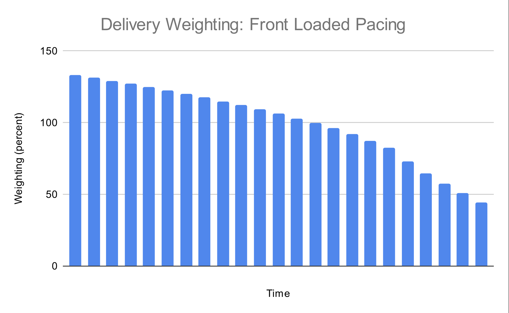

# Smoothing Ad Delivery

Adnuntius provided two different options for smooth ad delivery:

- Even Pacing: where the system attempts to deliver at a constant rate throughout the campaign
- Ahead Pacing: where the system delivers more quickly at the beginning of the campaign

The impact of chosing *Ahead Pacing* is shown in the charts below.

