# Targeting

Targeting lets you direct a line item's and/or creative's impressions to specific users or content. Any of the targeting criteria below can be added to both line items and creatives. Just make sure that when you use targeting on both these levels, that they are not mutually exclusive. For instance, if you target a line item to people sitting in New York, and one of its creatives to people sitting in Miami, then you reach no people with that creative \(because no one can be in two places at the same time\).


Please note that you do not have to add targeting to both line items and creatives, unless you need to.


When you target multiple items in the same group \(for instance, multiple ad units\) your ads will be eligible to be shown in item 1, item 2, OR item N. When you target multiple groups \(for instance, one ad unit and one segment\) then your ads will only be shown when group 1 AND group 2 matches.


## Targeting Templates

Targeting templates allow you to save combinations of targeting criteria for later re-use. For example: if you repeatedly target multiple line items or creatives to a set of locations, then rather than adding those locations manually each time you create one, you can save a template so that you can use the same targeting with one click. Below you can see an example of how to save a targeting template for multiple ad units. 


## Copy from Line Item

You can copy the targeting that has been added to other line items. If you work with complex targeting criteria and want to add these targeting combinations with the click of a button, then this is the function for you. You can either copy targeting from running line items, or you can create "template line items" that contain the targeting criteria you most often use, so that you can copy from those templates. Below is a video demonstrating how to copy targeting from other line items. 

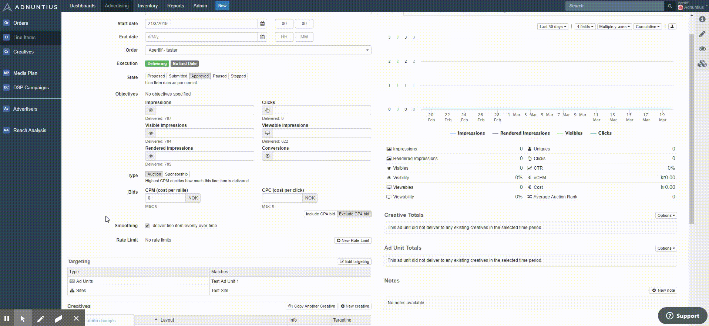

## Ad Unit Targeting

An [ad unit ](../inventory/adunits-1.md)is a placement that goes onto your site, so that you can later fill it with ads. It is as such an empty container that sets aside a space on your site so that you can fill it with content. Ad unit targeting allows you to target a line item and/or creative to one or more ad units.

You can choose to add include the chosen items in your targeting, or to exclude them \(whatever is easiest given your need\). 

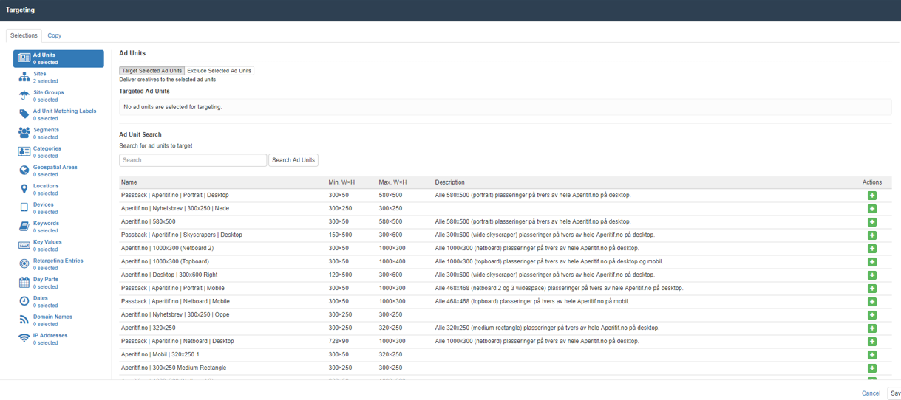

## Site Targeting

A [site](../inventory/sites.md) is an object that makes it easy to organize your content according to the domains, or sites, that you own, control or have access to. Site targeting allows you to target your line items and/or creatives to one or more sites. You can choose to add include the chosen items in your targeting, or to exclude them \(whatever is easiest given your need\).

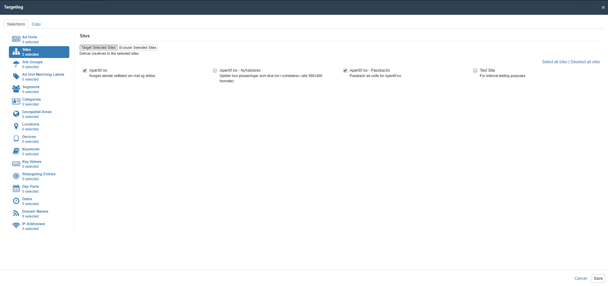

## Site Group Targeting

Publishers can [group sites together](../inventory/site-groups.md) in order to make targeting a set of sites easier. Once a site group is created you can target line items and/or creatives. You can choose to add include the chosen items in your targeting, or to exclude them \(whatever is easiest given your need\).

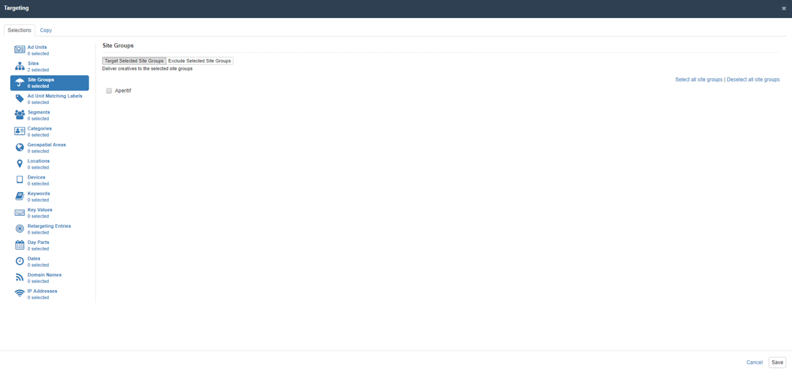

## Ad Unit Matching Label Targeting

Matching labels are labels added to ad units that you can later use for targeting groups of ad units. Let's say that you add the label "sports" to three different ad units, and then target a line item to the matching label "sports". You will then target your ads to be shown in these three ad units.

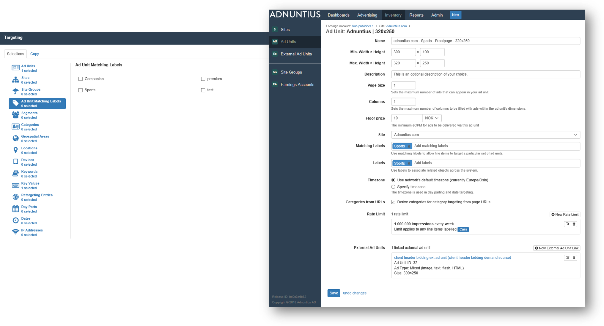

## Segment Targeting

Segments are based on historic user behaviour, and targes groups of users \(or "audiences"\) that have something in common. There are three ways of connecting to user segments: 

1. Using [Adnuntius Data](../../../#adnuntius-data), a data platform that allows you to unify your 1st and 3rd party data and eliminate silos, create segments with consistent user profiles, and to activate your data in any system. Any data collected by Adnuntius Data will automatically be avaiable for targeting in Adnuntius Advertising without any setup work needed in advance. 
2. Using Cxense DMP. Adnuntius has a server-side "out-of-the-box" integration to data management platform \(DMP\) partner Cxense, which means that you can easily connect to Cxense to get your segments into Adnuntius for targeting. To connect your Cxense account, please [read more here](../admin/connections.md). 
3. Using whatever data source or DMP that you already use. [Read more here](../../admin-api/endpoints/segmentsupload.md) about how to connect your data source to Adnuntius Advertising so that you can target your audience. 

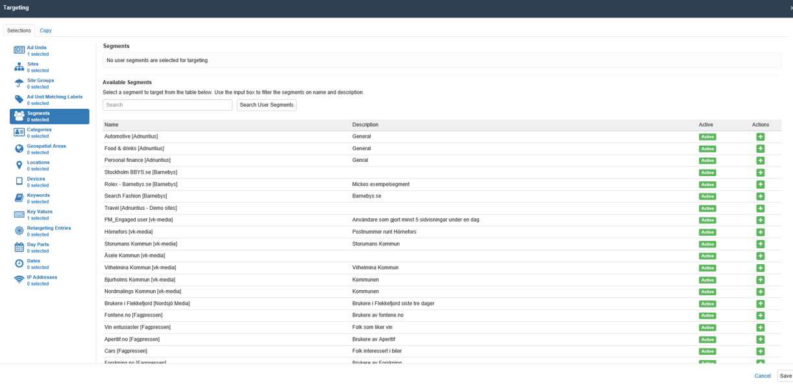

## Category Targeting

Adnuntius can read the URLs from whatever pages that ad units are deployed to. [Read more about how to set ad units to derive categories for category targeting from page URLs](../inventory/adunits-1.md). Once you've set up your ad units you can add targeting in different ways: 

* If you add "sports, travel" to the text field your ad will target any URL that contains either /sports/ or /travel/ or both. For example, the URL www.example.com/sports/football/article.html will match. 
* If you add sports/football then your ad will target any URL that contains /sports/football/. For example, the URL www.example.com/sports/football/article.html will match. However, the URL www.example.com/sports/article.html will not match.
* If you add www.example.com/sports/football/article.html then your ad will target this URL and only this URL. Please note that dashes in a URL will not work. In other words, this URL \(www.example.com/sports/football/article.html\) will work fine, but this URL \(www.example.com/sports/football/some-article.html\) will not. 

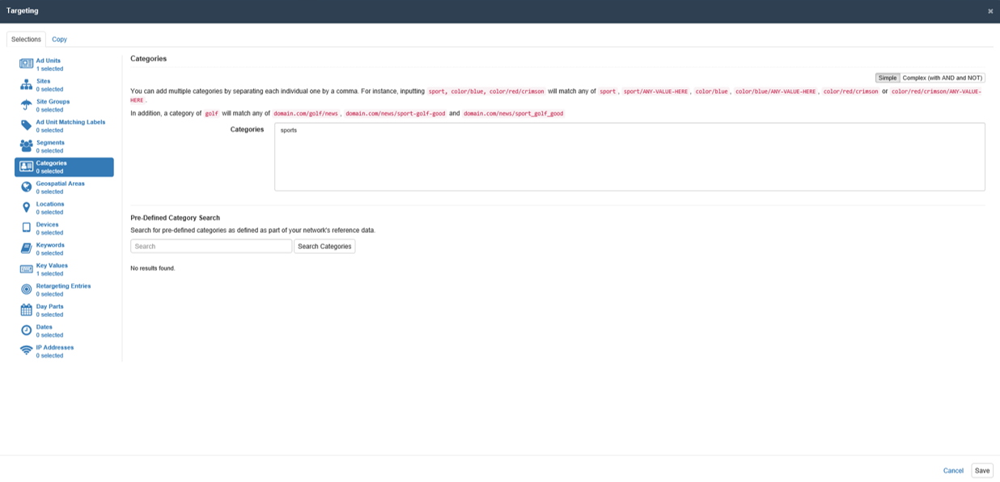

You can also upload a library of categories if you would rather like to choose categories from a list rather than writing them into the text field. For more information on how to upload categories, please see [Reference Data](../admin/reference-data.md). 

## Geospatial Targeting

Geospatial targeting can be used when you want to closely manage which geographical locations are to be targeted. Click the polygon or rectangle icon on the right hand side of the map and start drawing in order to specify the location you want to target. 

Please note that, by default, geospatial targeting uses IP addresses for locating users. As IP addresses do not always provide accurate locations you can, if you ask for users' permission to track their location, [send the longitude and latitude](https://docs.adnuntius.com/adnuntius-advertising/requesting-ads/intro/adn-request) together with the ad request in order to provide accurate locations. 

If you for some reason cannot supply Adnuntius Advertising with longitude and latitude, you can consider using [named location targeting](https://docs.adnuntius.com/adnuntius-advertising/admin-ui/advertising/targeting#location-targeting) instead. 


## Location Targeting

Location targeting allows you to add named locations by searching for them, or by browsing from a list. You can add target continents at the highest level and post/zip codes at the lowest level. You can choose to add include the chosen items in your targeting, or to exclude them \(whatever is easiest given your need\).



Adnuntius uses Netacuity Pulse to provide you with excellent location targeting.


## Device Targeting

Device targeting lets you target ads to specific devices. Simply choose the device types, operating systems or brands, hit "save" and your ad is targeted. 

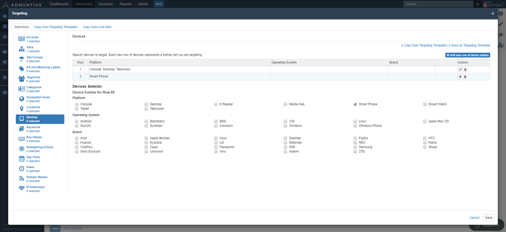

Adnuntius has access to a range of browser, hardware and platform information. If there is any data you would like us to add to the device targeting list, then feel free to send us a request on support@adnuntius.com. You can also use key value targeting \(see next tab\) to target specific devices using any of these keys:

* browserName
* browserVendor
* browserVersion
* hardwareFamily
* hardwareModel
* hardwareName
* hardwareVendor
* platformName
* platformVendor
* platformVersion

## Key Value Targeting

Key values are keywords that you can send together with an ad request so that you can target line items and/or creatives to those keywords. 

```text
<!-- 0000000000000001 -->
<div id="adn-0000000000000001" style="display: none"></div>
<script src="https://cdn.adnuntius.com/adn.js" async></script>
<script>
window.adn = window.adn || {}; adn.calls = adn.calls || [];
adn.calls.push(function() {
   adn.request({ adUnits: [
      { auId: '0000000000000001', kv: { 'query': ['red wine', 'cola'], 'content': ['drinks'] } }
   ]});
});
</script>
```

The ad tag example above illustrates how the key values query=red wine, query=cola and content=drinks can be sent with an ad request. Once key values are sent you can target line items and creatives by adding key values as shown below. Here are some tips: 

* Separating key values by commas means that the ad will match any of the added values. For instance, "key: value1, value2" means that the ad will match as long as either value1, value2 or both are sent. 
* You can also add more complex criteria such as AND and AND NOT to ensure that you only match certain combinations of key values. 


You can also upload a library of key values if you would rather like to choose them from a list rather than writing them into the text field. For more information on how to upload key values, please see [Reference Data](../admin/reference-data.md).


Even though you send key values with an ad request, ads with no key values can still be served inside this ad unit; but line items and creatives targeted with key values can be served ONLY if the ad unit sends these key values. If you want to set an ad unit to only show ads if the line items/creatives have key values, please see [Ad units and "must match type". ](../inventory/adunits-1.md)


## Keyword Targeting

Keywords are words in written text on any page where the ad is shown. For example, if you are a publisher and one of your articles mentions the keyword "football" then this keyword can be automatically picked up from the article text as long as its weight \(meaning its significance for the article's content\) is high. 

Targeting a keyword means that you will target an ad to any page where the keyword is part of the text. Adnuntius uses data management platform partner Cxense to power this feature, and keyword targeting will not work without a Cxense account. If you need this, please contact us at [support@adnuntius.com](mailto:support@adnuntius.com). 

Just like with [key value targeting](https://docs.adnuntius.com/adnuntius-advertising/admin-ui/advertising/targeting#key-value-targeting), you can separate keywords by commas to match any of the keywords, or use the operators AND, OR and AND NOT to create more complex criteria. 

## Retargeting

Retargeting can be used to target line items and/or creatives to users who have performed specific actions. For example, you can retarget a user that have put a product in your shopping cart, but didn't actually purchase it. Or you can retarget a user who has read about sports the last 30 days. 

You can add multiple values for every retargeting key by separating individual values by a comma. For instance, inputting red, blue, green as values means that the retargeting key will match any of red, blue or green. 

```text


```

The three examples above shows you the format you must use when you add retargeting pixels to your page \(where you want to "trigger" retargeting for a user\). The example above registers the following three targets:

* shop with value petshop.com.au will last as a target for 2 592 000 seconds \(30 days\) 
* age with value 39 will last as a target for 5 184 000 seconds \(60 days\) 
* sport with value handball will last as a target for the default length of time \(usually 30 days\)

Once you have added the retargeting pixels to your page you can start targeting ads to any of the values. Just like with [key value targeting](https://docs.adnuntius.com/adnuntius-advertising/admin-ui/advertising/targeting#key-value-targeting), you can separate retargeting entries by commas to match any of the retargeting entries, or use the operators AND, OR and AND NOT to create more complex criteria. The example below shows how to target users who match all of the criteria "shop: petshop.com.au", "age: 39" AND "sport: handball". 

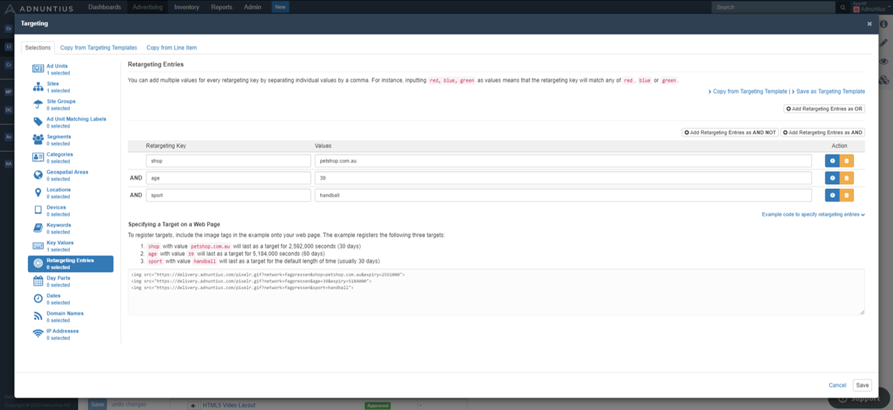

## Day Parts Targeting

Day Parts lets you choose the days, and times of day, that your ad should be shown. You can add multiple day parts. You can choose to set a day part to the user's timezone, or the ad unit's timezone. The user's timezone is the timezone that the user visiting your page is physically in, while to ad unit's timezone is the timezone that your [ad unit](../inventory/adunits-1.md) is set to. 

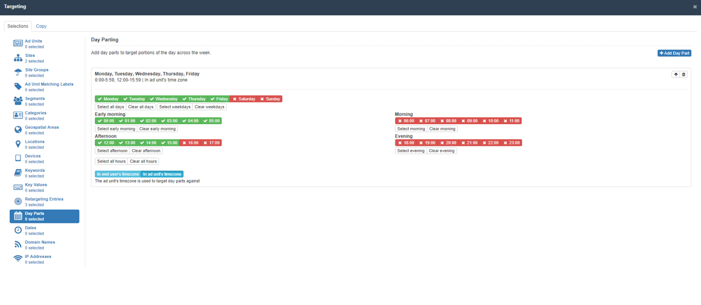

## Date Targeting

You can add specific dates or ranges of dates to make sure that your line item and/or creative delivers on specific dates or ranges of dates.

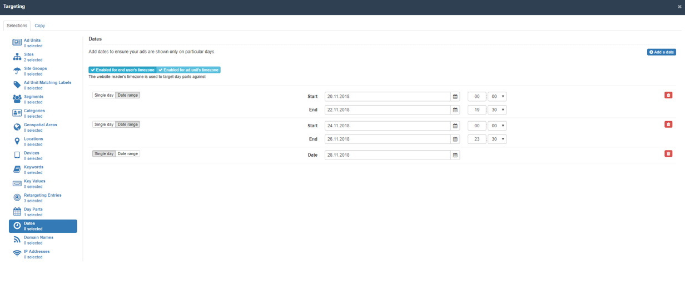

## IP Address Targeting

Targeting specific IP addresses can be useful, for instance when testing in a limited environment that ads look good before they are released to the whole world. You can add multiple IP addresses by separating each individual IP address by a comma. For instance, inputting 118.16.78.34, 205.112.45.0/24 will match any of 118.16.78.34 and 205.112.45.0 through to 205.112.45.255.

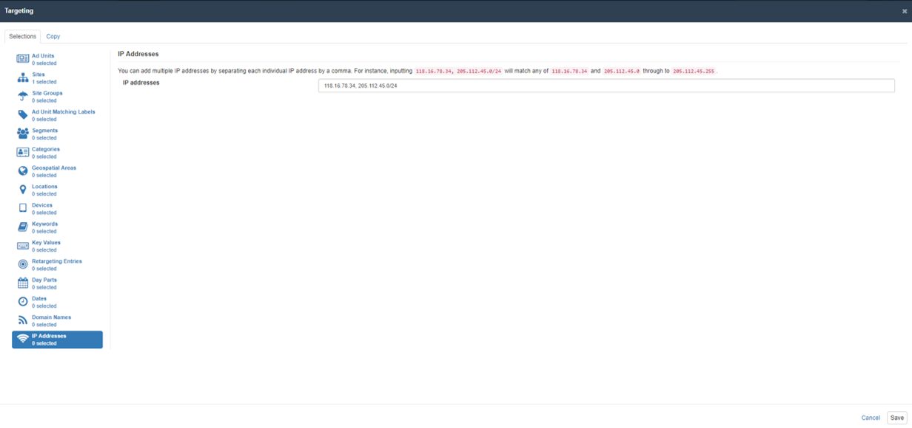

