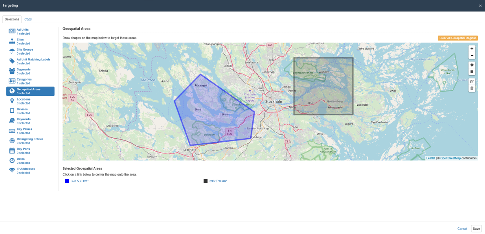
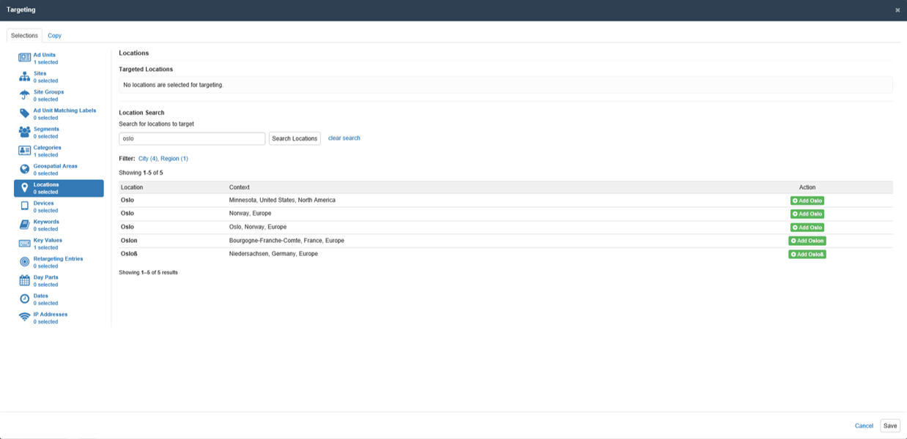
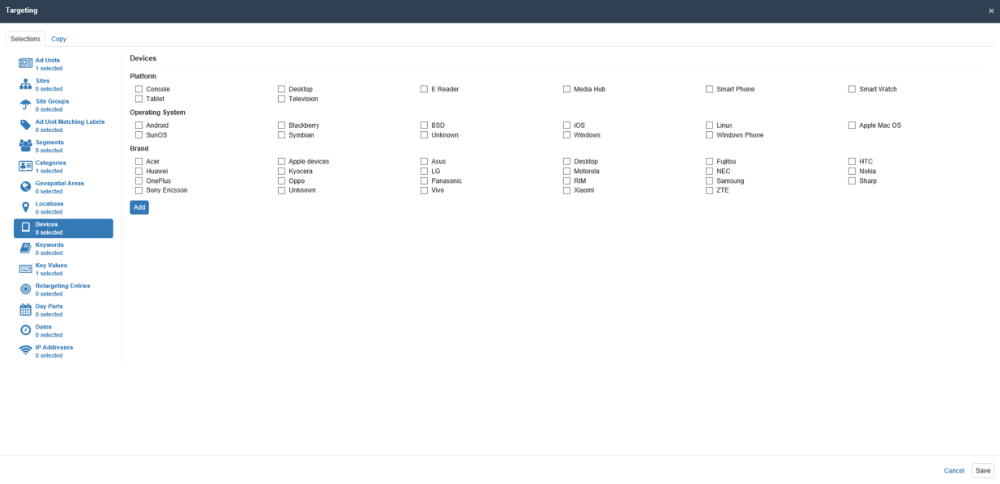
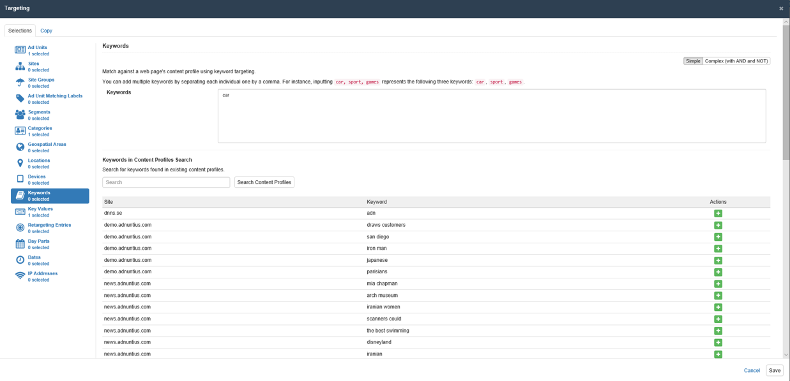
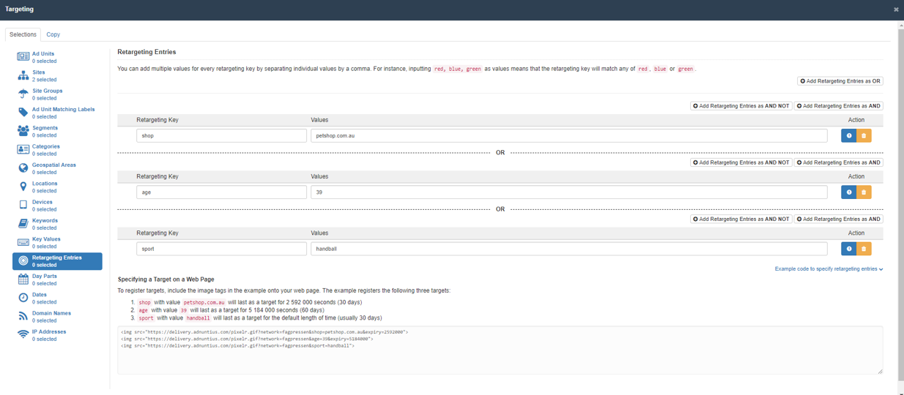

# Targeting




Target select ad units, or exclude select ad units. When you target one ad unit, you make sure that your line item is shown only in this ad unit. [Learn more about ad units](../inventory/#ad-units).





Target select sites. When choosing one site, you make sure that your line item is shown only in ad units belonging to this site. [Learn more about sites](../inventory/#site).





If you have many sites, and want to save time when booking your campaigns, you can gather sites into site groups. Once you have done this you can easily target your groups of sites. [Learn more about site groups](../inventory/#site-group).





Matching labels are labels added to ad units that you can later use for targeting groups of ad units. Let's say that you add the label "sports" to three different ad units, and then target a line item to the matching label "sports". You will then target your ads to be shown in these three ad units.





Segments are groups of users that match whatever criteria you would like to set for that audience. Adnuntius has a server-side "out-of-the-box" integration to data management platform \(DMP\) partner Cxense, which means that you can easily [connect to Cxense ](../admin.md#context-service-connections)to get your segments into Adnuntius for targeting.



Would you like to consider Cxense as your DMP? Contact us at support@adnuntius.com, and we will introduce you to the DMP and get you started.



Would you like your DMP to get integrated with Adnuntius? Contact us at support@adnuntius.com, and we can discuss!




Adnuntius can read the URLs from whatever pages that ad units are deployed to. [Read more about how derive categories for category targeting from page URLs](../inventory/#ad-units). Once you've set up your ad units, you can add multiple categories by separating each individual one by a comma. For instance, inputting sport, color/blue, color/red/crimson will match any of sport, sport/ANY-VALUE-HERE, color/blue, color/blue/ANY-VALUE-HERE, color/red/crimson or color/red/crimson/ANY-VALUE-HERE. In addition, a category of golf will match any of domain.com/golf/news, domain.com/news/sport-golf-good and domain.com/news/sport\_golf\_good.



You can create a library of pre-defined categories to simplify targeting \(this way you don't have to remember or look up your site's category structure every time you want to use category targeting. [Read more about how to create a library](../admin.md#reference-data).




Geospatial targeting can be used when you want to closely manage which geographical locations are to be targeted. Simply click the polygon or rectangle icon on the right hand side of the map and start drawing.




If you want to define a default position from which you can start drawing \(for instance the area that you use the most\), you can define this in the [Admin &gt; Network section](../admin.md#network).



If you ask your users or customers for permission to track their locations, you can send this to Adnuntius for improved targeting. Out of the box, Adnuntius uses [Netacuity Pulse](https://www.digitalelement.com/solutions/netacuity-pulse/) to provide you with excellent location targeting.




Named locations lets you search for specific locations and to add them to a list locations that you want to target with your ad.




Adnuntius uses [Netacuity Pulse](https://www.digitalelement.com/solutions/netacuity-pulse/) to provide you with excellent location targeting.




Device targeting lets you target ads to specific devices. Simply choose the device types, operating systems or brands, hit "save" and your ad is targeted.

Adnuntius has access to a range of browser, hardware and platform information. If there is any data you would like us to add to the device targeting list, then feel free to send us a request on support@adnuntius.com. You can also use key value targeting \(see next tab\) to target specific devices using any of these keys:

* browserName 
* browserVendor 
* browserVersion 
* hardwareFamily 
* hardwareModel 
* hardwareName 
* hardwareVendor 
* platformName 
* platformVendor 
* platformVersion




Adnuntius uses [51Degrees Device Detection](https://51degrees.com/device-detection) to provide you with excellent device targeting.




Key values is your regular swiss army knife of targeting, as you can send any key and value to Adnuntius with any ad request. You can add multiple values for every key by separating individual values by a comma. For instance, inputting red, blue, green as values means that the key will match any of red, blue or green. [Read more about adn.js and key value targeting](http://admin.adnuntius.com/adn).

You can add key values with the boolean operators AND, OR and NOT.





Keywords are words in written text on any page where the ad is shown. Targeting a keyword therefore means that you will target an ad to any page where the keyword is part of the text. Please note that Adnuntius uses data management platform partner Cxense to power this feature, and keyword targeting will not work without a Cxense account.

You can add key values with the boolean operators AND, OR and NOT.




Are you interested in testing Cxense as a data management platform? Contact us at support@adnuntius.com and we will help you out.




Retargeting can be used to target an ad to users who have performed specific actions. For instance, you can retarget a user that have put a product in your shopping cart, but didn't actually purchase it. Or you can retarget a user who has read about sports the last 30 days.

You can add multiple values for every retargeting key by separating individual values by a comma. For instance, inputting red, blue, green as values means that the retargeting key will match any of red, blue or green.

To register targets, include the image tags in the example onto your web page. The example below registers the following three targets:

* shop with value petshop.com.au will last as a target for 2 592 000 seconds \(30 days\) 
* age with value 39 will last as a target for 5 184 000 seconds \(60 days\) 
* sport with value handball will last as a target for the default length of time \(usually 30 days\)

```text


```





Day Parting lets you choose the days and times of day that your ad should be shown. You can add multiple day parts.





You can add specific dates or ranges of dates to make sure that your line item delivers on the date that it should.





Targeting specific IP addresses can be useful, for instance when testing in a limited environment that ads look good before they are released to the whole world. You can add multiple IP addresses by separating each individual IP address by a comma. For instance, inputting 118.16.78.34, 205.112.45.0/24 will match any of 118.16.78.34 and 205.112.45.0 through to 205.112.45.255.









