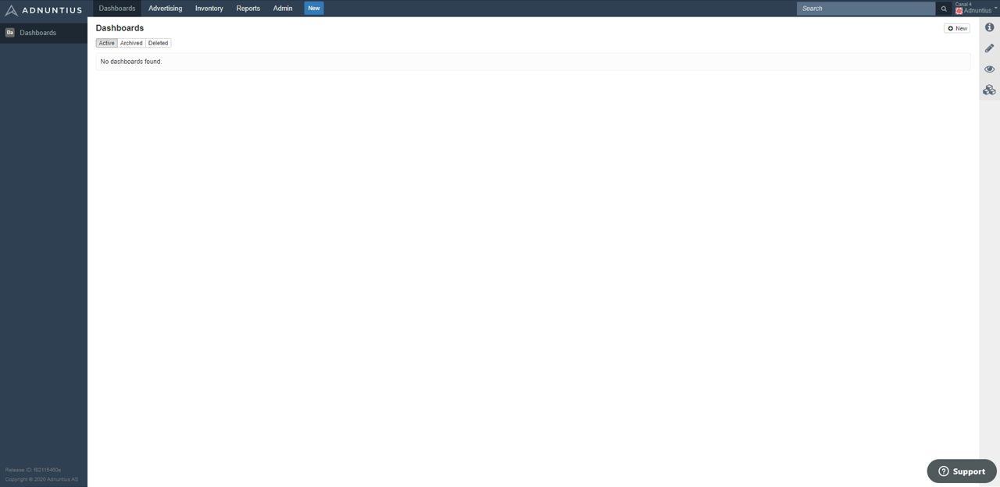
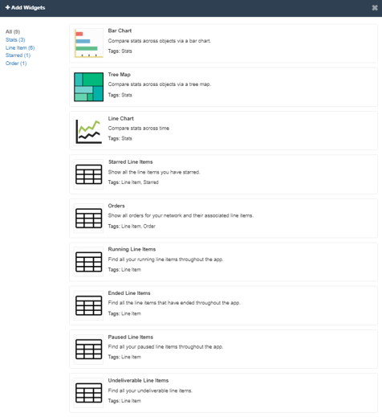

# Dashboards

Dashboards are pages consisting of widgets in which you can define the content, so that you can keep control of what is going on in Adnuntius Advertising. You can create any number of dashboards and change between them in the left-most column as soon as they are created. 

To create a new dashboard, go to Dashboards in the top line menu and then to Dashboards in the left-side menu. In the upper right corner, click "New".

When you create a new dashboard, give it a name of your choice, a description \(optional\) and then start adding widgets. 

**Bar charts, line charts and tree maps** allow you to design graphs based on date range, object type \(orders, line items, creatives, sites or ad units\), objects and metrics \(impressions, viewables, clicks and much more\). 

**Tables** allow you to get overviews of orders and line items for different purposes. Examples include: 

* Running line items: Keep an eye on running line items, and easily see which line items are overdelivering or underdelivering. 
* Undeliverable line items: Quickly identify the campaigns that you need to make changes to in order for them to start running. 
* Ended line items: If you haven't set up automated reporting, an overview of ended line items can help you keep overview of the reports you should be sending out.
* Paused line items: See which line items are paused. 
* Starred line items: Keep an extra eye on your favorites.
* Orders: Overview of active orders.

