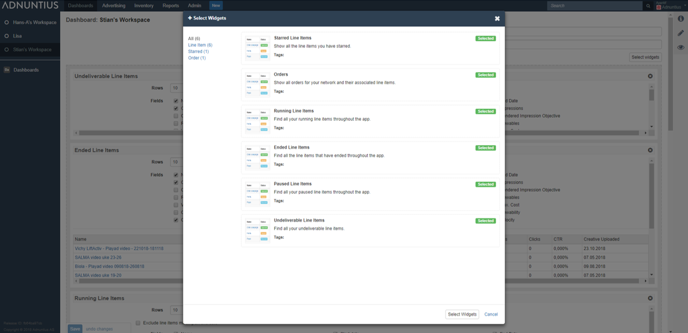
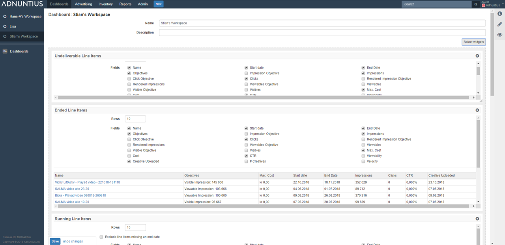
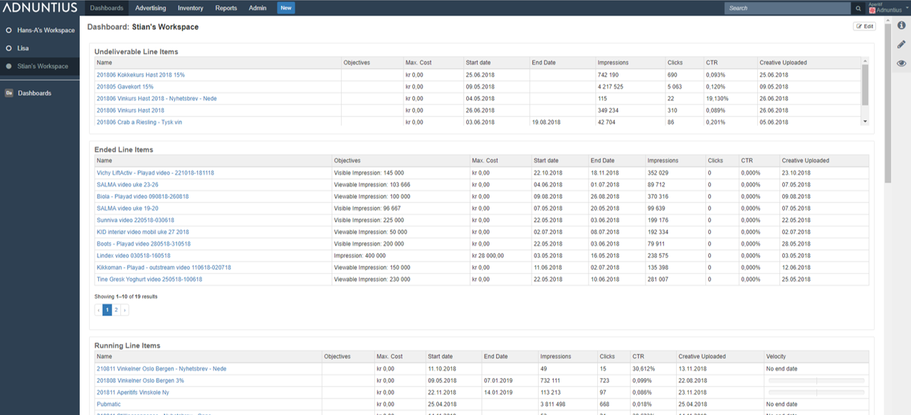

# Dashboards

Dashboards is a set of drag-and-drop widgets that you can add in order to keep control of what is going on. You can create any number of dashboards and change between them in the left-most column as soon as they are created. Here are an explanation of the widgets you can add to your dashboard.

* Running line items: Keep an eye on running line items, and easily see which line items are overdelivering or underdelivering. 
* Undeliverable line items: Quickly identify the campaigns that you need to make changes to in order for them to start running. 
* Ended line items: If you haven't set up automated reporting, an overview of ended line items can help you keep overview of the reports you should be sending out.
* Paused line items: See which line items are paused. 
* Starred line items: Keep an extra eye on your favorites.
* Orders: Overview of active orders.

