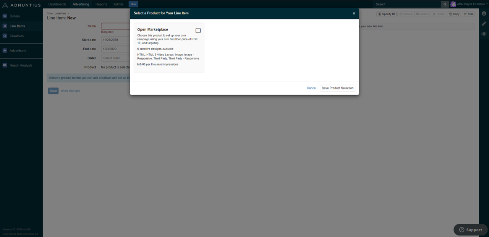

# Marketplace Products


Introduction to Marketplace Products.


As a publisher you can create a marketplace product to design a specific buying option to one or more defined marketplace advertisers buying your traffic. A marketplace product is comparable to a programmatic deal ID that can be shared with a buyer, but markeplace products adds more features and provides a higher level of automation.

.png>)

Whenever a marketplace product is created and assigned to one or more buyers, then buyers will be able to create [line items](../advertising/line-items.md) with the opportunities and constraints that you set in the product.

**Where to find marketplace products.** [Click here](https://admin.adnuntius.com/admin/marketplace-products) to go to the marketplace product section in admin.adnuntius.com. To create a new product, click New in the upper right corner of the screen. You can create any number of products.

Give the product a **name and description** of your choice. The name and description will be available to the buyers that you allow access to use this product.

**Objective Requirements** allows you to specifiy if a Marketplace Advertiser has to select an Objective or not. You can set the value to **Any** (Advertisers must specify at least one objective), **Impressions** (Advertisers must specify an impressions objective) or **Optional** (Advertisers do not need to supply any objective).

**Minimum CPM** specifies the minimum CPM bid that the marketplace advertiser has to pay when buying advertising through this product. The **CPM Value** determines if that price should be a fixed price, or if buyers should be allowed to bid higher as well. The **Bid Strategy Option** determines if a Marketplace Advertiser will always bid their nominated CPM (Standrd only) or if they can bid a CPM that is proportion to ad unit viewability (vCPM permitted).

* Minimum CPC specifies the minimum CPC if you choose to offer it (network owners can turn on and off different cost models available under the [Network Section](../../../adnuntius-data/user-interface-guide/admin/network.md)).
* Minimum and maximum budgets specify the budget constraints that marketplace advertisers will be allowed to put into their campaigns (max budgets can for instance be used to avoid mistakes).

**Dimensions** lets you limit the creative dimensions allowed for a Marketplace Product. If no dimensions are added means creatives can have any dimensions.

**Rate limits** allows you to specify for instance frequency capping, for instance that the marketplace advertiser's campaign will automatically deliver max 3 impressions per 24 hours.

**Review Workflow** lets you specify whether a marketplace advertiser's creatives should be reviewed by a network admin before they are allowed to go live. Please note that if you are part of a shared marketplace where multiple publishers participate, please [ask Adnuntius](mailto:support@adnuntius.com) whether the network is set up with ad ops resources to perform that review.

**Default tier** specifies in which tier the marketplace advertiser's line items will be placed when they use this product. You can therefore decide which priority that the line items should have relative to other line items.

**Default Deal ID** allows you to add a deal ID to the product. Any campaigns created using this product will have this deal ID assigned by default.

**Owenership** defines the ownership and who can make changes to a Marketplace product.

**Teams** is where you can choose which teams (marketplace advertisers) should have access to this product.

**Layouts** lets you make different [layouts ](layouts.md)available to buyers. For example, if you want a specified set of marketplace advertisers to have access to buy the layout parallax ([see example here](https://admin.adnuntius.com/admin/layout-examples/layout-example/parallax-layout-example)), then you can add this layout to the product. When added, advertisers will be able to choose between only the layouts that you enable here.

**Mandatory targeting** lets you pre-choose the targeting criteria that will be available when creating line items using this product. For example, if this product should offer location targeting only within Australia, then you can set that location targeting here. This means that all line items created with this product will always be targeted to Australia only.

**Optional targeting types** lets you choose the options that advertisers can choose between when targeting their campaigns. If you for example allow for location targeting and site targeting, then marketplace advertisers will be able to choose between whatever locations and sites they want to.


If you do not send contextual information such as categories or key values to Adnuntius, then you should disable these targeting criteria so that they are not available to marketplace advertisers. You can easily exclude targeting options with optional targeting.


When a product is created and assigned to a buyer, then that buyer can choose that product when creating a line item. The screenshot below shows an example where a buyer has been assigned to one product only.

