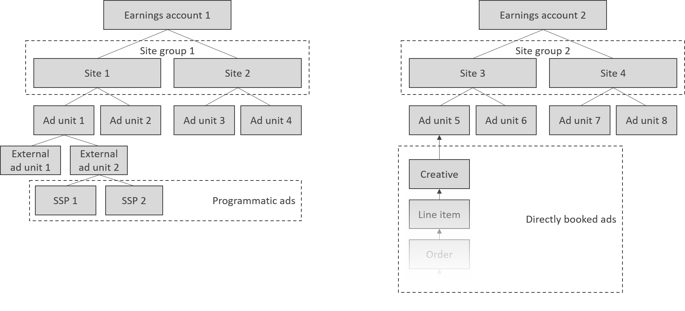

# Inventory

## Concept Summary

| Name | Description |
| :--- | :--- |
| [Earnings account](earnings-accounts.md) | Lets you aggregate earnings that one or more sites have made. Here is how you create an earnings account. |
| [Site group](site-groups.md) | Lets publishers group sites together to make targeting line items and/or creatives to multiple sites easier. |
| [Site](sites.md) | A site or domain with a given name, containing one or more ad units.  |
| [Ad Unit](adunits-1.md) | A placement that goes onto your site, so that you can later fill it with ads. It is as such an empty container that sets aside a space on your site so that you can fill it with content. |
| [External Ad Unit](external-adunits.md) | A placement connecting programmatic ads to an ad unit, enabling you to serve ads from an SSP with a server-side connection. |

Here is how the various objects hang together: an earnings account and site group can both contain multiple sites; a site can contain multiple ad units, and ad units can connect to creatives \(for direct advertising\) or to external ad units \(for programmatic ads\). 

