# Adunits



An Ad unit is a placement that serves advertising and other content onto a publisher's site. It is a snippet of code placed on a website or within a third party system to request content from Adnuntius. If you're a developer and want to know the properties of the ad tag \(adn.js\), please see "[Requesting ads](../../requesting-ads/)".

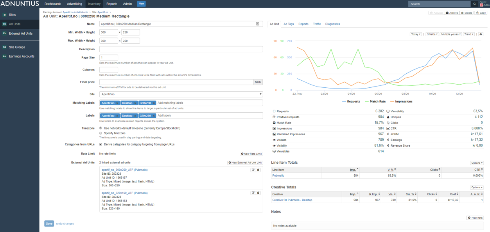

You can create an ad unit by going to Inventory &gt; Ad Units, then in the upper right corner click "New".

**Name and description**: Give the ad unit a name and description \(optional\) of your choice. It is always better to use spacing between words rather than underscores, as searching for items later makes the items easier to find.

**Minimum and maximum width and height**: You can add a range of dimensions to ensure that an ad unit can serve any size between your minimum and maximum constraints. For example, if your ad unit has minimum 728x90 and maximum 1000x400 pixels, then any creative with width between 728 and 1000, and height between 90 and 400 pixels can be served. 


As long as the creative is within the min/max size limits, the ad unit will automatically shrink to the size of the creative. If there is no creative  to serve, the ad unit will by default collapse so that it does not take up space on the site.  


**Page size and columns**: _Page siz_e determines the number of creatives that can be shown inside your ad unit. For instance, if you have a 1000x300 ad unit and page size of 3, then the ad unit may \(depending on what provides the highest revenue\) serve for instance three 300x300 creatives inside this ad unit. _Columns_ lets you set the maximum number of columns to be filled with ads within the ad unit's dimensions. So if you have your 1000x300 ad unit and allow 2 columns, then that ad unit can fill for instance two 300x300 creatives side by side, but not three.


If you leave the page size and columns fields blank, then Adnuntius will serve any number of ads and columns inside the ad unit \(of course without exceeding the size constraints\).


**Floor price** determines the minimum eCPM, or the cost per thousand ad impressions, that you will accept on this ad unit. This means that any line items with a CPM bid lower than what you specify, will not be shown in this ad unit. Please note that if you run programmatic advertising with prebid or with one of our server-side connections, the floor price will apply also to these advertising sources.

**Site** lets you specify this ad unit's parent site. 

**Matching labels** lets you target line items and/or creatives to groups of ad units with the same label. For instance, if you add “sports”, or “300x250”, or “mobile” to a set of ad units, you can with one click target a line item and/or creative to these ad units.

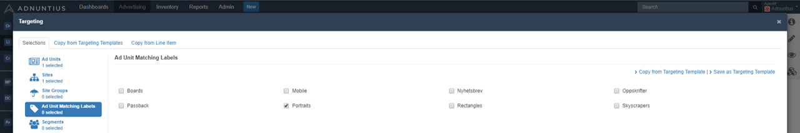

**Labels** can be added to make reporting work for you. Let's say you add the label "skyscrapers" to a set of ad units, and then want to run a report only for this group of ad units. You can then run a report which filters on these ad units specifically. [Learn more about reports. ](../reports/publishing-queries.md)

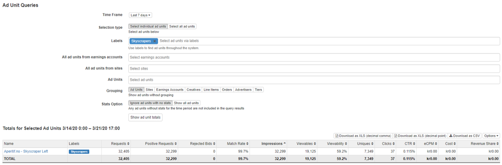

**Timezone** lets you choose the timezone for the ad unit. Timezones is important because you can target ads to run on specific dates and times. For instance, if your ad unit's timezone is set to London and you have an ad that runs until 4pm every day using [day parts](https://docs.adnuntius.com/adnuntius-advertising/admin-ui/advertising/targeting#day-parts-targeting), then that ad will stop running at 4pm London time. However, if you would set that ad unit to Oslo time instead \(which is 1 hour ahead of London\), the ad would stop running at 4pm Oslo time - which is 5pm London time.

**Categories from URLs**: ad units can automatically pick up the URL for the page on which it is shown, so that you can later use that information for [targeting ads to specific categories](https://docs.adnuntius.com/adnuntius-advertising/admin-ui/advertising/targeting#category-targeting).

**Key values from URLs**: ad units can automatically derive key values for key value targeting from the page URL's query string. For example, if a user goes to the site example.com, searches for "wine" and the landing page has the URL [https://example.com/search?query=wine](https://www.aperitif.no/sok?query=wine), then the key value query=wine will immediately be available for targeting for line items and creatives. 

**Targeting options**: The ad server's default option "Can have no targeting", which means that the ad server will deliver ads to every ad unit that it will fit. Sometimes that will not be the best solution for you. For these scenarios we have added two more targeting options.



"Can have no targeting" means that line items with no targeting can deliver to this ad unit \(useful for backfill or network-wide ads\).



"Must have Targeting" means that only line items with any kind of targeting can deliver to this ad unit.



"Must match type" allows you to select what targeting you will allow for this ad unit. It will open a list that looks like this.

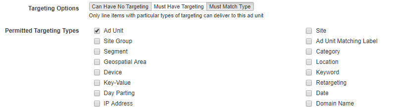

In the instance above only ad unit targeting is selected. This will only allow line items with ad unit targeting to be showed for this ad unit. If this would be applied to an ad unit it would not show any ads unless it´s explicitly targeted. You can of course add more targeting to the line item to reduce the scope of users to target.



**Rate limits** allows you to limit the traffic \(viewable/visible/rendered/regular impressions or clicks\) that an ad unit receives in a given timeframe. A rate limit may be useful to ad networks that are allowed to sell only a defined set of impressions on a publisher’s behalf. If this applies to you, simply add the number of impressions, clicks or other that you are allowed to sell, then choose the period. You can also add labels if the limitation should apply only to certain line items. For example, if you add “cars” to the label field, then the rate limit will apply to all line items with the label "cars", while all other line items will be free to deliver without limitation.

**External ad units** are placements connecting programmatic ads to an ad unit, enabling you to serve ads from one or more SSPs with a client-side or server-side connection. [Read more about external ad units in this separate section](external-adunits.md).

**Overview, charts and reports**: On the right side of an ad unit's page you will find multiple tabs. 



Ad unit charts provides you with insights about the ad unit's performance for whichever period you would like. Choose the period, the metrics, and the visualization of the data to design the charts you want to see. You can also download the report to Excel directly from this page.

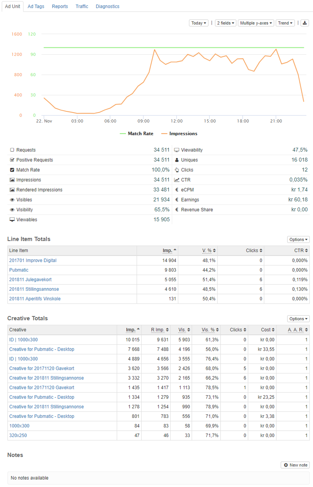



If you have external ad units serving programmatic ads AND you have connected this ad unit to one or more external ad units, you can see how programmatic ads are delivering to this ad unit. 

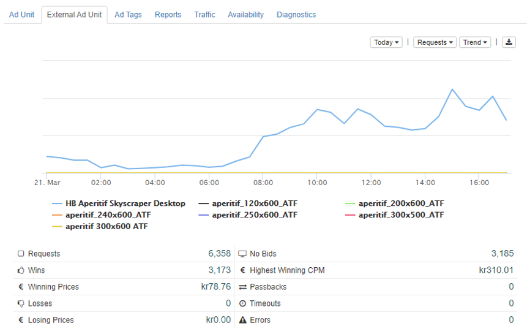



The tab “Ad Tags” is where you get the ad tag that is to be placed onto the page where you want ads to show. You can choose between standard tags for your webpage, email tags that can go into your newsletter, and VAST tags if you want to implement for video ads \(instance prerolls, midrolls or endrolls\).

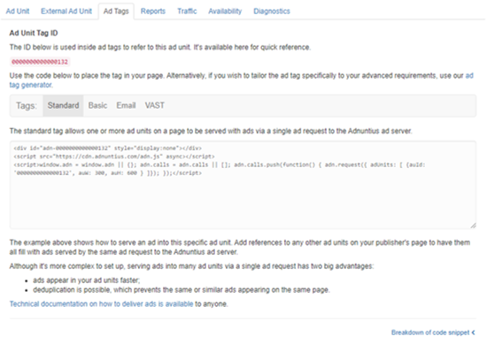



Allows you to create a report based on a [report template](../reports/reports-templates-and-schedules.md), that can be shared with others as a link. You can also schedule reports to be created regularly, and whoever should receive the reports. Once you have created a scheduled report and added a recipient, Adnuntius will automatically send reports to recipients, containing the data you have decided on using in the [report template](../reports/reports-templates-and-schedules.md).

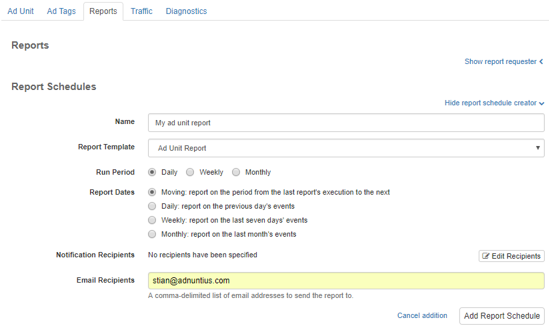



The traffic tab shows you the delivery of impressions, clicks, viewables and visible impressions that this ad unit has delivered, per device type, operating system and mobile brand. 

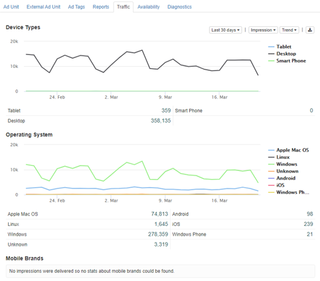



Availability allows you to forecast how much traffic your ad unit is likely to have available in a defined period. Just enter a date range and then click “run availability” analysis. 

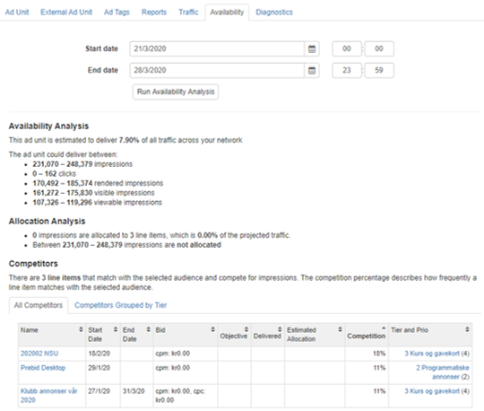

The followin explanations will the example above above for guidance. 

First, the analysis tells you that "**This ad unit is estimated to deliver 7.90% of all traffic across your network**", and that this means that for the defined period the ad unit can deliver between 231,070 and 248,379 impressions, between 0 and 162 clicks etc. If you choose a longer period of time \(start and end date\) these numbers are likely to increase. 

Next, the allocation analysis tells you that "**0 impressions are allocated to 3 line items, which is 0.00% of the projected traffic**". This may sound strange, but the reason is that none of the three line items currently taking up space for this ad unit have any objectives \(impressions, clicks etc\) registered. Let's say that one of the three line items had an impression objective of 100,000 impressions, was targeted to this ad unit only and had start and end dates equal to the ones you chose, then the message could be "100,000 impressions are allocated to 3 line items, which is 43.29% of the projected traffic".

The message "**Between 231,070 – 248,379 impressions are not allocated**" tells you how many impressions are not booked already, meaning that you can probably book this many impressions for a new line item. If we repeated the example above with the 100,000 booke impressions, the message could have been "Between 131,070 – 148,379 impressions are not allocated". 

Competitors is a useful list of competing line items \(either as one list, or grouped by tiers\). This list lets you identify competing line items and make changes to them in case you need to make room for a new and more important campaign.



If you cannot see any ads in your ad unit, or you expected to see another ad, then diagnostics is a test that gives you more insight into what might be going on. You can simulate different targeting criteria before you run the test. Running the test, you will get detailed feedback on winning, losing, capped, unmatched and unsuitable line items, and the reasons why they were so. 

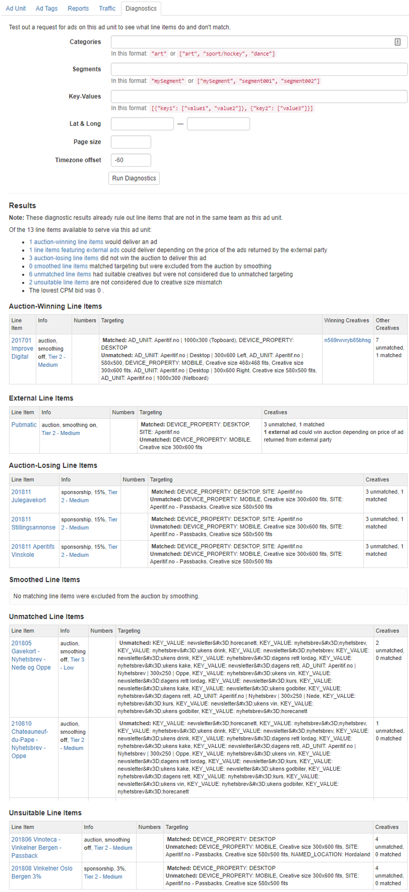


You can also run diagnostics for [line items](../advertising/#line-item) if you wonder how an ad unit gave a line item the result that it got.



You can also add ?adndebug123 at the end of any URL \(example: www.aperitif.no?adndebug123\) to show you all ad units, line items, creatives, targeting and more information in the context of a webpage.




