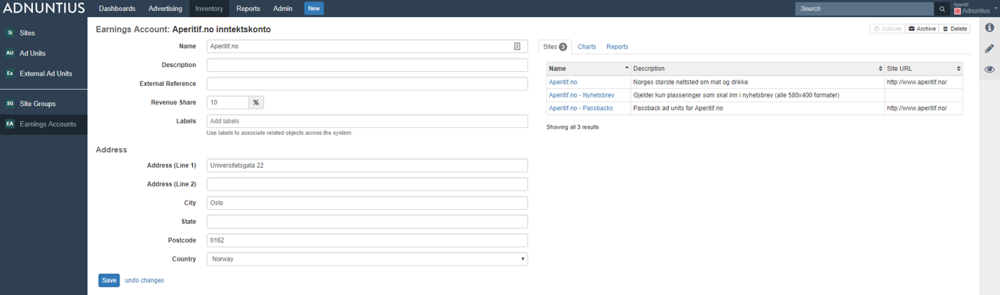
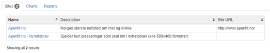
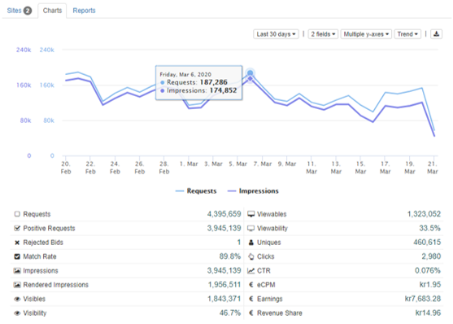
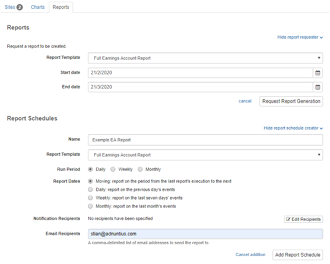

# Earnings Accounts


How to create an earnings account.


An earnings account contains one or more sites, and makes it easy to keep track of the earnings you as a publisher have made across those sites, or the spending that you as a buyer has made across those sites.


A site can only have one earnings account, as registering the same earnings multiple places would result in the wrong earnings. However, an earnings account may contain multiple sites.


**Name, description and address**: Give the earnings account a name and description (optional) of your choice. You can also add an address to the account (optional).

**External reference:** Add an external reference (optional) if you want to match the earnings account with the same account in another system. For instance, if you are an ad network working with publishing partners, and a publisher is registered in your invoicing system with customer ID 123456, then you can add 123456 as an external reference in Adnuntius. This way you can easily recognize two different entries as the same item across two different systems, which may in turn speed up processes like invoicing.

**Revenue share**: If you are an ad network or a marketer with publishing partners, where the publisher is entitled to a share of revenue, then you can specify the revenue share. For example, if you add 10% as revenue share, this means that you award this earnings account 10% of whatever is earned from the sites belonging to this earnings account.&#x20;

**Labels** can be added to make reporting work for you. Let's say you add the label "Norway" to a set of earnings accounts, and then want to run a report only for this set of accounts. You can then run a report which filters on these accounts specifically. [Read more about reports](../reports/publishing-queries.md).

Once an earnings account is created you get more choices on the right side.&#x20;



An overview of the sites belonging to this earnings account. You can change a site's earnings account under [Sites](sites.md).




Charts shows any of your chosen metrics for any given period. You can from here download reports to Excel.&#x20;




Reports allow you to generate a report based on any of your report templates. The result is a URL that can be shared with any person (that person does not need to have access to Adnuntius).&#x20;

You can also generate scheduled reports that will automatically send reports per email to any receiver. [Learn how to create report templates](../reports/reports-templates-and-schedules.md).&#x20;



