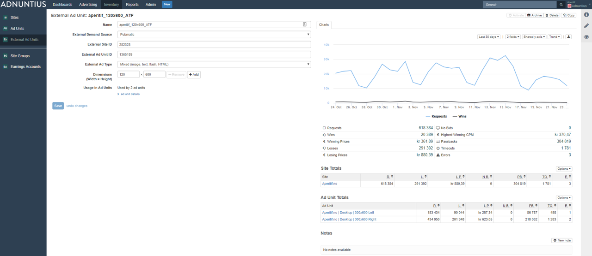
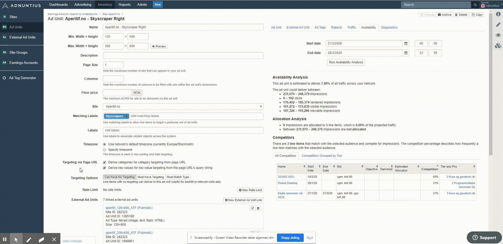

# External Ad Units

Put simply, an external ad unit is what connects a ["regular" Adnuntius ad unit](./#ad-units) to an ad unit that you've creating in one or more SSPs. Before creating external ad units you need to have done the following: 

1. Created accounts \(customer relationships\) with one or more SSPs, and ad units within those SSPs. Please contact us at [support@adnuntius.com](mailto:support@adnuntius.com) if you want our advise on this. 
2. Set up a connection[ between Adnuntius and an SSP](../admin.md#external-demand-sources).

**Name**: Give the external ad unit a name of your choice. We recommend that you use the same name for ad units that connect your SSP with Adnuntius. 

**External demand source**: Select an external demand source \(SSP\) from the dropdown list. If your dropdown list is empty, this is because you have not set up a [connection between Adnuntius and an SSP](../admin.md#external-demand-sources).

**External site and ad unit ID:** Provide this ad unit's parent site ID as it is defined in your SSP account, and the SSP ad unit ID that you want to connect to this external ad unit. For example, in Pubmatic you will find the site ID in the URL when editing the site \(example URL: [https://apps.pubmatic.com/inventoryui/\#/sites/editSites/250032](https://apps.pubmatic.com/inventoryui/#/sites/editSites/250032)\). 250032 is the site's ID in this example. And you will find Pubmatic ad unit IDs in list of a site's ad units - like here: 

**External ad type** means that you can choose between ad formats like video, flash, text, html, image and more. We normally like to go with "mixed" as this gives the ad unit to choose the most profitable alternative between the various format options, but if you have preferences you can choose one specific type. 

**Dimensions**: Give your external ad unit a width and height. This should be the same width and height as you provide in the SSP that your external ad unit connects to. 

**Usage in ad units**: The last step is to connect your external ad unit to a ["regular" Adnuntius ad unit](./#ad-units). This is done on the ad unit page, and once you have done so, you will on the external ad unit page see an overview of the ad units connected to your external ad unit. 


If you want granular reporting you can create one external ad unit for every SSP ad unit you create. But if you are ok with aggregating the statistics a bit and want to save time, you can create one external ad unit for every ad unit size. You can then connect that one size to multiple regular Adnuntius ad units. 


