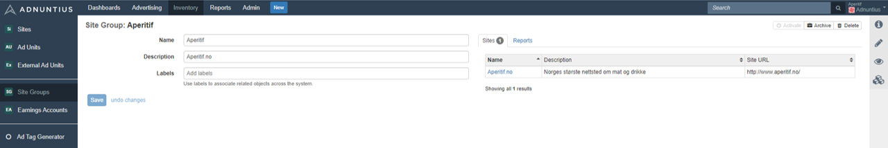
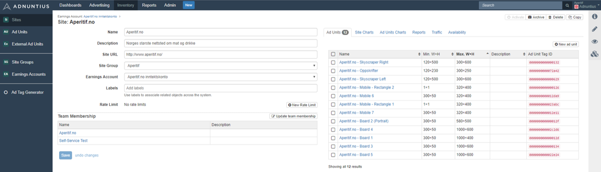

# Site Groups


How to create a site group.


To create a site group, go to Inventory > Site Groups and click "New" in the upper right corner. Give the site group a name, a description (optional), and any labels (optional) to make search and reporting easier.  Then click save.

Then, go to any site that you would like to put into the site group. Under Site group, click the dropdown menu and choose your site group. Then click to save the changes to the site. 

After this, when you or any buyer clicks to target a line item or creative, they will find your site group as a criteria. Once a site group is chosen, the line item or creative will target that group of sites. 

