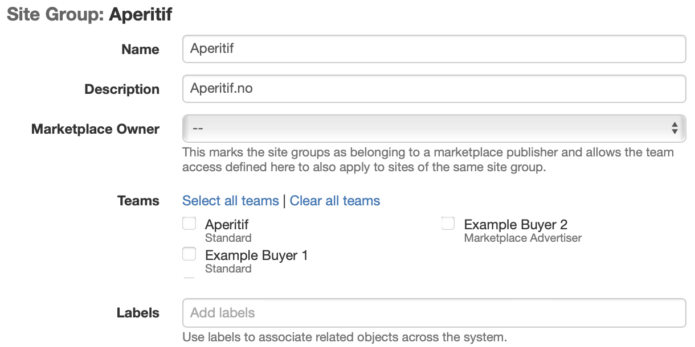

# Site Groups


How to create a site group.


## Creating a Site Group

To create a site group [go to Site Groups under the Inventory section](https://admin.adnuntius.com/site-groups), and then click "New" in the upper right corner. Give the site group a **name**, an optional **description**, and any optional **labels** to make search and reporting easier.&#x20;

<figure><figcaption></figcaption></figure>

Assign a site group **Owner** to mark that the site group belongs to a marketplace publisher and allows the team access defined here to also apply to sites of the same site group.

Choose the [**teams** ](../users/users-teams-and-roles-1.md)that should have access to target line items and creatives to this site group. Then click save.

You can now go to any site that you would like to put into the site group. On each site, under Site group, click the dropdown menu and choose your site group. Then click to save the changes to the site.

## When a Site Group is Created

### Site Group Targeting

When you or any buyer clicks to target a line item or creative, they will find your site group as a criteria. Once a site group is chosen, the line item or creative will target that group of sites.

### Sites

When you have created a site group you will see the sites under it in the right-side column.

### Reports

Reports allow you to generate a report based on any of your report templates. The result is a URL that can be shared with any person (that person does not need to have access to Adnuntius).

You can also generate scheduled reports that will automatically send reports per email to any receiver. [Learn how to create report templates](../reports/reports-templates-and-schedules.md).

