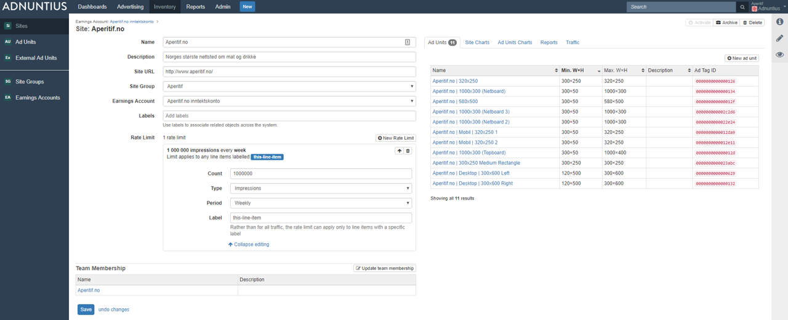
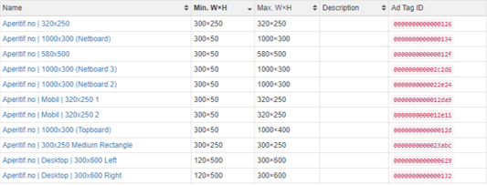
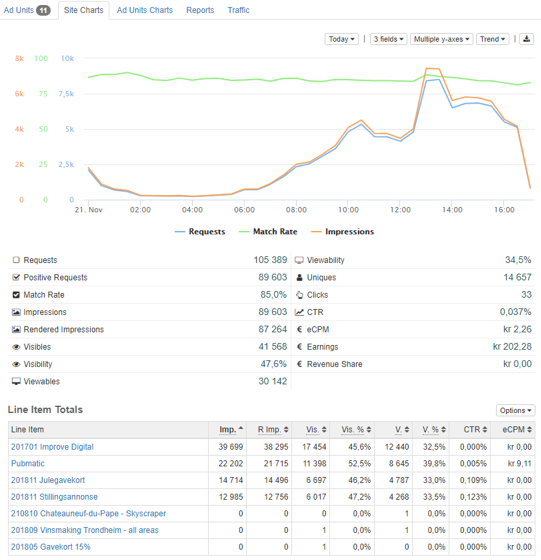
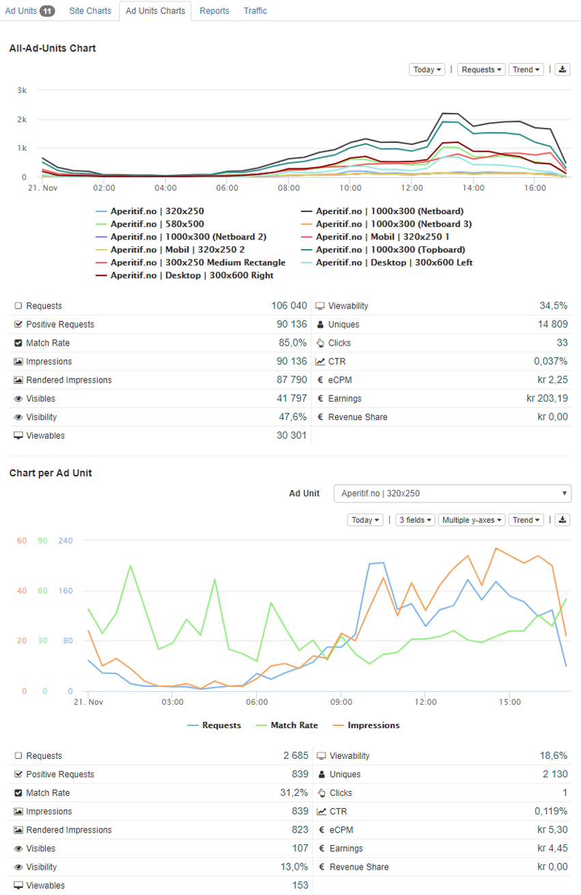
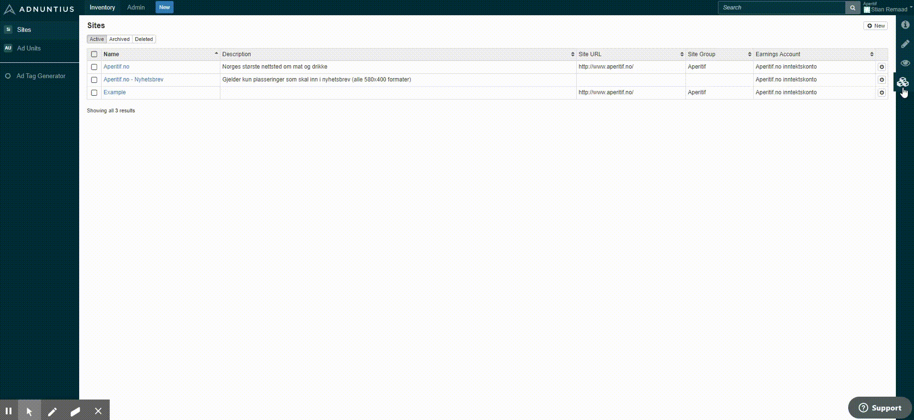

# Sites


How to create a site.


Sites are objects that make it easy for publishers to organize advertising inventory according to the domains, or sites, that publishers own, control or have access to. Once a site is created it can be targeted by line items and creatives. It is also a folder for ad units, which are the placements that go onto the sites to show ads. Ad units are the most granular object on the inventory part of Adnuntius Advertising, and sites are as such folders that help you as a publisher to organize your ad units.

To create a site, go to [https://admin.adnuntius.com/sites](https://admin.adnuntius.com/sites) and click "New" in the upper right corner.

**Name, description and site URL**: Give your site a name and description (optional) of your choice. The site URL (optional) helps you quickly visit the site in question, but does not impact any form of targeting, and has no other functions.

**Site group (optional)**: Connect the site to a [site group](site-groups.md) to make targeting multiple sites easier. 

**Earnings account (optional)**: Connect the site to an [earnings account](earnings-accounts.md) to aggregate earnings from this site and other sites to an earnings account. 

**Labels** (optional) can be added to make it easier to search for the site, and to make reporting work for you. Let's say you add the label "publishing-group" to a set of sites, and then want to run a report only for this group of sites. You can then run a report which contains these sites specifically. [Learn more about reports](../reports/publishing-queries.md).

**Rate limits** allows you to limit the traffic (viewable/visible/rendered/regular impressions or clicks) that a site or ad unit receives in a given timeframe. A rate limit may be useful to ad networks that are allowed to sell only a defined set of impressions on a publisher’s behalf. If this applies to you, simply add the number of impressions, clicks or other that you are allowed to sell, then choose the period. You can also add labels if the limitation should apply only to certain line items. For example, if you add “cars” to the label field, then the rate limit will apply to all line items with the label "cars", while all other line items will be free to deliver without limitation.  

**Team membership: ** A [team](../admin/users-teams-and-roles.md) consists of users who should have access to see and/or perform changes to the site (their privileges are determined by [Roles](../admin/users-teams-and-roles.md)). When you add your site to a team, this determines who will have access to view and/or change the site.


While we cover teams in greater detail in the admin section, a [team](../admin/users-teams-and-roles.md) determines what content a user will have access to. A [Role ](../admin/users-teams-and-roles.md)on the other hand, defines the actions that user can take to that content. 


**Overview, charts and reports**: On the right side of a site's page you will find multiple tabs that each has its function. 



An overview of ad units belonging to the site. From here you can also create new ad units. 




Site charts provides you with insights about the site's performance for whichever period you would like. Choose the period, the metrics, and the visualization of the data to design the charts you want to see. You can also see the line items that delivered to the site in the period. 




Ad unit charts provides you with insights about the site's ad unit performance for whichever period you would like. Choose the period, the metrics, and the visualization of the data to design the charts you want to see. You can also see the line items that delivered to the site, and for each ad unit, in the period.




Allows you to create a report based on a [report template](../reports/reports-templates-and-schedules.md), that can be shared with others as a link. You can also schedule reports to be created regularly, and whoever should receive the reports. Once you have created a scheduled report and added a recipient, Adnuntius will automatically send reports to recipients, containing the data you have decided on using in the [report template](../reports/reports-templates-and-schedules.md). 




The traffic tab shows you the delivery of impressions, clicks, viewables and visible impressions that this site has delivered, per device type, operating system and mobile brand. 




Availability allows you to forecast how much traffic your site is likely to have available in a defined period. Just enter a date range and then click “run availability” analysis. 

The following explanations will the example above above for guidance. 

First, the analysis tells you that "**This ad unit is estimated to deliver 7.90% of all traffic across your network**", and that this means that for the defined period the ad unit can deliver between 231,070 and 248,379 impressions, between 0 and 162 clicks etc. If you choose a longer period of time (start and end date) these numbers are likely to increase. 

Next, the allocation analysis tells you that "**0 impressions are allocated to 3 line items, which is 0.00% of the projected traffic**". This may sound strange, but the reason is that none of the three line items currently taking up space for this site have any objectives (impressions, clicks etc) registered. Let's say that one of the three line items had an impression objective of 100,000 impressions, was targeted to this ad unit only and had start and end dates equal to the ones you chose, then the message could be "100,000 impressions are allocated to 3 line items, which is 43.29% of the projected traffic".

The message "**Between 231,070 – 248,379 impressions are not allocated**" tells you how many impressions are not booked already, meaning that you can probably book this many impressions for a new line item. If we repeated the example above with the 100,000 booke impressions, the message could have been "Between 131,070 – 148,379 impressions are not allocated". 

Competitors is a useful list of competing line items (either as one list, or grouped by tiers). This list lets you identify competing line items and make changes to them in case you need to make room for a new and more important campaign.



Please note that if you have access to more than one network you can easily switch between networks. Let's say that you as a publisher have your own private network, and access to sell your inventory through the [Adnuntius Buying Network](../../../onboarding-guides/adnuntius-buying-network/); then you can easily switch between networks you have access to, as shown in the image below. 

