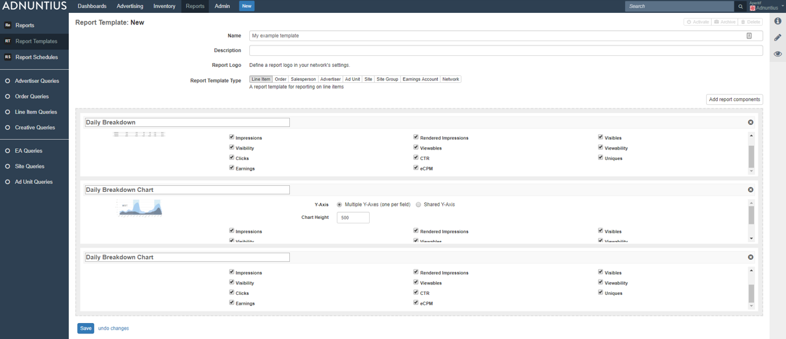
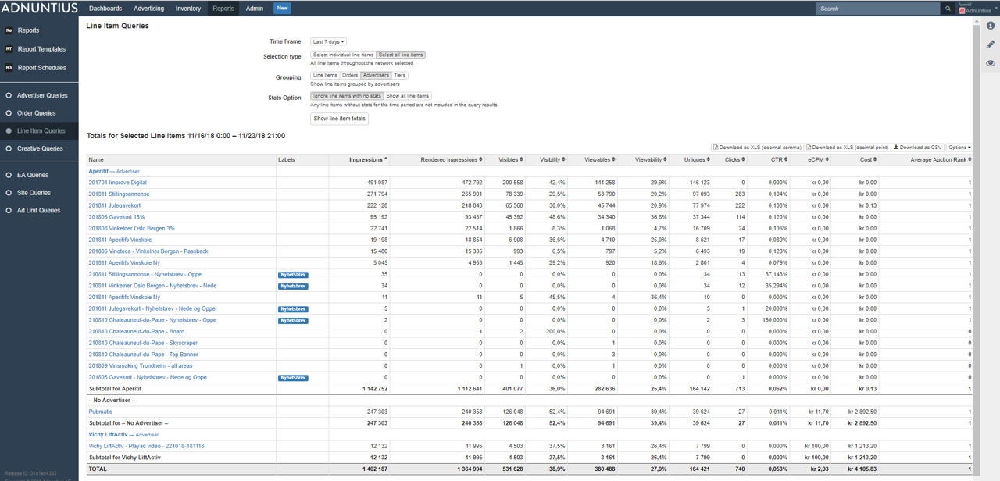
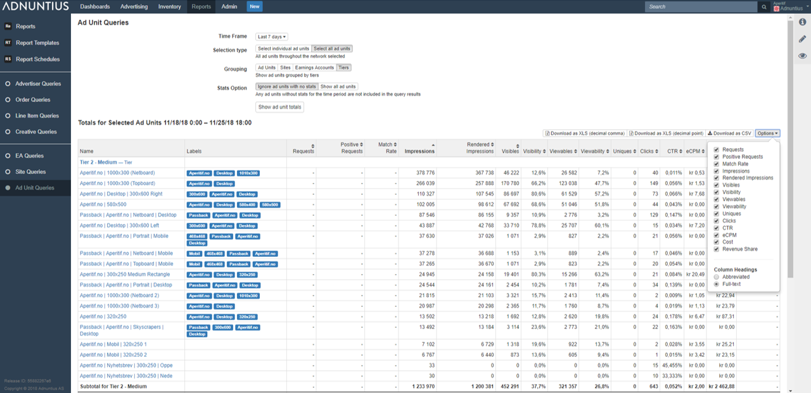

# Reports

## Reports, Report Templates, and Report Schedules

**Reports** is an overview of the reports that have run in the past. This overview allows you to quickly retrieve and report that the system has generated, and to open them. 

**Report schedules** is an overview of all reports that have been scheduled to run. 

**Report templates** allow you to determine how a\(n automatically generated\) report by Adnuntius should look like, regarding the insights it should produce, using which metrics. Here is how you create a template.

**Name, description and logo:** Give the report template a name and description \(optional\) of your choice. If you have [uploaded a logo in the Admin &gt; Network section](admin.md#network), you can also preview the logo that will be used in reports when they are generated. 

**Report template type**: Choose the report type you want to create based on this template. For example, if you choose "line item", then this template will be made available for users when they create a report for line items. The types you can choose between: 

* Line item
* Order
* Salesperson
* Advertiser
* Ad unit
* Site
* Site group
* Earnings account
* Network \(creates day-by-day breakdown of all metrics per advertiser, per line item, per ad unit\).

**Report components** are widgets you can add to the template to display reporting data. After you've chosen one or more widgets you can decide which metrics \(impressions, viewables, clicks, earnings etc\) that you want to show inside that widget. Example: If you are a publisher intending to automatically send reports to advertisers, perhaps you don't want to show the earnings? If this is the case, you can disable earnings from being shown.


You can show one report component several times in the same template by choosing it, saving, clicking "Add report component" again, and then choosing it again. This may be useful if you for instance want to split up daily breakdown charts, and have one of them display clicks and clickrates, and another one display impressions and viewables. 


## Advertising Queries

Advertising queries are reports you can run to get an overview of all advertisers, orders, line items or creatives that have been running in your chosen time period. You can apply multiple filters to get the data you want.

**Metrics**: Here are the metrics returned by a query, and what they mean.

* Impression: An ad has been delivered by the Adnuntius adserver.
* Rendered Impression: An ad has been rendered onto a page.
* Visibles: An ad has shown one or more pixels in the viewport.
* Visibility: The share of impressions that were visible.
* Viewables: Ad ad has 50% or more of its pixels shown in the viewport for 1 second or longer.
* Viewability: The share of impressions that were viewable.
* Uniques: Unique users \(browsers\).
* Clicks: Clicks on an ad.
* CTR: Clickrate, meaning the share of impressions that produce a click.
* eCPM: \(effective\) cost per thousand ad impressions, calculated as \[Cost\] / \[Impressions\] x 1000.
* Cost: The revenue generated over the period.
* Average Auction Rank: The average rank of the ad impression. If more than one ad is shown inside an ad unit, this number is the ranking of this ad.

## Publishing queries

Publishing queries are reports you can run to get an overview of all earnings accounts, sites or ad units that have been running in your chosen time period. You can apply multiple filters to get the data you want.

**Metrics**: Here are the metrics returned by a query, and what they mean.

* Request: An ad tag has sent a request to the Adnuntius adserver for an ad. 
* Positive request: The Adnuntius adserver has responded to the request with one or more ads. 
* Match rate: The share of requests that return one or more ads.
* Impression: An ad has been delivered by the Adnuntius adserver. Please note that the number of ad impressions may be higher than positive requests; this is because an ad unit can show more than one ad.
* Rendered Impression: An ad has been rendered onto a page.
* Visibles: An ad has shown one or more pixels in the viewport.
* Visibility: The share of impressions that were visible.
* Viewables: Ad ad has 50% or more of its pixels shown in the viewport for 1 second or longer.
* Viewability: The share of impressions that were viewable.
* Uniques: Unique users \(browsers\).
* Clicks: Clicks on an ad.
* CTR: Clickrate, meaning the share of impressions that produce a click.
* eCPM: \(effective\) cost per thousand ad impressions, calculated as \[Cost\] / \[Impressions\] x 1000.
* Cost: The revenue generated over the period.
* Revenue share: Revenue share to partners as specified in [earnings accounts](inventory/#earnings-account).

