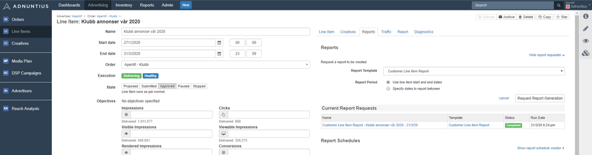

# Templates and Schedules


How to create a report template.


## **Reports and Scheduled Reports**

**Reports** is an overview of the reports that have run in the past. This overview allows you to quickly retrieve a report that the system has previosuly generated, and to open them.

**Report schedules** is an overview of all scheduled reports that are running. From here you can archive or delete a scheduled report so that it stops running and no longer sends emails to any receivers.

## **Report Templates**

Report templates allow you to determine how a (scheduled) report by Adnuntius should look like, what insights it should produce, and using which metrics.

To create a template, [go to Report Templates under the Reports section](https://admin.adnuntius.com/report-templates), and click "new" in the upper right corner.&#x20;

Give the report template a **name** and **description** of your choice.&#x20;

Choose the report **template type**. If you choose for example "line item", then this template will be made available for users when they create a report for line items. The types you can choose between are Line item, Order, Salesperson, Advertiser, Ad unit, Site, Site group, Earnings account, and Network (creates day-by-day breakdown of all metrics per advertiser, per line item, per ad unit).

You can choose between HTML and CSV as **format**. If you choose HTML then the link will lead to a webpage showing the report. If you choose CSV then the link will trigger a download of a CSV file containing the reporting data.&#x20;

You can link to your **logo** for this specific template, or refer to the logo URL in the [admin section](../admin/) if you have specified one there. You can use our CDN uploads if you need a place to get your logo online.

**Header content** and **footer content** can be used if you want to style your report header. Any content entered here goes into the head/footer tag of the generated report.

If you have created a **report translation** then you can apply this translation here, to ensure that report receivers get the reports in the language they prefer.

**Report components** are widgets you can add to the template to display reporting data. After you've chosen one or more widgets you can decide which metrics (impressions, viewables, clicks, earnings etc) that you want to show inside that widget. Example: If you are a publisher intending to automatically send reports to advertisers, perhaps you don't want to show the earnings? If this is the case, you can disable earnings from being shown.


You can show one report component several times in the same template by choosing it, saving, clicking "Add report component" again, and then choosing it again. This may be useful if you for instance want to split up daily breakdown charts, and have one of them display clicks and clickrates, and another one display impressions and viewables.


