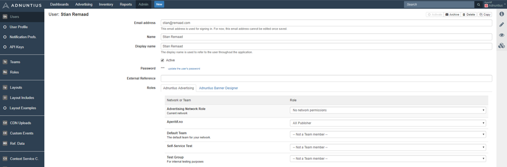

# Users


How to create a user.


To create a user, go to [https://admin.adnuntius.com/admin/users](https://admin.adnuntius.com/admin/users) and click "New" in the upper right corner.

**Email address, Name and Display name**: Apply the user's email address and name. Display name is the name that will be displayed in the upper right corner of the user interface.


Adnuntius automatically sends an email inviting the user to the network, and passwords are created automatically. Administrators can change users' password later if needed, but password changes will not be sent to users, so make sure that you notify users about any new passwords you create.



Please note that, depending on your privileges, some of the elements explained on this page may not be visible to you.


Add an **external reference (optional)** if you want to match the user with the same user in another system. For instance, if John Doe is registered in another system with user ID 123456, then you can add 123456 as an external reference in Adnuntius. This way you can easily recognize two different entries as the same user across two different systems.

**Roles**: A user needs to be assigned with at least two types of roles; a network role and one team role per team. You will find more information on teams and roles further down, but in short:

* A network role (the top role in the user interface, in light gray) determines the actions the user will be able to perform across your entire Adnuntius account. this includes advertisers, earnings accounts, layouts, report templates, users, tiers, custom events, roles and teams.
* A team role determines the actions that a user will be able to perform to content that is team-specific, which includes orders, line items, creatives, sites, ad units, report schedules and reports.

You can also switch between Adnuntius Advertising, Adnuntius Data and Adnuntius Designer. If you click Adnuntius Designer you can assign a role to the user for the Adnuntius Designer application (please note that you may have to create a [role](../../admin-api/endpoints/roles.md) first).


If you want to create a user that has no network permissions, you can create a network role where all permissions are unchecked (and call it for instance "no permissions"). This way, when you add a user with this network role, they cannot do anything to the network, only to the team(s) they're invited to.



In [Admin > Network](../admin/network.md) you can choose to show or hide sections of the user interface that users do not have permissions to edit.

