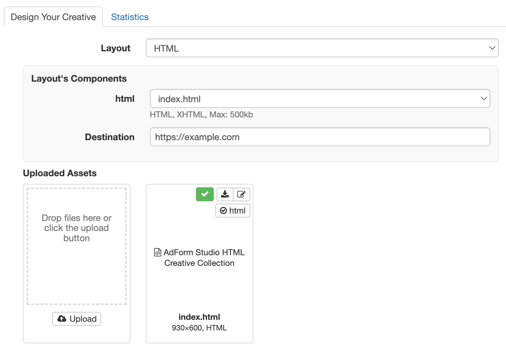

# HTML5 Creatives

Adnuntius supports HTML5 creative ad delivery as a standard feature.&#x20;

To deliver a HTML5 creative, choose a HTML layout, upload your HTML5 zip file and Adnuntius will read everything appropriately, like so:

<figure><figcaption></figcaption></figure>

As shown above, you can also update the destination URL within the Adnuntius platform rather than having to edit the contents of the zip file.

Adnuntius natively supports AdForm Studio, Bannerflow, Google Web Designer, Adobe Animate and Adobe Edge HTML5 creative formats. Just upload the zip and we'll be able to find destination URLs and the dimensions.

In addition, we natively support deriving the destination URLs out of any HTML5 creative that includes any of the following:

* a link assigned to a `clickTag` variable in the zip's primary HTML file, so something like this: `var clickTag = "https://example.com";`
* a link assigned to an anchor tag in the zip's primary HTML file, so something like this: `<a href="https://example.com">My Link</a>`
* a link specified within a `window.open` in the zip's primary HTML file, so something like this: `window.open("https://example.com")`

### Multiple destinations&#x20;

For multiple destinations, we support links assigned to a `clickTag` or `clickUrl` with an appended number. For example:

```
<script>
    var clickTag = "https://destination1.com";
    var clickTag2 = "https://destination2.com";
    var clickTag99 = "https://destination99.com";
</script>
```

### Creative dimensions

Furthermore, we can determine the creative dimensions of any HTML5 creative that specifies the following:

* the height and width within the zip's manifest.json
* the dimensions within the title tag of the zip's primary HTML file, so something like `<title>My HTML5 Creative 320x250</title>`
* the dimensions within the metadata of the zip's primary HTML file, so something like `<meta content="width=300,height=250">`
* the dimensions within the name of the zip's primary HTML file, so something like `index-300x250.html`

On the rare occasion you upload a HTML5 zip file from which we cannot derive any destination URLs or dimensions, you can edit the contents of your zip file to include any of the above, re-zip and re-upload.

Alternatively, you could choose a HTML5 layout on your creative that includes a click overlay and enter the dimensions of the creative manually within Adnuntius.

