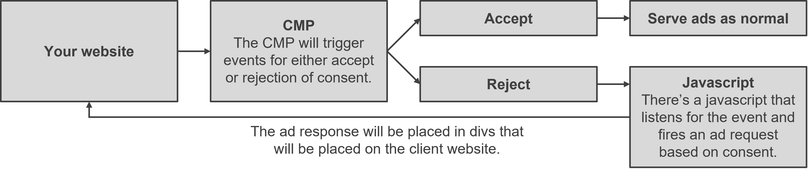

# Cookieless Advertising

Advertising without cookies is easy at Adnuntius. No first-party cookies, no third-party cookies and no local storage is necessary.

We call it anonymous advertising: we don’t need to know anything about who we serve ads to nor leave any trace behind to track anyone.

## HTML5 Ads and Third-Party Creatives

HTML5 and third-party creatives allow advertisers to upload scripts and ads from third-parties that might use cookies. Those scripts and ads from third-party systems are not under our direct control.

Nevertheless, we can do our utmost to block all third-party cookie usage even with HTML5 ads and third-party creatives. We are generally able to block all use of third-party cookies, especially on browsers such as Safari, Firefox and Brave. Occasionally on the Chrome or Edge browsers, some third-party cookies manage to slip through.

Some HTML5 ads and third-party creatives will not appear or function in a user’s browser if cookies are blocked. If this is a problem, we do provide the ability to turn strict cookie blocking on or off at a granular level, which means particular ads can be delivered without cookie restrictions when required.

## The Technical Details

Please note that these details build on the information [provided here](intro/). By default, Adnuntius uses cookies and local storage when delivering ads. To avoid cookies, you can do either of the two things:

* add this code to the top of your web page `adn.useCookies(false);`
* in your ad request, add `useCookies: false` into your ad request as below:

```javascript
adn.request({useCookies: false, adUnits: [{adId: "000000000023"}]});
```

To avoid the use of local storage, you add the following to your page: `adn.useLocalStorage(false);`

To block the use of cookies and local storage in HTML5 ads and third-party cookies, add `isolateFrame: true` into your ad request as below:

```javascript
adn.request({isolateFrame: true, adUnits: [{adId: "000000000023"}]});
```

Note: using the `isolateFrame` option might cause some HTML5 ads or third-party creatives to fail to function or display in a user's browser.

Putting all these options together, you might end up with something like this:

```javascript
  window.adn = window.adn || {}; adn.calls = adn.calls || [];
  adn.calls.push(function() {
    adn.useLocalStorage(false);
    adn.request({ useCookies: false, isolateFrame: true,
        adUnits: [ {  auId: '00000000000432e3' } ]
    });
  });
```

## What We Can't Do When Advertising Anonymously

If you choose to advertise anonymously, with neither cookies or local storage in use, there are two features we cannot provide:

* Per-user caps on ad delivery;
* Accurate unique user counts.

We can provide these two features if cookies or local storage is enabled, but not if both are disabled.

You can still deliver ads anonymously and enjoy both features if you are able to provide a user ID with each ad request.

We keep no retrievable record of the user ID you pass into us because we utilise a mathematical technique called one-way hashing. With one-way hashing, we transform the ID into another set of characters that cannot then be transformed back into the original ID. This means we can count how many unique users have seen an ad but without knowing which particular user IDs saw the ad.

## Implementing Cookieless with a CMP

If you have implemented a consent management platform \(CMP\) that lets your website visitors consent to or reject tracking, then you can most likely use that CMP to set up for cookieless adserving. The logic is as follows, where a website visitor should get a cookieless ad or a normal one depending on their decision. 



Below is an example of the code that will be placed on the page, where Usercentrics CMP is used as the example CMP. It uses an event listener that will fire the ad request depending on the consent that is given. Usually this is easy for developers to support. The important part for Adnuntius is the useCookie: false parameter, and the other parameters described above.

```javascript
<script src="https://cdn.adnuntius.com/adn.js" async></script>
<div id="adn-000000000013fa45" style="display:none"></div>
<script>
window.addEventListener("ucEvent", function (e) {   
   if( e.detail && e.detail.event == "consent_status") {
       // check for consent status of advertising
       if(e.detail['NOT SURE OF THE VALUE'] === true) {
           window.adn = window.adn || {};
           adn.calls = adn.calls || [];
           adn.calls.push(function () {
               // More ad units can be added as needed.
               adn.requestAds({
                   adUnits: [
                       { auId: '000000000013fa45', auW: 300, auH: 250, useCookies: false }
                   ]
               });
           });
       }
   }
});

</script>

```


Please note that different CMPs have different ways of triggering events, and the code must be changed accordingly.


