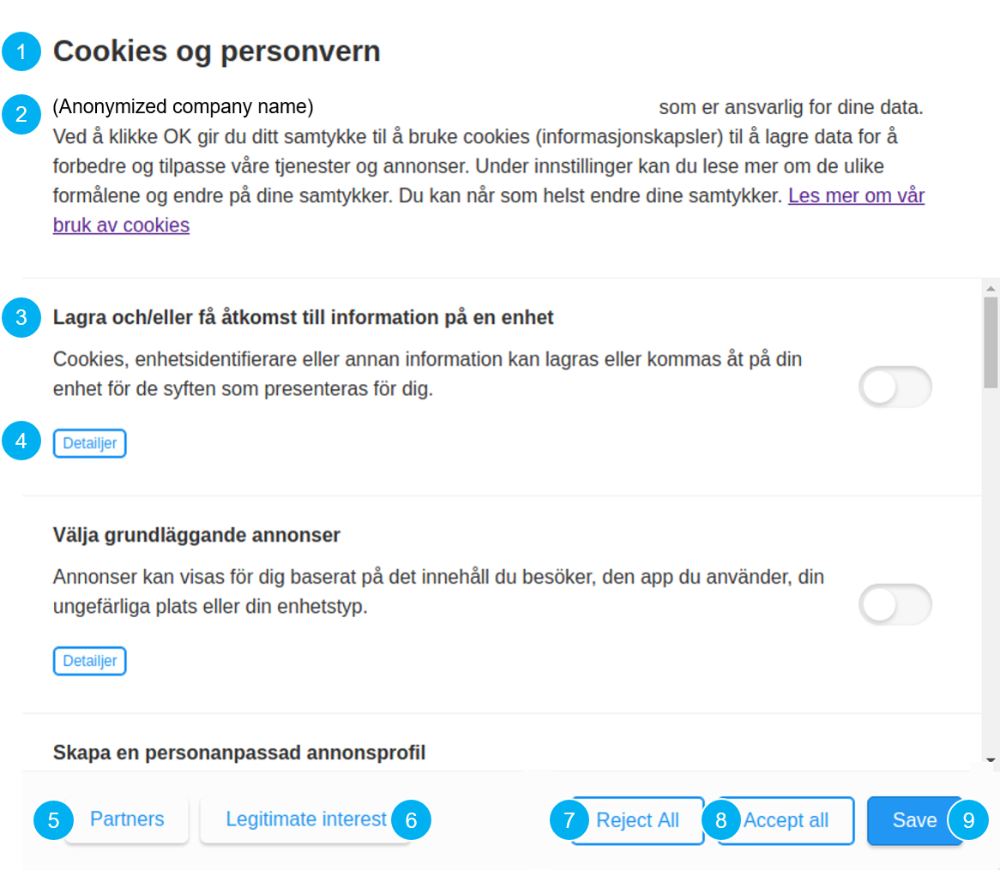
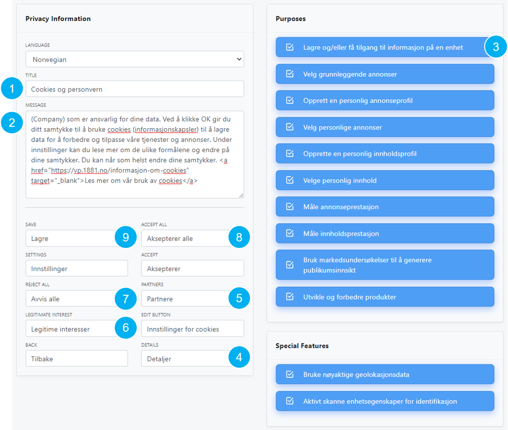

# Privacy \(updates in progress\)

The privacy section allows you to design a consent box that ensures that users are informed about the data you collect and for which purposes, and that they can control whether or not to consent to those purposes. Below is an example consent box.

The box can be styled using CSS in the [Publish section](publish.md), but in general the consent tool is built up by defining texts for specified parts of that box. Below is a numbered list that corresponds to each part of the example consent box below. 

1. Header text.
2. Exlanatory text where you can inform your visitors.
3. Purposes as they are defined by [IAB's TCF policies \(see Appendix A\)](https://iabeurope.eu/iab-europe-transparency-consent-framework-policies/).
4. Button that allows visitors to get more details per purpose. 
5. Button leading to an overview of the technologies that collecting personal data. 
6. Button leading to an overview of the technologies considered to be protected by legitimate interest. 
7. Reject all button. 
8. Accept all button.
9. Button to save your changes. 

Below are the same input fields in the user interface, aligned with the numbers above.

The non-numbered input fields are for other parts of the consent box that appear if you interact with it, for instance to obtain more information. To test and interact with a live consent box on a test page, please see here: [http://demo.adnuntius.com/consent/v2/](http://demo.adnuntius.com/consent/v2/).

Finally click “Save”. When you’re ready to get your consent box onto your website, go to [Publish ](publish.md)to read how you publish your consent box. However, you may want to read more about variables, triggers and tags before you go there.

