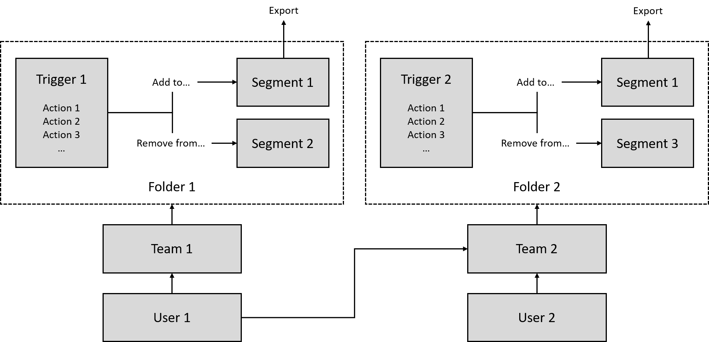

# Users, Teams and Roles

For more information on how to create users, teams and roles, please see the [Adnuntius Advertiser users, teams and roles page](../../../adnuntius-advertising/admin-ui/users/users-teams-and-roles.md), as the method is the same for Adnuntius Advertising as it is for Adnuntius Data.

However, the roles you can choose between for Adnuntius Data are the following:

* Network: **Adnuntius Data Admin** gives a user access to manages the main account in Adnuntius Data.
* Team: **Manage Adnuntius Data** gives a user permission to create segments and folders in Adnuntius Data.

**Connecting teams to folders.** Once you have [created a folder,](../segmentation/folders.md) you can connect that folder to a team to determine which segments and triggers those users have access to.

