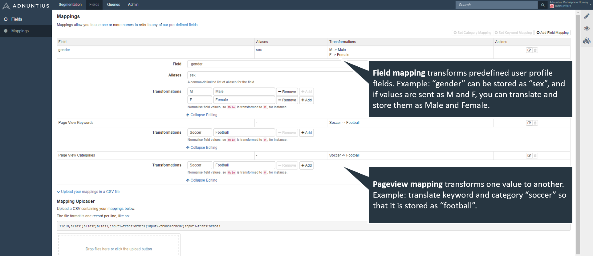

# Mappings

Consider this example: One publishing website writes about football, and also asks registering users for their gender. Another publishing website that cooperates with the first one through a network also collects this information, but they call it “soccer” and “sex” instead of "football" and "gender". In order to store all information with a unified structure and language, you need to transform “soccer” to “football” and “sex” to “gender”. 

This can be done with mapping. To add a mapping, go to [https://admin.adnuntius.com/mappings](https://admin.adnuntius.com/mappings) and click “Add Mapping” in the upper right corner. 

You can map [user profile data]() and [pageview data](../../api-documentation/javascript/page-views.md) \(which are split into categories and keywords\). In the example below you will see how user profile data “gender” has been given the alias “sex” so that different parties can send different denominations, while all information will still be stored in a unified structure. If gender is sent you can also transform each value so that for example the values M and F are translated to Male and Female respectively.

To translate pageview keywords and categories, simply add the value as the data is sent with, in the example above “soccer”, and then define how you want to actually store the data. In the example above a publisher can send the keyword soccer, but it will be stored as the keyword “football”.


Example: if you want to collect the gender \(one of the [field values](fields.md) you can choose\) of your users, but that you need to send the value "sex" instead of "gender". You can then map sex to gender, so that you can keep sending "sex".



Example: if you’re sending both values “males” and “m” then you can transform “male” to “m” so that all variations are normalized to the same value in Adnuntius Data. 


