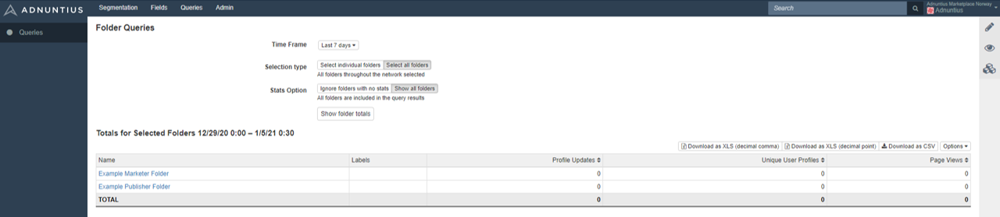

# Queries

To create a query, go to [https://admin.adnuntius.com/data-queries/data-queries/folder](https://admin.adnuntius.com/data-queries/data-queries/folder).

First, select the **time frame**, for example the last 6 months. **Selection type** allows you to specify folders by name or labels, or choose all folders in your network to which you have access. **Stats options** allow you to ignore folders with no data for the chosen time period, or to include them nonetheless.

The reports will produce an overview of the following:

* The name of, and the link to, each folder. 
* Any labels added to folders.
* Profile Updates: every time a [user profile is updated](../api-documentation/javascript/page-views.md) \(which means that a addition, change or new profile is added\) this will count as an update. Profile updates as such counts how many changes have happened to your user profiles for the given time frame. 
* Unique User Profiles: counts how many users you have in total, based on [user profiles that are sent](../api-documentation/javascript/page-views.md). 
* Page Views: How many [pageviews that are sent](../api-documentation/javascript/profile-updates.md) to Adnuntius Data. 

